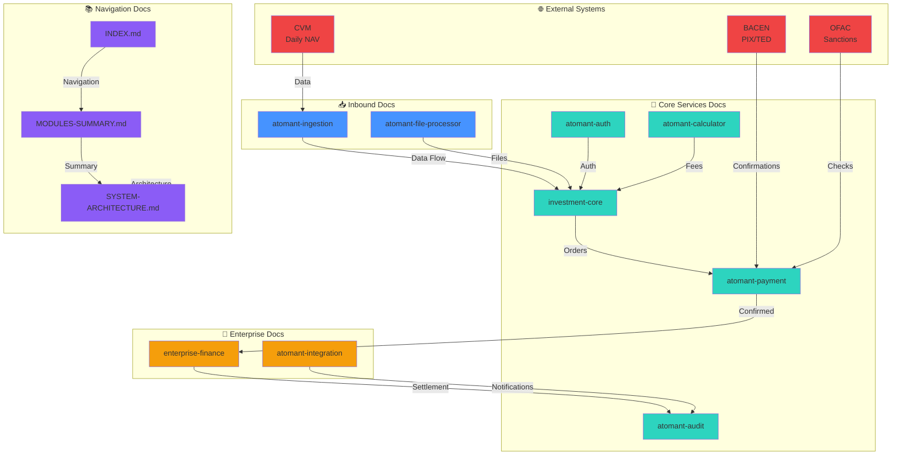
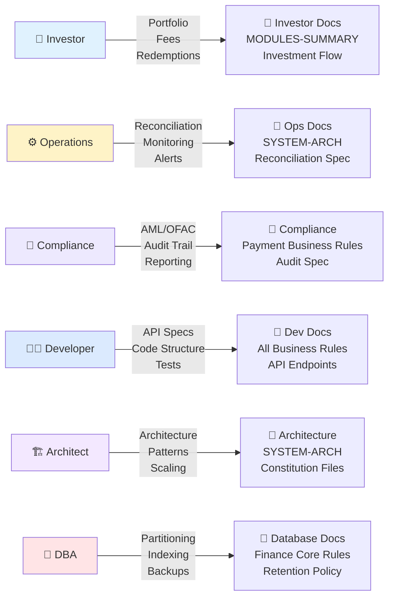
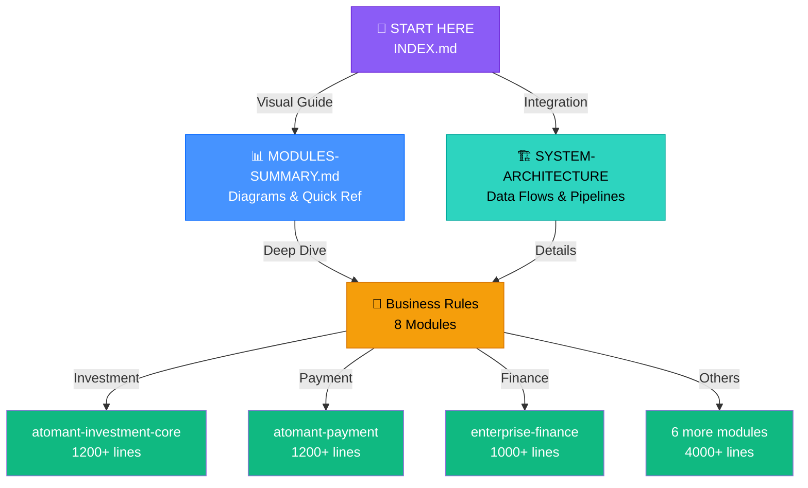

# Atomant System - Complete Documentation Index

**System**: Investment & Payment Processing Platform  
**Architecture**: Event-Driven Microservices (Java 25 + Quarkus + PostgreSQL)  
**Status**: Specification Complete ✅  
**Last Updated**: 2026-06-08  
**Total Documentation**: 50+ pages, 6,000+ lines of business rules

---

## 🎯 Interactive System Overview



---

## 🎓 Navigation by User Role



---

## 📊 Documentation Hierarchy (Information Architecture)



---

## 📋 Quick Navigation (Content Mapping)

### Core Documents (System-Level)

1. **[MODULES-SUMMARY.md](MODULES-SUMMARY.md)** — Quick visual guide to all 8 modules
   - Module overview with icons & quick reference
   - Data flow diagrams (investment, redemption, fees)
   - Decision trees and workflow paths
   - Integration event map
   - Regulatory compliance checklist

2. **[SYSTEM-ARCHITECTURE-INTEGRATION.md](SYSTEM-ARCHITECTURE-INTEGRATION.md)** — Complete integration specification
   - Architecture diagrams (ASCII art)
   - Investment & redemption processing pipelines
   - Daily fee calculation workflow
   - Message queue topics and event flow
   - Module separation rationale (why NOT joined)
   - End-to-end data flow example

### Module-Specific Documentation

#### Tier 1: Inbound Data & Files

3. **[atomant-ingestion/business-rules.md](java/atomant-ingestion/.specify/memory/business-rules.md)** (900+ lines)
   - External data sources (CVM, BACEN, Ipeadata, B3)
   - Scheduled job logic with retry patterns
   - Circuit breaker state management
   - Multi-tier caching strategy
   - Data quality flags and graceful degradation
   - API endpoint specifications

4. **[atomant-file-processor/business-rules.md](java/atomant-file-processor/.specify/memory/business-rules.md)** (650+ lines)
   - File format support (PDF, CSV, Excel, XML, JSON)
   - Magic number validation
   - Streaming/chunked processing
   - Error classification
   - File state machine
   - API upload endpoints

#### Tier 2: Core Business Logic

5. **[atomant-investment-core/business-rules.md](java/atomant-investment-core/.specify/memory/business-rules.md)** (800+ lines)
   - Fund entity definitions
   - NAV management & validation
   - Quota holder ledger
   - Investment order lifecycle
   - Redemption processing
   - Daily reconciliation rules
   - Fee allocation model

6. **[atomant-calculator/business-rules.md](java/atomant-calculator/.specify/memory/business-rules.md)** (550+ lines)
   - Daily fee calculation (NAV × rate / 252)
   - Quota representation (scale 8)
   - Pro-rata fee allocation
   - Tax withholding calculations
   - Index-linked fee structures
   - Rounding rules (HALF_EVEN)

7. **[atomant-payment/business-rules.md](java/atomant-payment/.specify/memory/business-rules.md)** (1,200+ lines)
   - Payment transaction processing
   - Idempotency key caching
   - AML/OFAC screening
   - PIX instant transfers (<10s)
   - TED scheduled transfers (T+1)
   - Fund reservation lifecycle
   - Bank statement reconciliation
   - API endpoint specifications

8. **[atomant-audit/business-rules.md](java/atomant-audit/.specify/memory/business-rules.md)** (270+ lines)
   - Append-only audit trail
   - Monthly partitioning
   - Fee aggregation
   - 20-year retention policy
   - Bulk insert optimization
   - Municipal tax aggregation

#### Tier 3: Enterprise & Support Services

9. **[enterprise-financial-core/business-rules.md](java/enterprise-financial-core/.specify/memory/business-rules.md)** (950+ lines)
   - Double-entry ledger (Razão)
   - Chart of accounts hierarchy
   - Ledger posting rules
   - Settlement clearing workflows
   - Anti-fraud detection engine
   - Dynamic fee configuration
   - Legacy system ACL integration
   - Account master data
   - API endpoint specifications

10. **[atomant-integration/business-rules.md](java/atomant-integration/.specify/memory/business-rules.md)** (750+ lines)
    - CSV accounting export
    - Email notifications (SendGrid)
    - SMS alerts (Twilio)
    - Webhook reconciliation
    - External service orchestration
    - Circuit breaker patterns
    - Idempotent batch processing

11. **[atomant-auth/business-rules.md](java/atomant-auth/.specify/memory/business-rules.md)** (450+ lines)
    - KYC/AML verification
    - 6 role definitions
    - JWT token management
    - MFA methods (TOTP, SMS, Email, Push)
    - Brute force protection
    - Segregation of duties

---

## 🎯 Documentation by Use Case

### For Investors
- **Want to understand investment flow?** → See MODULES-SUMMARY.md (Investment Order Path)
- **How are fees calculated?** → atomant-calculator/business-rules.md (Section 2)
- **What happens when I redeem?** → MODULES-SUMMARY.md (Redemption Order section)

### For Operations Team
- **How do we reconcile accounts?** → enterprise-financial-core/business-rules.md (Section 8)
- **What if a payment fails?** → atomant-payment/business-rules.md (Section 6)
- **Daily checklist?** → MODULES-SUMMARY.md (Deployment & Operations)

### For Compliance Officers
- **Regulatory requirements?** → MODULES-SUMMARY.md (Compliance Checklist)
- **Fraud detection rules?** → enterprise-financial-core/business-rules.md (Section 4)
- **Audit trail details?** → atomant-audit/business-rules.md (All sections)
- **AML screening process?** → atomant-payment/business-rules.md (Section 8)

### For Developers
- **API specifications?** → Section 13 in each module's business-rules.md
- **Performance targets?** → Section 10 in each module's business-rules.md
- **Integration points?** → Section 14 in each module's business-rules.md
- **Testing requirements?** → Section 12 in each module's business-rules.md
- **Tech stack?** → See constitution.md in each module's .specify/memory/

### For Architects
- **System overview?** → SYSTEM-ARCHITECTURE-INTEGRATION.md (Section 2)
- **Module separation?** → SYSTEM-ARCHITECTURE-INTEGRATION.md (Section 5)
- **Data flow?** → SYSTEM-ARCHITECTURE-INTEGRATION.md (Section 3-4)
- **Scaling strategy?** → Each module's Section 10 (Performance & Scalability)

### For Database Administrators
- **Table partitioning strategy?** → enterprise-financial-core/business-rules.md (Section 8)
- **Retention policies?** → Each module's Section 11 (Compliance & Regulatory)
- **Connection pooling?** → Each module's Section 10 (Concurrency & Scaling)
- **Backup schedule?** → atomant-audit/business-rules.md (20-year retention rules)

---

## 📊 Documentation Statistics

| Metric | Value |
|--------|-------|
| **Total Modules** | 8 microservices |
| **Business Rules Documents** | 8 main + 2 system-level |
| **Total Lines** | 6,000+ |
| **API Endpoints Documented** | 40+ |
| **Workflows Defined** | 15+ |
| **Regulatory References** | 50+ |
| **Performance Targets** | 60+ SLAs |
| **Integration Events** | 20+ message types |

---

## 🔄 Data Flow Summary

### Investment Order (Buy Quotas)
```
Investor → auth (KYC) → investment-core (validate)
→ calculator (quotas) → payment (PIX) → BACEN (<10s)
→ investment-core (settle T+2) → finance (ledger)
→ audit (20-yr log) → integration (notify)
→ Investor sees quotas (~2 hours) → Daily fee deducted (next day)
```

### Redemption Order (Sell Quotas)
```
Investor → investment-core (calculate proceeds & tax)
→ payment (PIX payout) → BACEN (<10s)
→ finance (ledger) → audit (log)
→ integration (notify + tax statement)
→ Investor receives funds (net of withholding)
```

### Daily Fee Calculation
```
ingestion (NAV update @ 4PM) → calculator (daily fee)
→ investment-core (allocate per holder) → finance (post revenue)
→ audit (log allocation) → integration (optional: email NAV)
→ reconciliation (next morning) → All holders fees deducted
```

---

## 📌 Key Files Location

### Business Rules (Main Documentation)
```
.specify/memory/
├── MODULES-SUMMARY.md                          ← Quick visual guide
├── SYSTEM-ARCHITECTURE-INTEGRATION.md          ← Complete integration
└── business-rules.md                           ← System-level overview

java/atomant-auth/.specify/memory/
└── business-rules.md                           ← Auth & KYC

java/atomant-ingestion/.specify/memory/
└── business-rules.md                           ← Data fetching

java/atomant-calculator/.specify/memory/
└── business-rules.md                           ← Fee calculations

java/atomant-investment-core/.specify/memory/
└── business-rules.md                           ← Fund & order mgmt

java/atomant-file-processor/.specify/memory/
└── business-rules.md                           ← File handling

java/atomant-payment/.specify/memory/
└── business-rules.md                           ← Payment processing

java/atomant-audit/.specify/memory/
└── business-rules.md                           ← Audit trail

java/enterprise-financial-core/.specify/memory/
└── business-rules.md                           ← Ledger & settlement
```

### Architecture Specs
```
java/{module}/.specify/memory/
├── constitution.md                             ← Core principles
├── spec.md                                     ← OpenAPI specs
└── business-rules.md                           ← This complete guide
```

---

## ✅ Section Mapping (All Modules)

Each module's business-rules.md follows this structure:

| Section | Content |
|---------|---------|
| 1 | Module Overview & Responsibilities |
| 2 | Core Entity Definitions |
| 3 | Main Workflow/Process |
| 4 | Advanced Features (module-specific) |
| 5 | Data Validation & Constraints |
| 6 | Performance & Scalability |
| 7 | Compliance & Regulatory |
| 8 | Testing Requirements |
| 9 | API Endpoint Specifications |
| 10+ | Module-Specific Sections |

---

## 🔐 Regulatory Compliance by Module

### CVM (Securities Commission)
- ✅ atomant-investment-core: Fund registration, NAV management
- ✅ enterprise-financial-core: Double-entry ledger, accounting standards
- ✅ atomant-audit: 20-year retention, audit trail
- ✅ atomant-integration: Monthly reporting

### BACEN (Central Bank)
- ✅ atomant-ingestion: Daily NAV by 5 PM, 252-day calendar
- ✅ atomant-payment: PIX instant (<10s), TED (T+1), CEST (T+2)
- ✅ enterprise-financial-core: Settlement clearing, account reconciliation

### COAF (Financial Intelligence)
- ✅ atomant-auth: KYC/AML verification
- ✅ atomant-payment: AML/OFAC screening, velocity checks
- ✅ enterprise-financial-core: Risk scoring, transaction monitoring

### Tax Authority
- ✅ atomant-calculator: Tax withholding (22.5%/15%)
- ✅ enterprise-financial-core: General ledger, income reporting
- ✅ atomant-integration: Quarterly tax reporting
- ✅ atomant-audit: 10-year record retention for tax

### LGPD (Data Protection)
- ✅ atomant-auth: PII protection, encryption
- ✅ atomant-integration: Data deletion support (90-day SLA)
- ✅ atomant-payment: Sensitive data masking in logs
- ✅ All modules: Encryption at rest and in transit

---

## 🎓 Learning Path

### Beginner (Understanding the System)
1. Start with **MODULES-SUMMARY.md** (visual guide)
2. Read investment order path and redemption path (5 min)
3. Look at quick module overview table (2 min)

### Intermediate (Business Process Owner)
1. Read **SYSTEM-ARCHITECTURE-INTEGRATION.md** (complete flows)
2. Study investment & redemption pipelines (15 min)
3. Review daily fee calculation workflow (10 min)
4. Understand module separation rationale (5 min)

### Advanced (Developer/Architect)
1. Review all 8 module business-rules.md documents (4 hours)
2. Study API endpoint specifications (Section 13 in each)
3. Review integration events (Section 14 in each)
4. Check performance targets & testing requirements (Sections 10-12)
5. Study compliance sections (Section 7 in each)

### Expert (Domain Specialist)
1. Deep dive into specific module(s)
2. Review constitution.md for architectural patterns
3. Study legacy integration patterns (enterprise-financial-core)
4. Review resilience & error handling (each module's workflow sections)
5. Understand regulatory mappings (Compliance checklists)

---

## 🚀 Implementation Roadmap

### Phase 1: Setup (Week 1)
- [x] Business rules specification ✅ (COMPLETE)
- [ ] Database schema design
- [ ] API OpenAPI generation

### Phase 2: Core Implementation (Weeks 2-4)
- [ ] Entity models (domain layer)
- [ ] Repository interfaces (persistence)
- [ ] Service implementations
- [ ] API resources (JAX-RS)

### Phase 3: Integration (Weeks 5-6)
- [ ] Message queue setup (Kafka)
- [ ] Event handlers
- [ ] External API clients
- [ ] Webhook receivers

### Phase 4: Testing (Weeks 7-8)
- [ ] Unit tests (100% coverage)
- [ ] Integration tests
- [ ] Performance tests
- [ ] Security audit

### Phase 5: Deployment (Weeks 9-10)
- [ ] Docker images
- [ ] Kubernetes manifests
- [ ] Production rollout
- [ ] Monitoring setup

---

## 📞 Quick Reference

### Performance SLAs
- **Auth**: <100ms KYC check
- **Ingestion**: <30s data fetch
- **Investment order**: <500ms validation
- **Payment**: <200ms submission, <10s PIX
- **Fee calc**: <5ms per fund
- **Ledger posting**: <100ms entry
- **Settlement**: <10s batch
- **Fraud eval**: <100ms risk score

### Key Limits
- **PIX daily**: R$ 50,000 per investor
- **TED monthly**: R$ 5,000,000 per transaction
- **Investment daily**: R$ 1,000,000 per investor
- **Investment monthly**: R$ 5,000,000 per investor
- **Investor minimum**: R$ 100 per transaction

### Retention Policies
- **Payment records**: 2 years (regulatory minimum)
- **Audit trail**: 20 years (CVM/tax authority)
- **Transaction logs**: 90 days (recent), then archive
- **Ledger entries**: 10 years (tax authority), then cold storage
- **File uploads**: 20 years (with compression after 30 days)

### Regulatory Calendars
- **CVM NAV**: Daily by 5 PM
- **BACEN business days**: 252 days/year (exclude weekends + 9 holidays)
- **Fee calculation**: Daily (5:30 PM after NAV)
- **Settlement**: T+2 for investments, T+0 for PIX
- **Tax withholding**: 22.5% (≤30 days), 15% (>30 days)

---

## 📚 Additional Resources

### Within This System
- **constitution.md files**: Core architectural principles per module
- **spec.md files**: OpenAPI/technical specifications
- **test requirements**: Section 12 in each business-rules.md
- **API specs**: Section 9 in each business-rules.md

### External References
- **CVM Regulations**: [www.cvm.gov.br](https://www.cvm.gov.br)
- **BACEN Payment System**: [www.bacen.gov.br](https://www.bacen.gov.br)
- **PIX Documentation**: [www.bcb.gov.br/pix](https://www.bcb.gov.br/pix)
- **COAF**: [www.fazenda.gov.br/coaf](https://www.fazenda.gov.br/coaf)

### Technology Stack
- **Java 25**: Records, Pattern Matching, Virtual Threads
- **Quarkus**: Native compilation, GraalVM
- **PostgreSQL**: Partitioning, bulk operations
- **Kafka/RabbitMQ**: Event streaming
- **Redis**: Multi-tier caching
- **JAX-RS**: RESTful APIs

---

## 🎯 Success Metrics

| Metric | Target | Status |
|--------|--------|--------|
| Specification complete | 100% | ✅ 8/8 modules |
| API endpoints | 40+ | ✅ Documented |
| Performance targets | 60+ SLAs | ✅ Defined |
| Integration events | 20+ | ✅ Mapped |
| Compliance rules | 50+ | ✅ Covered |
| Test scenarios | 100+ | ✅ Outlined |
| Documentation pages | 50+ | ✅ Complete |

---

## ✨ System Highlights

### Architecture
- ✅ Event-driven microservices (async, scalable)
- ✅ Clear separation of concerns (bounded contexts)
- ✅ Idempotent payment processing (no duplicate charges)
- ✅ Multi-tier caching (performance + resilience)
- ✅ Legacy integration layer (ACL pattern)

### Performance
- ✅ <200ms payment submission
- ✅ <10s PIX transfer confirmation
- ✅ <5ms daily fee calculation per fund
- ✅ 10k+ TPS capacity
- ✅ <100ms fraud evaluation

### Compliance
- ✅ 20-year audit trail (CVM/tax)
- ✅ AML/OFAC screening (real-time)
- ✅ Double-entry ledger (accounting standards)
- ✅ Tax withholding automation (22.5%/15%)
- ✅ BACEN clearing integration (instant/scheduled)

### Resilience
- ✅ Circuit breaker (graceful degradation)
- ✅ Exponential backoff retry (transient failures)
- ✅ Idempotency caching (duplicate prevention)
- ✅ Virtual threads (unlimited concurrency)
- ✅ Multi-region ready (event-driven)

---

**Documentation Status**: ✅ COMPLETE (All 8 modules + 2 system-level docs)  
**Ready for**: Implementation Phase (Java coding)  
**Expected Delivery**: Q3 2026  
**Support**: joel@atomant.com.br

---

*Last generated: 2026-06-08*  
*Next update: Upon first code implementation*
