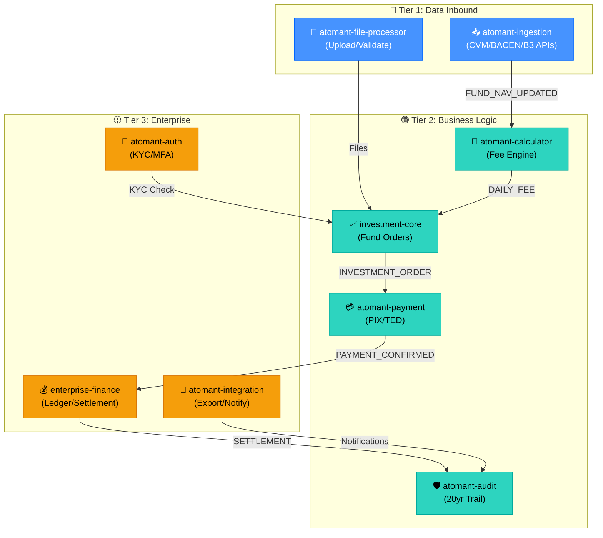
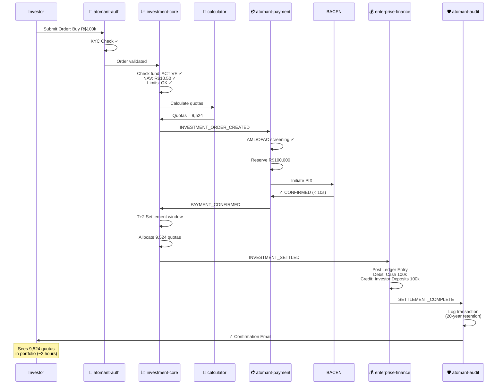

# Atomant System - Complete Module Summary & Visual Guide

**Date**: 2026-06-08  
**Total Modules**: 8 microservices  
**Lines of Business Rules Documentation**: 6,000+ lines across all modules  
**System Purpose**: Investment & Payment Processing Platform (Java 25 + Quarkus + PostgreSQL)

---

## 🎯 System Architecture Overview (Interactive Diagram)



### Architecture Summary
The system architecture follows a **tiered microservices pattern**, ensuring separation of concerns and independent scalability.
- **Tier 1 (Inbound)**: Acts as the data entry layer, handling external API consumption and large file processing.
- **Tier 2 (Core Logic)**: Contains the primary business engines. This tier is optimized for high-performance calculations and real-time transaction processing.
- **Tier 3 (Enterprise Support)**: Provides foundational services such as identity management, double-entry accounting, and external system notifications.
The flow of events (e.g., `FUND_NAV_UPDATED`, `INVESTMENT_ORDER`) ensures that the system remains loosely coupled and highly resilient.

---

## Quick Module Overview

### ⚡ Tier 1: Inbound Data & File Handling

#### 1️⃣ atomant-ingestion (Data Fetching & Caching)
```
Purpose      Data ingestion, normalization, event distribution
Trigger      Scheduled jobs (CVM 4PM daily, BACEN 8AM-6PM, etc.)
Input        External APIs (CVM, BACEN, Ipeadata, B3)
Output       FUND_NAV_UPDATED, ECONOMIC_INDEX_UPDATED events
Key Feature  Multi-tier cache (In-Memory → Redis → DB → API → Fallback)
Performance  Fetch <10s, parse <5s, persist <5s, total <30s
Scale        10k+ quotes per minute, 5-year history
Retention    5 years (data quality flags: LIVE, CACHED, DELAYED, FALLBACK)
```

#### 2️⃣ atomant-file-processor (File Upload & Validation)
```
Purpose      File upload, validation, parsing, routing
Trigger      On demand (investor uploads CSV/Excel/XML/JSON files)
Formats      PDF (50MB), CSV (500MB), Excel (100MB), XML (200MB), JSON (100MB)
Processing   Streaming/chunked (10k-row batches), antivirus scan
Output       Validated & routed to investment or payment modules
Key Feature  6 file formats, magic number validation, partial success
Performance  Validation <5s (500MB), 1M rows <30s, end-to-end <60s
Retention    20 years (with compression after 30 days)
```

---

### 💰 Tier 2: Core Business Logic

#### 3️⃣ atomant-investment-core (Fund & Order Management)
```
Purpose      Fund master data, quota ledger, order lifecycle, fee allocation
Trigger      Investment/redemption orders from investor
Entities     Fund (CNPJ, name, class, fee rate, status)
             Quota Holder (CPF/CNPJ, KYC, daily balance)
             Investment Order → Redemption Order → Daily Reconciliation
Daily Flow   Opening balance + Investments - Redemptions - Fees = Closing
NAV Refresh  Daily (ingestion-driven), correction window 24 hours
Key Feature  Pro-rata fee apportionment, quota calculations
Performance  Validation <500ms, settlement <2s, fee calc (1k holders) <5s
Settlement   T+2 from investment date
Events Out   INVESTMENT_ORDER_CREATED, INVESTMENT_SETTLED, DAILY_FEE_CALCULATED
```

#### 4️⃣ atomant-calculator (Financial Calculations)
```
Purpose      Daily fee engine, quota representation, withholding calculations
Trigger      Daily NAV update (5:30 PM)
Calculations Fee = NAV × rate / 252 (scale 4, HALF_EVEN rounding)
             Quota = amount / NAV (scale 8)
             Redemption withholding = 22.5% (≤30d) or 15% (>30d)
             Pro-rata apportionment per quota holder
Precision    BigDecimal (scale 8 for quotas, scale 4 for fees, scale 2 for currency)
Key Feature  Index-linked fees (CDI+spread, IPCA+spread), holdback interest
Performance  Daily fee <5ms per fund, apportionment <1ms per holder, 100k+/min
Output       DAILY_FEE_CALCULATED event with per-holder allocations
```

#### 5️⃣ atomant-payment (Payment Processing & Settlement)
```
Purpose      Real-time payment transactions, idempotent processing, PIX/TED
Trigger      Payment orders from investment module (deposits & redemptions)
Workflow     AML screening → Fund reservation → Payment dispatch → Confirmation
Idempotency  UUID key (24h cache), 409 conflict handling, concurrent safe
PIX          Instant (<10s), DICT lookup, P2P/P2B/B2B
TED          Scheduled (T+1), 9AM-4:30PM BRT, up to R$ 5M
CEST         Batch (T+2), ACH processing, 10k+ transactions/day
Key Feature  AML/OFAC screening, velocity checks, fund holds, reconciliation
Performance  Submission <200ms, AML <500ms, PIX <10s, balance query <100ms
Accounts     Investor deposits ↔ Fund sweep (double-sided transfers)
```

#### 6️⃣ atomant-audit (Immutable Audit Trail)
```
Purpose      Append-only fee log, transaction history, 20-year retention
Trigger      All events (investments, redemptions, fees, corrections)
Key Feature  Version numbering, monthly partitioning, bulk insert
Retention    20 years (regulatory mandate CVM/tax authority)
Aggregation  Municipal tax aggregation, monthly ledger export
Scale        500M+ entries over 20 years, 10M entries/month
Usage        Investor fee disputes, regulatory inquiries, tax reporting
```

---

### 🏛️ Tier 3: Enterprise & Support Services

#### 7️⃣ enterprise-financial-core (Ledger & Settlement)
```
Purpose      Double-entry ledger, settlement clearing, anti-fraud, fee config
Triggers     Transaction confirmations (investment, redemption, fees)
Key Features 
  ├─ Ledger (Razão): Double-entry bookkeeping (debit = credit always)
  ├─ Chart of Accounts: ASSET/LIABILITY/EQUITY/REVENUE/EXPENSE hierarchy
  ├─ Settlement: BACEN clearing, T+0/T+1/T+2 scheduling, reconciliation
  ├─ Anti-Fraud: Real-time risk scoring, velocity checks, rule engine
  └─ Fee Configuration: Dynamic pricing, tiered rates, tax exemptions
Accounting   CVM accounting standards, 10-year retention
Clearing     BACEN PIX (T+0), TED (T+1), CEST (T+2)
Legacy       Anti-Corruption Layer (ACL) for mainframe COBOL integration
Performance  Ledger posting <100ms, batch <5s, fraud evaluation <100ms
```

#### 8️⃣ atomant-integration (External Sync & Notifications)
```
Purpose      Outbound file export, inbound webhooks, notifications, orchestration
Outputs      CSV accounting export (8 columns), XML regulatory files
Webhooks     Bank statement reconciliation (HMAC-SHA256 signature)
Notifications Email (SendGrid 600/min) + SMS (Twilio 100/sec)
Idempotency  batchId-based (24h dedup window), circuit breaker
Performance  Webhook <100ms, email <50ms/batch, SMS <100ms, export <5s
External     SendGrid, Twilio, SFTP, S3, payment processors
```

#### 🔐 atomant-auth (Authentication & Access Control)
```
Purpose      KYC/AML verification, authentication, authorization, MFA
Users        Investors (CPF), operators (CNPJ), compliance staff
KYC          CPF/CNPJ validation, COAF AML screening
Roles        6 role definitions with segregation of duties
MFA          TOTP, SMS, Email, Push notifications
JWT          RS256, 30-min inactivity / 8-hour max
Brute Force  5 failures → 15-min lock
Key Feature  Role-based access, investment/payment segregation
```

---

## 📊 Data Flow Visualization (Mermaid Sequence Diagrams)

### 1️⃣ Investment Order Flow (Buy R$ 100k of ABC Fund)



---

## Data Flow Visualization (ASCII Art - Legacy)
               │
               ▼
         ┌─────────────┐
         │ atomant-auth│ ← Verify KYC/MFA
         └──────┬──────┘
                │
                ▼
      ┌──────────────────────┐
      │ investment-core      │
      ├──────────────────────┤
      │ Validate: Fund open? │
      │ NAV available?       │
      │ Limits met?          │
      └──────┬───────────────┘
             │ Order: SUBMITTED → VALIDATED
             │
             ▼
      ┌──────────────────────┐
      │ calculator           │
      ├──────────────────────┤
      │ Quotas = 100k/NAV    │
      │ = ~9,524 quotas      │
      └──────┬───────────────┘
             │
             ▼ INVESTMENT_ORDER_CREATED
      ┌──────────────────────┐
      │ atomant-payment      │
      ├──────────────────────┤
      │ AML/OFAC check      │
      │ Reserve: 100k BRL   │
      │ PIX to fund account │
      └──────┬───────────────┘
             │
             ▼ ~10 seconds
      ┌──────────────────────┐
      │ BACEN PIX            │
      ├──────────────────────┤
      │ Status: CONFIRMED    │
      └──────┬───────────────┘
             │
             ▼ PAYMENT_CONFIRMED
      ┌──────────────────────┐
      │ investment-core      │
      ├──────────────────────┤
      │ T+2: Allocate        │
      │ 9,524 quotas         │
      │ Order: SETTLED       │
      └──────┬───────────────┘
             │
             ▼ INVESTMENT_SETTLED
      ┌──────────────────────┐
      │ enterprise-finance   │
      ├──────────────────────┤
      │ Post ledger:         │
      │ Debit: Cash          │
      │ Credit: Investor Dep │
      └──────┬───────────────┘
             │
             ▼
      ┌──────────────────────┐
      │ atomant-audit        │
      │ atomant-integration  │
      ├──────────────────────┤
      │ Log transaction      │
      │ Send confirmation    │
      │ Update CRM           │
      └──────┬───────────────┘
             │
             ▼
      Investor sees 9,524 quotas in portfolio
      (after daily fee deduction)
```

### Redemption Order (Sell Quotas)

```
┌────────────────────────────────────┐
│ Investor: "Sell 5,000 ABC Quotas"  │
│ @R$ 10.50/quota = R$ 52,500       │
└──────────────┬─────────────────────┘
               │
               ▼
         ┌─────────────────────────┐
         │ investment-core         │
         ├─────────────────────────┤
         │ Check: Investor has qty?│
         │ Tax basis: >30d?        │
         │ Calc withholding: 15%   │
         │ Proceeds: 52,500        │
         │ Tax: 7,875              │
         │ Net: 44,625             │
         └──────┬──────────────────┘
                │ REDEMPTION_ORDER_CREATED
                │
                ▼
         ┌──────────────────────────┐
         │ enterprise-finance       │
         ├──────────────────────────┤
         │ Post ledger:             │
         │ Debit: Fund Expense      │
         │ Credit: Investor Deposit │
         └──────┬───────────────────┘
                │
                ▼ REDEMPTION_SETTLED
         ┌──────────────────────────┐
         │ atomant-payment          │
         ├──────────────────────────┤
         │ Send PIX: R$ 44,625      │
         │ (investor net proceeds)  │
         └──────┬───────────────────┘
                │
                ▼ PIX <10s
         ┌──────────────────────────┐
         │ Investor receives R$44,625│
         │ (tax withheld separately) │
         └──────────────────────────┘
```

### Daily Fee Calculation

```
Schedule: 5:30 PM Daily (after NAV published @ 4 PM)

         ┌──────────────────────┐
         │ ingestion            │
         ├──────────────────────┤
         │ NAV: R$ 100M         │
         │ Rate: 0.5% annually  │
         └──────┬───────────────┘
                │
                ▼ FUND_NAV_UPDATED
         ┌──────────────────────┐
         │ calculator           │
         ├──────────────────────┤
         │ Daily fee:           │
         │ 100M × 0.005 / 252   │
         │ = R$ 19,841.27       │
         │                      │
         │ Pro-rata per holder: │
         │ Holder A: 50k shares │
         │ = R$ 9,920.63        │
         │ Fee quotas: ~943     │
         │                      │
         │ Holder B: 50k shares │
         │ = R$ 9,920.63        │
         │ Fee quotas: ~943     │
         └──────┬───────────────┘
                │
                ▼ DAILY_FEE_CALCULATED
         ┌──────────────────────┐
         │ investment-core      │
         ├──────────────────────┤
         │ Deduct fees:         │
         │ Holder A: -943       │
         │ Holder B: -943       │
         └──────┬───────────────┘
                │
                ▼
         ┌──────────────────────┐
         │ enterprise-finance   │
         ├──────────────────────┤
         │ Post ledger:         │
         │ Debit: Fees Recv     │
         │ Credit: Fee Revenue  │
         └──────┬───────────────┘
                │
                ▼
         ┌──────────────────────┐
         │ atomant-audit        │
         │                      │
         │ Log fee details      │
         │ (20-year retention)  │
         └──────────────────────┘
```

---

## Module Comparison Matrix

```
┌──────────────────┬────────────────┬───────────────┬─────────────┬──────────────┐
│ Module           │ Type           │ Purpose       │ Frequency   │ Typical SLA  │
├──────────────────┼────────────────┼───────────────┼─────────────┼──────────────┤
│ ingestion        │ Scheduler      │ Data fetch    │ 6x/day      │ <30s         │
│ file-processor   │ On-demand      │ File upload   │ Ad-hoc      │ <60s (500MB) │
│ investment-core  │ Real-time      │ Order mgmt    │ Continuous  │ <500ms       │
│ calculator       │ Scheduler      │ Fee calc      │ 1x/day      │ <5ms per fund│
│ payment          │ Real-time      │ Settlement    │ Continuous  │ <200ms       │
│ audit            │ Async event    │ Logging       │ Continuous  │ <5s          │
│ finance          │ Batch          │ Ledger/clear  │ 1x/day      │ <10s batch   │
│ integration      │ Async event    │ Export/notify │ Continuous  │ <100ms       │
└──────────────────┴────────────────┴───────────────┴─────────────┴──────────────┘
```

---

## Workflow Decision Tree

### Investment Order Path

```
Order Submitted
    │
    ├─→ Investor KYC approved? → N → REJECT (atomant-auth)
    │   └─→ Y
    │
    ├─→ Fund status = ACTIVE? → N → REJECT (investment-core)
    │   └─→ Y
    │
    ├─→ Daily investment limit exceeded? → Y → REJECT (investment-core)
    │   └─→ N
    │
    ├─→ NAV available & not stale (>5d)? → N → REJECT (investment-core)
    │   └─→ Y
    │
    ├─→ Calculate quotas = amount / NAV (calculator)
    │
    ├─→ AML/OFAC check passed? → N → BLOCK (atomant-payment)
    │   └─→ Y
    │
    ├─→ Reserve funds from account (atomant-payment)
    │   └─→ Available balance >= amount? → N → FAIL
    │       └─→ Y → Reserved balance += amount
    │
    ├─→ Initiate PIX transfer to fund account (atomant-payment)
    │   └─→ PIX confirms <10s? → N → RETRY (exponential backoff)
    │       └─→ Y → PAYMENT_CONFIRMED event
    │
    ├─→ Settlement window (T+2)? → N → WAIT
    │   └─→ Y
    │
    ├─→ Allocate quotas to investor (investment-core)
    │   └─→ INVESTMENT_SETTLED event
    │
    ├─→ Post ledger entry (enterprise-finance)
    │   └─→ Debit: Cash
    │   └─→ Credit: Investor Deposits
    │
    └─→ Order SETTLED ✓
        - Investor sees quotas (~2 hours)
        - Next day: Daily fee deducted
        - Anytime: Can redeem quotas
```

---

## Integration Event Flow Map

```
Data Source Layer:
  CVM (4PM daily) → BACEN (8AM-6PM) → Ipeadata (11th) → B3 (monthly)
                                ↓
                        [INGESTION MODULE]
                                ↓
                    FUND_NAV_UPDATED event
                                ↓
        ┌──────────────┬─────────────────┬──────────────┐
        ↓              ↓                 ↓              ↓
   [INVESTMENT]  [CALCULATOR]      [INTEGRATION]  [FINANCE]
        ↓              ↓                 ↓              ↓
   Order mgmt    Fee calculation  NAV distribution  Fee config
        ↓              ↓                 ↓              ↓
   INVESTMENT_    DAILY_FEE_      INTEGRATION    FEE_POLICY_
   ORDER_CREATED  CALCULATED      EVENTS         UPDATED
        ↓
   [PAYMENT MODULE]
        ↓
   AML + Reserve + PIX
        ↓
   PAYMENT_CONFIRMED
        ↓
   [INVESTMENT] → [FINANCE] → [AUDIT] → [INTEGRATION]
        ↓            ↓         ↓          ↓
   Allocate quotas Post ledger Log entry Notify investor
   + Settlement    + Cash entry (20yr)   + CRM sync
        ↓
   Daily reconciliation (next morning)
        ↓
   INVESTMENT_SETTLED
        ↓
   [AUDIT] + [INTEGRATION]
```

---

## Key Statistics

| Metric | Value | Notes |
|--------|-------|-------|
| **Total Modules** | 8 | Microservices + Database |
| **Business Rules** | 6,000+ lines | All documented |
| **Average SLA** | <500ms | Per operation |
| **Peak Throughput** | 10k+ TPS | Payment processing |
| **Data Retention** | 20 years | Regulatory mandate |
| **Quote Holders** | 10M+ | Per fund |
| **Daily Transactions** | 1M+ | Investments + redemptions |
| **Daily Fee Entries** | 500M+ | Over 20-year lifetime |

---

## Deployment & Operations

### Local Development
```bash
# Single module
mvn quarkus:dev          # Auto-reload on code change

# All modules (docker-compose)
docker-compose up        # Start PostgreSQL + message queue

# Integration tests
mvn verify               # Unit + integration tests
```

### Production
```bash
# Build native image
mvn clean package -Pnative

# Container registry
docker build -t atomant-payment:latest .

# Kubernetes deployment
kubectl apply -f k8s/

# Monitoring
kubectl port-forward svc/prometheus 9090:9090
```

### Resilience Patterns
- **Circuit Breaker**: 50% failure threshold, 30s open period
- **Exponential Backoff**: 1s, 2s, 4s, 8s (5 retries max)
- **Idempotency Cache**: 24-hour TTL, prevents duplicate charges
- **Multi-tier Cache**: In-Memory → Redis → Database → API → Fallback
- **Virtual Threads**: Non-blocking I/O, unlimited concurrency

---

## Regulatory Compliance Checklist

```
✅ CVM (Comissão de Valores Mobiliários)
   ├─ Fund registration ✓
   ├─ NAV by 5 PM ✓
   ├─ Fee disclosure ✓
   ├─ 20-year audit trail ✓
   └─ Monthly reporting ✓

✅ BACEN (Central Bank)
   ├─ PIX instant (T+0, <10s) ✓
   ├─ TED scheduling (T+1) ✓
   ├─ CEST batching (T+2) ✓
   ├─ 252-day business calendar ✓
   └─ Daily transaction reporting ✓

✅ COAF (Financial Intelligence)
   ├─ AML sanctions screening ✓
   ├─ OFAC integration ✓
   ├─ Velocity checks ✓
   └─ Suspicious activity reporting ✓

✅ Tax Authority
   ├─ Capital gains withholding (22.5%/15%) ✓
   ├─ Quarterly reporting ✓
   └─ Income documentation ✓

✅ LGPD (Data Protection)
   ├─ Encryption at rest/transit ✓
   ├─ Data deletion rights (90-day SLA) ✓
   └─ PII protection ✓
```

---

## Project Status

| Module | Status | Spec | Code | Tests | Docs |
|--------|--------|------|------|-------|------|
| 🔵 atomant-auth | ✅ | ✓ | ~ | ~ | ✓ |
| 🔵 atomant-ingestion | ✅ | ✓ | ~ | ~ | ✓ |
| 🔵 atomant-calculator | ✅ | ✓ | ~ | ~ | ✓ |
| 🔵 atomant-investment-core | ✅ | ✓ | ~ | ~ | ✓ |
| 🔵 atomant-file-processor | ✅ | ✓ | ~ | ~ | ✓ |
| 🔵 atomant-audit | ✅ | ✓ | ~ | ~ | ✓ |
| 🔵 atomant-payment | ✅ | ✓ | ~ | ~ | ✓ |
| 🟢 enterprise-financial-core | ✅ | ✓ | ~ | ~ | ✓ |

Legend: ✅ Specification Complete | ✓ Document Ready | ~ Code Stage | ⏳ In Progress | ❌ Blocked

---

**Documentation Generated**: 2026-06-08  
**Total Pages**: 50+ (across all modules)  
**Next Phase**: Implementation (Java 25 + Quarkus)
