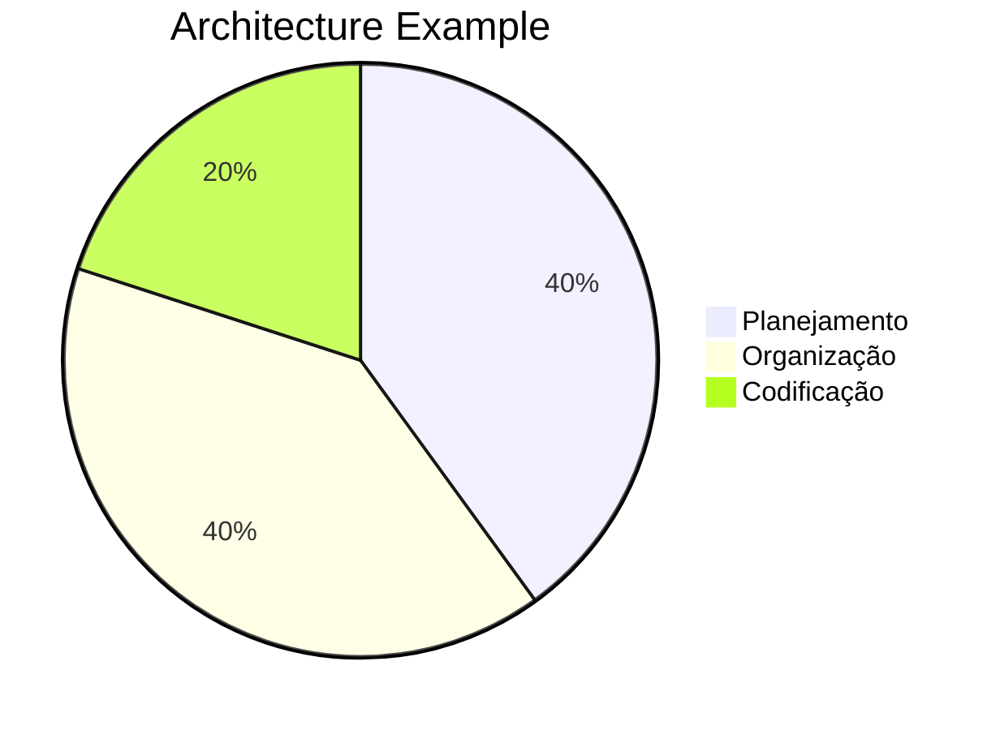
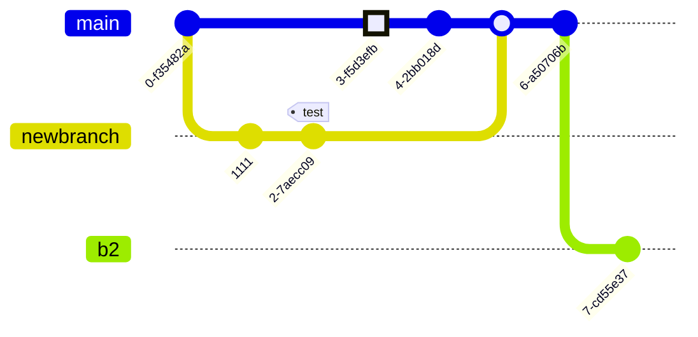
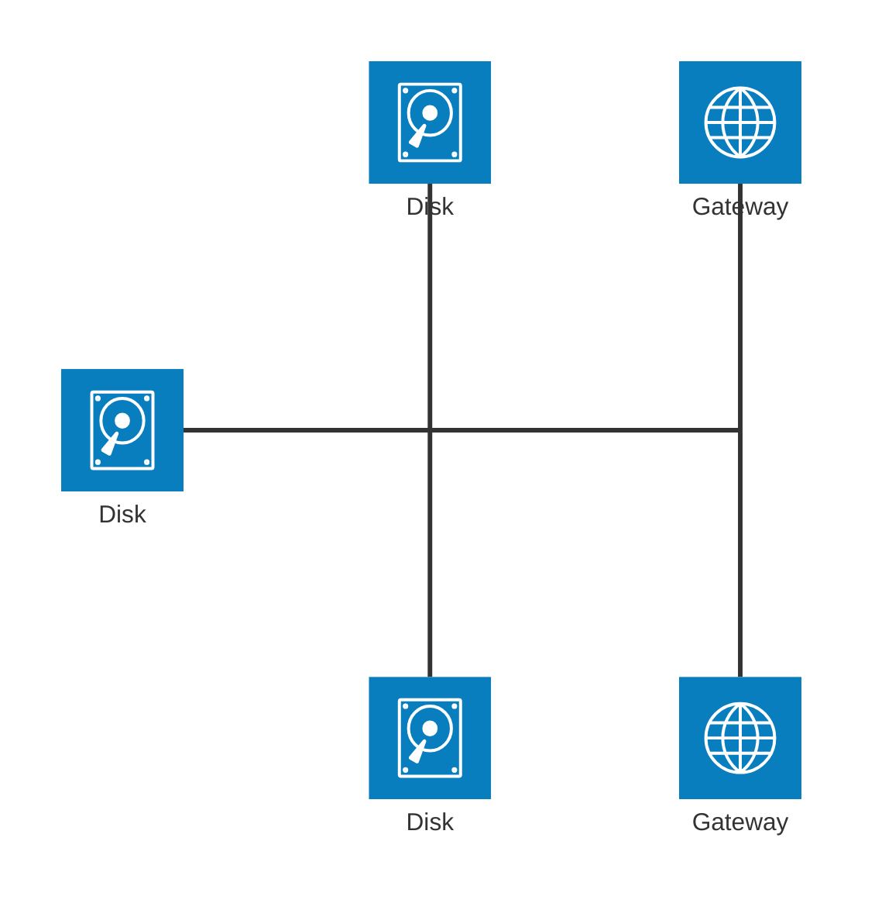
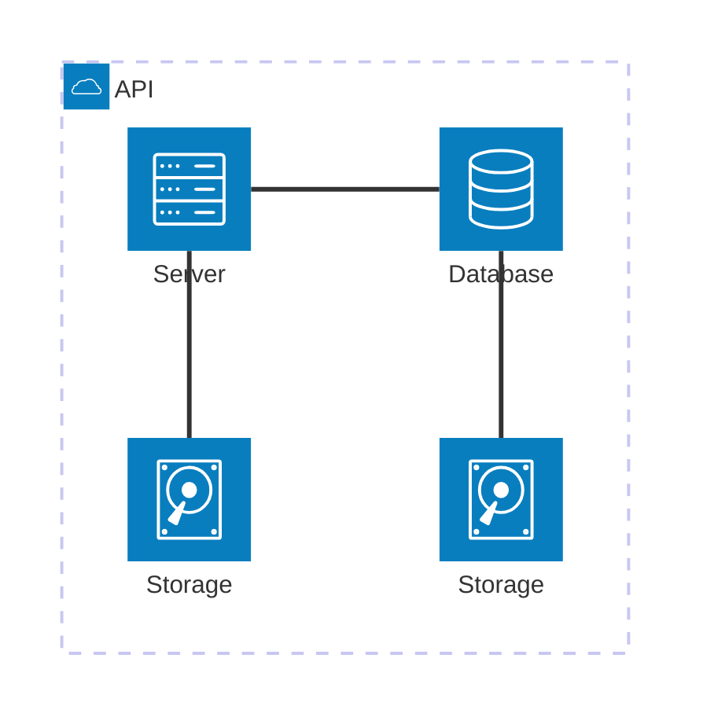
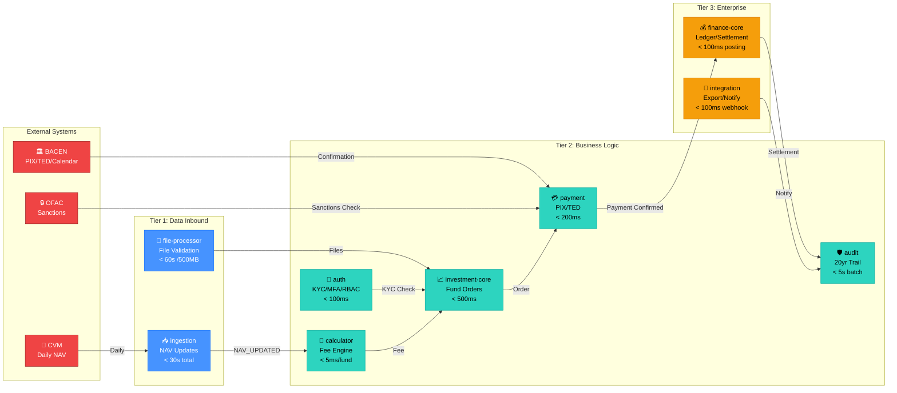
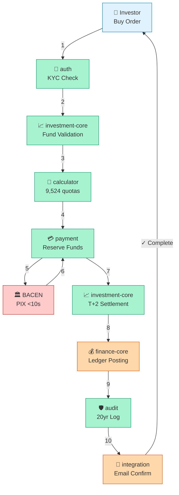

# System Architecture & Module Integration Guide









**System**: Atomant - Investment & Payment Processing Platform
**Purpose**: Unified specification for investment order processing, payment settlement, and financial ledger management
**Last Updated**: 2026-06-08

---

## 🎯 Interactive System Architecture Diagram



### System Architecture Description
The system follows a tiered microservices architecture designed for high availability and low latency.
- **External Systems**: Regulated entities (CVM, BACEN) and security providers (OFAC) providing authoritative data.
- **Tier 1 (Data Inbound)**: Responsible for the ingestion and validation of large datasets. Focuses on throughput and fault tolerance.
- **Tier 2 (Business Logic)**: The core of the platform. Services like `auth`, `investment-core`, and `payment` handle real-time user requests with strict SLA requirements.
- **Tier 3 (Enterprise)**: Handles the long-term persistence, accounting, and integration needs of the enterprise, ensuring that every cent is accounted for and audit trails are immutable.

---

## Module Overview & Responsibilities

The atomant system is organized into **8 specialized microservices**, each with distinct bounded contexts and responsibilities:

### Tier 1: Data Ingestion & Normalization
- **atomant-ingestion**: External data fetching (CVM NAV, BACEN rates, Ipeadata macroeconomic)
- **atomant-file-processor**: File upload, validation, parsing, routing

### Tier 2: Core Business Logic
- **atomant-investment-core**: Fund master data, quota ledger, order processing, fee calculation
- **atomant-calculator**: Financial calculation engine (fees, quotas, apportionment, withholding)
- **atomant-payment**: Payment transaction processing, idempotency, PIX/TED, account management
- **atomant-audit**: Immutable audit trail, fee aggregation, fee logging

### Tier 3: Enterprise Services
- **enterprise-financial-core**: Double-entry ledger, settlement clearing, anti-fraud, fee configuration
- **atomant-integration**: Outbound file export, inbound webhooks, notifications, external orchestration
- **atomant-auth**: Authentication, authorization, access control, MFA

---

## 🔄 Investment Processing Pipeline (Step-by-Step)



---

## 2. Architecture Diagram: Investment & Payment Flow

```
┌─────────────────────────────────────────────────────────────────────┐
│                        INVESTOR INTERFACE                           │
│                   (Web/Mobile Application)                          │
└────────────────────────┬────────────────────────────────────────────┘
                         │
        ┌────────────────┼────────────────┐
        ↓                ↓                ↓
   ┌─────────┐    ┌─────────┐    ┌──────────┐
   │INVEST   │    │REDEEM   │    │QUERY     │
   │REQUEST  │    │REQUEST  │    │BALANCE   │
   └────┬────┘    └────┬────┘    └────┬─────┘
        │               │               │
        └───────────────┼───────────────┘
                        │
        ┌───────────────▼───────────────┐
        │   atomant-auth               │
        │ (KYC/MFA/Access Control)     │
        └───────────────┬───────────────┘
                        │
        ┌───────────────▼─────────────────────────────────────┐
        │        ATOMANT-INVESTMENT-CORE (Order Processing)   │
        │  ┌──────────────┐         ┌──────────────┐          │
        │  │ Fund Registry│         │Quota Ledger  │          │
        │  ├──────────────┤         ├──────────────┤          │
        │  │ NAV Management   │ Daily Positions  │          │
        │  └──────────────┘         └──────────────┘          │
        │  ┌──────────────┐         ┌──────────────┐          │
        │  │ Investment   │         │ Redemption   │          │
        │  │ Order Flow   │         │ Order Flow   │          │
        │  └──────────────┘         └──────────────┘          │
        │  ┌──────────────┐         ┌──────────────┐          │
        │  │ Fee Splits   │         │ Settlement   │          │
        │  │ Allocation   │         │ Coordination │          │
        │  └──────────────┘         └──────────────┘          │
        └─────────────────┬────────────────────────────────────┘
                          │
        ┌─────────────────▼────────────────┐
        │  ATOMANT-CALCULATOR               │
        │  (Daily Fee Calculation Engine)   │
        │  ├─ Daily NAV × Rate / 252        │
        │  ├─ Pro-rata fee split            │
        │  ├─ Tax withholding calculations  │
        │  ├─ Quota representation          │
        │  └─ Interest calculations         │
        └─────────────────┬────────────────┘
                          │
        ┌─────────────────▼────────────────────────────────────┐
        │   ATOMANT-PAYMENT (Real-Time Settlement)             │
        │  ┌──────────────┐         ┌──────────────┐           │
        │  │Payment       │         │ Idempotency  │           │
        │  │Processing    │         │ Key Caching  │           │
        │  └──────────────┘         └──────────────┘           │
        │  ┌──────────────┐         ┌──────────────┐           │
        │  │ PIX Instant  │         │ TED Scheduled│           │
        │  │ Transfers    │         │ Transfers    │           │
        │  └──────────────┘         └──────────────┘           │
        │  ┌──────────────┐         ┌──────────────┐           │
        │  │ Fund Reserve │         │ AML/OFAC     │           │
        │  │ Management   │         │ Screening    │           │
        │  └──────────────┘         └──────────────┘           │
        └──────────┬──────────────────────────────────────────┘
                   │
        ┌──────────▼──────────────────────────────┐
        │ENTERPRISE-FINANCIAL-CORE                │
        │(Double-Entry Ledger & Settlement)       │
        │  ┌──────────────┐  ┌──────────────┐    │
        │  │ Ledger       │  │Settlement    │    │
        │  │ (Razão)      │  │Clearing      │    │
        │  │              │  │              │    │
        │  │• Debit/      │  │• Batch       │    │
        │  │  Credit      │  │  Processing  │    │
        │  │• Chart of    │  │• BACEN       │    │
        │  │  Accounts    │  │  Integration │    │
        │  │• Reconcil.   │  │• Settlement  │    │
        │  └──────────────┘  │  Confirm     │    │
        │  ┌──────────────┐  └──────────────┘    │
        │  │Anti-Fraud    │  ┌──────────────┐    │
        │  │Detection     │  │Fee Config    │    │
        │  │              │  │              │    │
        │  │• Risk Score  │  │• Dynamic     │    │
        │  │• Rules       │  │  Pricing     │    │
        │  │• Velocity    │  │• Exemptions  │    │
        │  │• AML Check   │  │• Tax Treat.  │    │
        │  └──────────────┘  └──────────────┘    │
        │  ┌──────────────────────────────────┐  │
        │  │Legacy Integration (ACL)          │  │
        │  │• Mainframe COBOL Mapping         │  │
        │  │• Strangler Fig Pattern           │  │
        │  └──────────────────────────────────┘  │
        └──────────┬──────────────────────────────┘
                   │
        ┌──────────▼──────────────────────────────┐
        │  ATOMANT-AUDIT (Immutable Records)      │
        │  ├─ Fee logs (20-year retention)        │
        │  ├─ Transaction audit trail             │
        │  ├─ Order history                       │
        │  └─ Regulatory compliance               │
        └──────────┬──────────────────────────────┘
                   │
        ┌──────────▼──────────────────────────────┐
        │  ATOMANT-INTEGRATION (External Sync)    │
        │  ├─ Accounting file export (CRM/ERP)    │
        │  ├─ Webhook reconciliation (Banks)      │
        │  ├─ Email/SMS notifications             │
        │  └─ External service orchestration      │
        └──────────────────────────────────────────┘
```

---

## 3. Event-Driven Integration Points

### Investment Order Processing Pipeline

```
┌──────────────────────────────────────────────────────────────────┐
│ INVESTMENT ORDER WORKFLOW                                         │
└──────────────────────────────────────────────────────────────────┘

INVESTOR SUBMITS BUY ORDER
  │
  ├─> atomant-auth: Verify investor KYC status ✓
  │
  ├─> atomant-investment-core: Validate order
  │   └─> Check: Fund active, NAV available, limits met
  │   └─> Calculate quotas: amount / NAV
  │   └─> Event: INVESTMENT_ORDER_CREATED
  │
  ├─> atomant-payment: Receive INVESTMENT_ORDER_CREATED
  │   └─> AML/OFAC screening
  │   └─> Reserve funds: availableBalance -= amount
  │   └─> Initiate PIX transfer to fund sweep account
  │   └─> Event: PAYMENT_INITIATED
  │
  ├─> BACEN PIX System: Process instant transfer
  │   └─> Confirmation: < 10 seconds
  │   └─> Webhook: Status callback
  │
  ├─> atomant-payment: Receive BACEN confirmation
  │   └─> Update payment status: CONFIRMED
  │   └─> Release from reserved balance
  │   └─> Event: PAYMENT_CONFIRMED
  │
  ├─> atomant-investment-core: Receive PAYMENT_CONFIRMED
  │   └─> Settlement date reached (T+2)
  │   └─> Allocate quotas to investor
  │   └─> Update daily quota balance
  │   └─> Event: INVESTMENT_SETTLED
  │
  ├─> enterprise-financial-core: Receive INVESTMENT_SETTLED
  │   └─> Post ledger entries:
  │       Debit: Cash account
  │       Credit: Investor deposits account
  │   └─> Update account balances
  │   └─> Event: SETTLEMENT_COMPLETE
  │
  ├─> atomant-audit: Receive SETTLEMENT_COMPLETE
  │   └─> Log investment transaction (20-year retention)
  │   └─> Update order history
  │
  ├─> atomant-integration: Receive INVESTMENT_SETTLED
  │   └─> Send investment confirmation email to investor
  │   └─> Update investor account on CRM
  │
  └─> INVESTOR RECEIVES QUOTAS
      (Visible in portfolio ~2 hours after order)
```

### Redemption Order Processing Pipeline

```
┌──────────────────────────────────────────────────────────────────┐
│ REDEMPTION ORDER WORKFLOW                                         │
└──────────────────────────────────────────────────────────────────┘

INVESTOR SUBMITS SELL ORDER
  │
  ├─> atomant-investment-core: Validate redemption
  │   └─> Check: Investor has quotas, fund not liquidated
  │   └─> Reserve quotas: mark as pending redemption
  │   └─> Calculate proceeds: quotas × NAV
  │   └─> Calculate withholding: 22.5% (≤30d) or 15% (>30d)
  │   └─> Net proceeds = proceeds - withholding
  │   └─> Event: REDEMPTION_ORDER_CREATED
  │
  ├─> enterprise-financial-core: Receive REDEMPTION_ORDER_CREATED
  │   └─> Post ledger entries:
  │       Debit: Fund expense account
  │       Credit: Investor deposits account
  │   └─> Track withholding tax (separate account)
  │
  ├─> atomant-payment: Receive REDEMPTION_ORDER_CREATED
  │   └─> Settlement date reached (T+2)
  │   └─> AML/OFAC screening
  │   └─> Initiate PIX transfer to investor account (net proceeds)
  │   └─> Event: REDEMPTION_INITIATED
  │
  ├─> BACEN PIX System: Process instant transfer
  │   └─> Confirmation: < 10 seconds
  │
  ├─> atomant-payment: Receive BACEN confirmation
  │   └─> Update payment status: CONFIRMED
  │   └─> Event: REDEMPTION_SETTLED
  │
  ├─> atomant-investment-core: Receive REDEMPTION_SETTLED
  │   └─> Remove quotas from investor balance
  │   └─> Update daily quota balance
  │
  ├─> atomant-audit: Receive REDEMPTION_SETTLED
  │   └─> Log redemption transaction
  │   └─> Log withholding tax details (for tax reporting)
  │
  ├─> atomant-integration: Receive REDEMPTION_SETTLED
  │   └─> Send redemption confirmation + tax statement
  │   └─> Update investor account on CRM
  │
  └─> INVESTOR RECEIVES FUNDS (NET OF TAX)
      (PIX: Instant; TED: Next business day)
```

### Daily Fee Calculation & Distribution

```
┌──────────────────────────────────────────────────────────────────┐
│ DAILY FEE CALCULATION & ALLOCATION                               │
└──────────────────────────────────────────────────────────────────┘

SCHEDULE: 5:30 PM DAILY (after NAV published)
  │
  ├─> atomant-ingestion: Publishes FUND_NAV_UPDATED event
  │   └─> NAV value, quality flag (LIVE/CACHED/FALLBACK)
  │
  ├─> atomant-calculator: Receives NAV event
  │   └─> Fetch all quota holders for fund
  │   └─> Calculate daily fee: NAV × rate / 252
  │   └─> For each quota holder:
  │       - Fee amount: daily fee × (holder quotas / total)
  │       - Fee quotas: fee amount / NAV
  │   └─> Event: DAILY_FEE_CALCULATED
  │
  ├─> atomant-investment-core: Receives FEE_CALCULATED
  │   └─> For each quota holder:
  │       - Deduct fee quotas from balance
  │       - Update quota balance: closingQuotas -= feeQuotas
  │
  ├─> enterprise-financial-core: Receives FEE_CALCULATED (async)
  │   └─> Post ledger entries:
  │       Debit: Fees receivable account
  │       Credit: Management fees revenue account
  │
  ├─> atomant-audit: Receives FEE_CALCULATED
  │   └─> Log fee calculation details per quota holder
  │   └─> Store for 20-year regulatory retention
  │   └─> Enable investor dispute resolution
  │
  ├─> atomant-integration: Receives FEE_CALCULATED
  │   └─> Optional: Send NAV & fee email to investors
  │   └─> Optional: Publish to external reporting
  │
  ├─> RECONCILIATION: 7:00 PM
  │   └─> Daily position reconciliation
  │   └─> Verify: opening + investments - redemptions - fees = closing
  │   └─> Flag variances for manual review
  │
  └─> SETTLEMENT: 4:45 PM NEXT DAY
      └─> Batch all daily operations
      └─> Settlement clearing via BACEN
      └─> Confirmation of all entries
```

---

## 4. Key Integration Events

### Message Queue Topics (Kafka/RabbitMQ)

**Event Categories**:

| Topic | Source → Destination | Frequency | Use Case |
|-------|----------------------|-----------|----------|
| FUND_NAV_UPDATED | ingestion → investment, calculator | Daily | NAV distribution |
| FUND_NAV_CORRECTED | ingestion → investment, calculator | Rare | NAV revision/recalc |
| INVESTMENT_ORDER_CREATED | investment → payment, audit | On demand | Payment reservation |
| INVESTMENT_SETTLED | investment → audit, integration | Daily batch | Settlement confirmation |
| PAYMENT_INITIATED | payment → investment | On demand | Payment tracking |
| PAYMENT_CONFIRMED | payment → investment, audit | On demand | Settlement trigger |
| PAYMENT_FAILED | payment → investment, audit | On demand | Error handling |
| DAILY_FEE_CALCULATED | calculator → investment, audit, finance | Daily | Fee posting |
| REDEMPTION_ORDER_CREATED | investment → payment, audit | On demand | Payout initiation |
| REDEMPTION_SETTLED | investment → audit, integration | Daily batch | Payout confirmation |
| SETTLEMENT_COMPLETE | finance → audit, integration | Daily batch | Final settlement |
| AML_BLOCKED | payment, finance → audit, integration | Rare | Compliance alert |
| QUOTA_BALANCE_VARIANCE | investment → audit | Rare | Reconciliation flag |

---

## 5. Module Separation Rationale

**Should atomant-payment & enterprise-financial-core be joined?**

### Answer: **NO** - They serve distinct bounded contexts and must remain separate

**Reasons for Separation**:

1. **Different Responsibility Scopes**:
   - **atomant-payment**: Real-time transaction processing, idempotency, payment routing, instant confirmations
   - **enterprise-financial-core**: Historical record-keeping, audit trails, regulatory reporting, legacy integration

2. **Technology Constraints**:
   - **atomant-payment**: Low-latency (<200ms), non-blocking I/O, stateless for horizontal scaling
   - **enterprise-financial-core**: ACID compliance, immutable ledger, transaction ordering, historical accuracy

3. **Scalability Patterns**:
   - **atomant-payment**: Stateless; horizontal scaling (10k+ TPS); API-driven
   - **enterprise-financial-core**: Stateful ledger; vertical scaling; batch processing

4. **Regulatory Requirements**:
   - **atomant-payment**: BACEN instant payment rules (10s SLA), OFAC screening
   - **enterprise-financial-core**: CVM accounting standards (20-year retention), tax reporting, double-entry immutability

5. **Failure Scenarios**:
   - **atomant-payment**: Timeout/retry acceptable; CAP theorem favors Availability (eventual consistency)
   - **enterprise-financial-core**: Immutability mandatory; CAP theorem favors Consistency (ACID)

6. **Operational Concerns**:
   - **atomant-payment**: Frequent deployments; feature velocity; rapid iteration
   - **enterprise-financial-core**: Stability; regulatory audits; slow change rate

### Integration Pattern: Event-Driven Saga

**Instead of joining**, they integrate via **asynchronous events**:
- Payment module processes transactions and publishes events
- Financial core module consumes events asynchronously
- No direct coupling; either can scale/deploy independently
- Event sourcing enables reconstruction of audit trail

---

## 6. Data Flow Summary: Investment to Settlement

```
┌─────────────────────────────────────────────────────────────────┐
│ INVESTOR BUY 10,000 ABC FUND @ R$ 10.50 PER QUOTA              │
│ = R$ 105,000 investment                                         │
└─────────────────────────────────────────────────────────────────┘

TIME T+0 (Investor places order):
  - Investment-Core: order status = SUBMITTED
  - Order ID: INV-20260608-001234

TIME T+0 (Validation):
  - Investment-Core: Validate KYC, fund, limits → VALIDATED
  - Payment-Core: Receive INVESTMENT_ORDER_CREATED event
  - Payment-Core: Reserve R$ 105,000 from investor account
  - Payment-Core: Initiate PIX transfer to fund sweep account
  - Payment status: PROCESSING

TIME T+0 (BACEN PIX):
  - BACEN: Process PIX in <10 seconds
  - BACEN: Confirm to payment system
  - Payment-Core: status = CONFIRMED
  - Investment-Core: Receive PAYMENT_CONFIRMED event
  - Investment-Core: order status = SETTLEMENT_PENDING

TIME T+1, T+2 (Quota allocation):
  - Investment-Core: Settlement window reached (T+2)
  - Investment-Core: Calculate quotas = 105,000 / 10.50 = 10,000 quotas
  - Investment-Core: Allocate quotas to investor
  - Investment-Core: order status = SETTLED
  - Investor daily quota balance updated

TIME T+2 (Daily reconciliation):
  - Investment-Core: Reconcile all daily balances
  - Financial-Core: Receive SETTLEMENT_COMPLETE event
  - Financial-Core: Post double-entry:
    Debit: Cash account (R$ 105,000)
    Credit: Investor deposits account (R$ 105,000)
  - Ledger status: POSTED

TIME T+2 (Audit recording):
  - Audit-Core: Receive SETTLEMENT_COMPLETE
  - Audit-Core: Log investment transaction
  - Audit-Core: Record for 20-year regulatory retention

TIME T+2 (Investor notification):
  - Integration-Core: Receive SETTLEMENT_COMPLETE
  - Integration-Core: Send confirmation email with receipt
  - CRM: Update investor account status
  - Investor sees 10,000 quotas in portfolio

TIME T+3 (Next day daily fee):
  - Ingestion-Core: Publishes new NAV (e.g., R$ 10.51)
  - Calculator-Core: Calculates daily fee
  - Investment-Core: Deducts fee quotas
  - Financial-Core: Posts fee revenue entry
  - Investor balance now: 9,999.52 quotas (after fee deduction)
```

---

## 7. Module Interaction Matrix

```
                      Investment  Payment  Finance  Integration  Audit  Calculator
Investment-Core       -           Event    Event    Event        Event  Event
Payment-Core          Event       -        Event    Event        Event  -
Enterprise-Finance    Event       Event    -        Event        Event  Event
Integration-Core      Event       -        -        -            Event  -
Audit-Core            Event       Event    Event    -            -      Event
Calculator-Core       Event       -        Event    Event        Event  -

Legend:
Event = Async event via Kafka
Direct = Synchronous REST/gRPC call (avoided where possible)
Cache = Shared read-only cache (NAV, fee configs)
```

---

## 8. File Organization & Best Practices

### Directory Structure for All Modules

```
{module-name}/
├── .specify/
│   ├── memory/
│   │   ├── constitution.md      ← Core architectural principles
│   │   ├── spec.md              ← Technical specification & OpenAPI
│   │   └── business-rules.md    ← This detailed business rules doc
│   ├── checklists/
│   │   └── requirements.md
│   └── tasks.md
├── src/
│   ├── main/
│   │   └── java/org/acme/{module}/
│   │       ├── api/             ← JAX-RS Resources, DTOs
│   │       ├── domain/          ← Pure business logic
│   │       │   ├── model/
│   │       │   ├── port/        ← Repository/Service interfaces
│   │       │   └── service/
│   │       └── infrastructure/  ← Database, external clients
│   │           ├── persistence/
│   │           ├── client/
│   │           └── config/
│   └── test/
│       ├── unit/
│       ├── integration/
│       └── performance/
├── pom.xml
├── mvnw
└── Dockerfile
```

### Business Rules Documentation Template

**All modules follow this structure**:

1. **Module Overview** (responsibilities, purpose)
2. **Core Entities** (domain models, relationships)
3. **Workflows** (step-by-step processes, decision trees)
4. **Validation Rules** (constraints, error codes)
5. **Performance Targets** (SLAs, scalability)
6. **Integration Points** (events, dependencies)
7. **API Endpoints** (OpenAPI specs with examples)
8. **Testing Requirements** (coverage, scenarios)
9. **Compliance** (regulatory, LGPD, audit)

---

## 9. Summary: Complete Investment + Payment System

| Aspect | atomant-payment | enterprise-financial-core |
|--------|-----------------|--------------------------|
| **Purpose** | Real-time payment processing | Historical ledger & settlement |
| **Scope** | Transactions, idempotency | Accounting, clearing, fraud |
| **Latency Target** | <200ms validation, <10s PIX | <100ms posting, <10s batch |
| **Scaling** | Horizontal (stateless) | Vertical (ledger ordering) |
| **Consistency** | Eventual (event-driven) | Strong (ACID, immutable) |
| **Key Features** | PIX/TED, AML, fund hold | Double-entry, settlement, ACL |
| **Integration** | → Payment confirmed → Settlement | ← Confirm posting → Audit |
| **Retention** | 2 years | 20 years (regulatory) |
| **Deployment** | Frequent (weekly) | Stable (monthly) |

### Complete End-to-End Flow:
```
Investor → atomant-auth (verify) → atomant-investment-core (order)
→ atomant-payment (reserve & transfer)
→ BACEN (confirm PIX in <10s)
→ enterprise-financial-core (post ledger)
→ atomant-audit (log 20 years)
→ atomant-integration (notify investor)
→ Investor receives quotas (visible ~2 hours)
→ Daily fee deducted (next day)
→ Investor can redeem (pro-rata distribution)
```

This architecture ensures:
✅ Fast payment processing (PIX <10s)
✅ Accurate financial records (double-entry ledger)
✅ Regulatory compliance (20-year audit, CVM/BACEN/tax)
✅ Fraud prevention (real-time AML/OFAC)
✅ Investor transparency (email notifications, statements)
✅ System scalability (10k+ TPS, 10M+ quota holders)
✅ Operational resilience (circuit breakers, retries, fallbacks)

---

**Next Steps**:
1. ✅ Create business rules for each module (COMPLETED)
2. ✅ Document integration points (THIS DOCUMENT)
3. ⏭ Implement domain models per module
4. ⏭ Create API specifications (OpenAPI/Swagger)
5. ⏭ Build unit/integration tests
6. ⏭ Deploy to staging environment
7. ⏭ Security audit (LGPD, PCI-DSS)
8. ⏭ Production rollout
