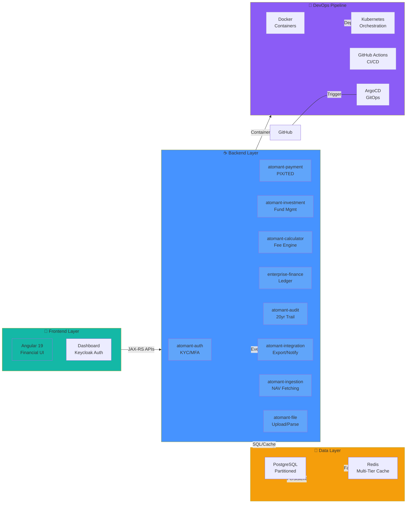

# 🗂️ Documentation & Specification

Welcome to the central documentation index for the **joelmaykon94** workspace. This repository represents a modern, clean-architecture banking platform integrating **Angular 19** frontends, **Java 21 / Quarkus** microservices, and automated **GitOps & DevOps** pipelines.

Use this dashboard to navigate the specifications, architecture constitutions, implementation plans, and visual diagrams across all sub-projects.

---

## 🏗️ Project Landscape & Tech Stack (Interactive)



---

## 📊 Technology Stack Overview


```
joelmaykon94/
├── angular/                 <-- Frontend Apps (Keycloak Auth, Financial Modules)
├── java/                    <-- Quarkus Backend Microservices (Hexagonal Architecture)
├── devops/                  <-- Docker Compose and Deployment configurations
└── docs/                    <-- Developer study guides, Visão Geral, and Docusaurus
```

---

## 🏛️ Architecture Constitutions

The architectural principles and design patterns are defined within each bounded context. Review these constitutions to ensure compliance during implementation:

* ☕ **Enterprise Financial Core**: [enterprise-financial-core Constitution](file:///home/joelmaykon/joelmaykon94/java/enterprise-financial-core/.specify/memory/constitution.md)
* 💳 **Payment Gateway**: [atomant-payment Constitution](file:///home/joelmaykon/joelmaykon94/java/atomant-payment/.specify/memory/constitution.md)
* 📈 **Investment Core**: [atomant-investment-core Constitution](file:///home/joelmaykon/joelmaykon94/java/atomant-investment-core/.specify/memory/constitution.md)
* 🔐 **Authentication Service**: [atomant-auth Constitution](file:///home/joelmaykon/joelmaykon94/java/atomant-auth/.specify/memory/constitution.md)
* 📊 **Financial Frontend**: [angular/financial Constitution](file:///home/joelmaykon/joelmaykon94/angular/financial/.specify/memory/constitution.md)
* 📂 **File Ingestion Processor**: [atomant-file-processor Constitution](file:///home/joelmaykon/joelmaykon94/java/atomant-file-processor/.specify/memory/constitution.md)
* 🔄 **Integration Gateway**: [atomant-integration Constitution](file:///home/joelmaykon/joelmaykon94/java/atomant-integration/.specify/memory/constitution.md)
* ➕ **Calculator Engine**: [atomant-calculator Constitution](file:///home/joelmaykon/joelmaykon94/java/atomant-calculator/.specify/memory/constitution.md)
* 🛡️ **Audit Ledger**: [atomant-audit Constitution](file:///home/joelmaykon/joelmaykon94/java/atomant-audit/.specify/memory/constitution.md)

---

## 📋 Java Microservice Specifications

### ☕ Enterprise Financial Core (`enterprise-financial-core`)
* 🔐 **API Protection & FAPI**: [zero_trust_api_gateway_fapi_spec.md](file:///home/joelmaykon/joelmaykon94/java/enterprise-financial-core/.specify/zero_trust_api_gateway_fapi_spec.md) — central API gateway using mTLS and PKCE.
* 🔎 **Risk Analysis Service**: [global_kyc_risk_analysis_spec.md](file:///home/joelmaykon/joelmaykon94/java/enterprise-financial-core/.specify/global_kyc_risk_analysis_spec.md) — internal PaaS reusable KYC and AML checks.
* ☁️ **Resilience & Cloud DORA**: [dora_compliance_cloud_resilience_spec.md](file:///home/joelmaykon/joelmaykon94/java/enterprise-financial-core/.specify/dora_compliance_cloud_resilience_spec.md) — high availability and failure recovery parameters.

### 💳 Payment Gateway (`atomant-payment`)
* 🏛️ **CQRS & Event Sourcing**: [cqrs_event_sourcing_payment_spec.md](file:///home/joelmaykon/joelmaykon94/java/atomant-payment/.specify/cqrs_event_sourcing_payment_spec.md) — event store for financial transaction data consistency.
* 👤 **Customer 360 Records**: [customer_360_golden_record_spec.md](file:///home/joelmaykon/joelmaykon94/java/atomant-payment/.specify/customer_360_golden_record_spec.md) — customer aggregate models and golden record views.
* 💸 **Financial Internal Transfers**: [financial_transfers_spec.md](file:///home/joelmaykon/joelmaykon94/java/atomant-payment/.specify/financial_transfers_spec.md) — pessimistic transaction locking for internal balances.
* ⚡ **Asynchronous Pix Handler**: [async_pix_spec.md](file:///home/joelmaykon/joelmaykon94/java/atomant-payment/.specify/async_pix_spec.md) — virtual-thread event processing over Apache Kafka.
* ⚖️ **AML Auditing Envers**: [regulatory_compliance_aml_audit_spec.md](file:///home/joelmaykon/joelmaykon94/java/atomant-payment/.specify/regulatory_compliance_aml_audit_spec.md) — immutable audit trails.
* 🔒 **Role Authorization**: [account_management_security_spec.md](file:///home/joelmaykon/joelmaykon94/java/atomant-payment/.specify/account_management_security_spec.md) — SmallRye JWT token rules for accounts.
* 📅 **Implementation Action Plan**: [tasks.md](file:///home/joelmaykon/joelmaykon94/java/atomant-payment/.specify/tasks.md) — execution phases for Phase 1-4.

### 📈 Investment Core (`atomant-investment-core`)
* 🧬 **Subclass Dynamic Generation**: [fund_subclass_dynamic_generation_spec.md](file:///home/joelmaykon/joelmaykon94/java/atomant-investment-core/.specify/fund_subclass_dynamic_generation_spec.md) — spawns up to 12 subclasses under a class.
* ⚖️ **Risk & Active Policy**: [class_risk_investment_policy_spec.md](file:///home/joelmaykon/joelmaykon94/java/atomant-investment-core/.specify/class_risk_investment_policy_spec.md) — portfolio benchmark compliance validation.
* 💵 **Custody Remuneration**: [custody_remuneration_spec.md](file:///home/joelmaykon/joelmaykon94/java/atomant-investment-core/.specify/custody_remuneration_spec.md) — high-precision custody fees using BigDecimal Banker's Rounding.
* 🚪 **State Navigation**: [demand_management_state_navigation_spec.md](file:///home/joelmaykon/joelmaykon94/java/atomant-investment-core/.specify/demand_management_state_navigation_spec.md) — state machine navigation rules.
* 🔗 **FIC Master Fund Integration**: [fic_master_fund_integration_spec.md](file:///home/joelmaykon/joelmaykon94/java/atomant-investment-core/.specify/fic_master_fund_integration_spec.md) — anti-corruption layer for Fund database.
* 📂 **Documentation Upload**: [fund_documentation_upload_service_spec.md](file:///home/joelmaykon/joelmaykon94/java/atomant-investment-core/.specify/fund_documentation_upload_service_spec.md) — file verification validations.
* ⏱️ **Deadlines & Schedules**: [fund_identification_deadlines_spec.md](file:///home/joelmaykon/joelmaykon94/java/atomant-investment-core/.specify/fund_identification_deadlines_spec.md) — scheduling rules.
* 🧮 **Portfolio Composition Matrix**: [portfolio_composition_matrix_spec.md](file:///home/joelmaykon/joelmaykon94/java/atomant-investment-core/.specify/portfolio_composition_matrix_spec.md) — matrix mappings.
* 📝 **Execution Plan**: [quarkus_implementation_plan.md](file:///home/joelmaykon/joelmaykon94/java/atomant-investment-core/.specify/quarkus_implementation_plan.md) — roadmap for implementation.

### 🔄 Integration Gateway (`atomant-integration`)
* 📊 **ERP Accounting Reconciliation**: [global_accounting_reconciliation_spec.md](file:///home/joelmaykon/joelmaykon94/java/atomant-integration/.specify/global_accounting_reconciliation_spec.md) — Quartz batch jobs reconciling ledger fees with the Enterprise ERP.
* 📡 **Kafka Change Data Capture (CDC)**: [legacy_decoupling_cdc_spec.md](file:///home/joelmaykon/joelmaykon94/java/atomant-integration/.specify/legacy_decoupling_cdc_spec.md) — Debezium Kafka streams decoupling card and loan mainframe silos.

### ➕ Calculation Engine (`atomant-calculator`)
* 🧮 **Interest Engine**: [universal_interest_calculation_engine_spec.md](file:///home/joelmaykon/joelmaykon94/java/atomant-calculator/.specify/universal_interest_calculation_engine_spec.md) — daily compounding interest computation.

---

## 🎨 System Architecture Diagrams

### 1. Zero-Trust API Gateway (Open Banking)


### 2. Fund Subclass Dynamic Generation


---

## 📐 Angular Frontend Specifications

* 🔑 **Keycloak User Authentication**: [angular/auth-keycloak Spec](file:///home/joelmaykon/joelmaykon94/angular/auth-keycloak/specs/001-bank-user-auth/spec.md)
* 🎛️ **Class Configuration Design**: [angular/financial Spec](file:///home/joelmaykon/joelmaykon94/angular/financial/.specify/class_configuration_design.md)

---

## 📚 Developer Guides & Study Resources (`docs/joel-dev`)

Explore detailed study logs, concept definitions, and tutorials inside our Docusaurus workspace:

* 🧭 **Visão Geral**: [Visão Geral da Arquitetura](file:///home/joelmaykon/joelmaykon94/docs/joel-dev/docs/arquitetura/visao-geral.md)
* ☕ **Advanced Java**: [Java Expert Guia de Estudo Profundo](file:///home/joelmaykon/joelmaykon94/docs/joel-dev/docs/java-expert/guia-estudo-profundo.md)
* 🤖 **Prompt Engineering**: [Estudo Profundo de Prompting](file:///home/joelmaykon/joelmaykon94/docs/joel-dev/docs/prompt-engineering/guia-estudo-profundo.md)
* ☸️ **GitOps & CI/CD**: [GitHub Actions Guide](file:///home/joelmaykon/joelmaykon94/docs/joel-dev/docs/gitops/github-actions.md) & [ArgoCD Guide](file:///home/joelmaykon/joelmaykon94/docs/joel-dev/docs/gitops/argocd.md)
* 🔍 **Observabilidade**: [SonarQube Guide](file:///home/joelmaykon/joelmaykon94/docs/joel-dev/docs/monitoramento/sonarqube.md)

---

## 🚀 How to Run locally

Refer to [devops/README.md](file:///home/joelmaykon/joelmaykon94/devops/README.md) for orchestrating PostgreSQL, Redpanda, Mock APIs, and the local Quarkus/Angular environment.
