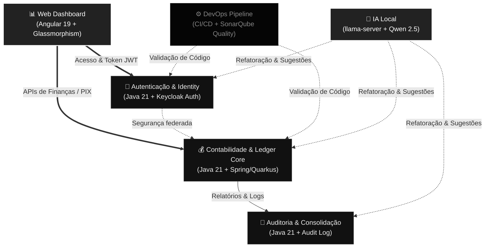

  <!-- Header Wave Render - Dracula Theme -->
  

  <!-- Background Banner -->
  

   

  <!-- Typing SVG - Dark Purple -->
  

  <!-- Core Badges - Dracula & Dark Purple Style -->
  
  
  
  
   
  
  <!-- Contador de Visitantes -->
  
 

---

## 👨‍💻 Sobre mim

Engenheiro de Software com **experiência consolidada desde 2018**. Minha filosofia de desenvolvimento é pautada na **simplicidade e eficiência**. Acredito que complexidade não é sinônimo de evolução e que, muitas vezes, "menos é mais".

---

## 🏗️ Arquitetura do Workspace & Fluxo do Sistema

Abaixo está o diagrama visual da comunicação dos serviços deste repositório e o detalhamento interativo de cada subprojeto:

 

### 📁 Estrutura de Diretórios Interativa

Clique em cada seção abaixo para expandir e explorar a função e stack de cada componente deste repositório:

  
<b>☕ java/ (Microsserviços Backend - Java 21)</b>

   
  <blockquote>
    <table>
      <thead>
        <tr>
          <th>Componente</th>
          <th>Diretório Local</th>
          <th>Propósito & Tecnologias</th>
        </tr>
      </thead>
      <tbody>
        <tr>
          <td>💰 <b>Financial Core</b></td>
          <td><a href="./java/atomant-financial-core"><code>java/atomant-financial-core</code></a></td>
          <td>Motor contábil e ledger financeiro distribuído de alta transacionalidade. Desenvolvido em Java 21 com foco em performance de banco.</td>
        </tr>
        <tr>
          <td>🔐 <b>Auth Service</b></td>
          <td><a href="./java/atomant-auth"><code>java/atomant-auth</code></a></td>
          <td>Microsserviço de gestão de tokens e integração com servidores de autenticação Keycloak.</td>
        </tr>
        <tr>
          <td>📝 <b>Audit Logger</b></td>
          <td><a href="./java/atomant-audit"><code>java/atomant-audit</code></a></td>
          <td>Processamento assíncrono e auditoria de eventos, transações e registros de sistema.</td>
        </tr>
      </tbody>
    </table>
  </blockquote>

  
<b>🅰️ angular/ (Aplicações Web Frontend - Angular 19)</b>

   
  <blockquote>
    <table>
      <thead>
        <tr>
          <th>Aplicação</th>
          <th>Diretório Local</th>
          <th>Propósito & Tecnologias</th>
        </tr>
      </thead>
      <tbody>
        <tr>
          <td>📊 <b>Financial Dashboard</b></td>
          <td><a href="./angular/financial"><code>angular/financial</code></a></td>
          <td>Painel web para gestão de contas e balanços. Utiliza Angular 19, Tailwind CSS e design system Glassmorphism de tons preto e prata.</td>
        </tr>
      </tbody>
    </table>
  </blockquote>

  
<b>🤖 local-llm/ (Iniciadores de Modelos de IA Offline)</b>

   
  <blockquote>
    <table>
      <thead>
        <tr>
          <th>Recurso</th>
          <th>Diretório Local</th>
          <th>Propósito & Tecnologias</th>
        </tr>
      </thead>
      <tbody>
        <tr>
          <td>🧠 <b>LLM Coder Host</b></td>
          <td><a href="./local-llm"><code>local-llm/</code></a></td>
          <td>Setup para rodar servidores locais do <code>Qwen 2.5 Coder</code> (1.5B/7B) via <code>llama.cpp</code> na CPU/GPU do próprio computador, integrando com extensões como o Continue.</td>
        </tr>
      </tbody>
    </table>
  </blockquote>

 

---

## 🛠️ Tech Stack (Specialist Focus)

| Categoria | Tecnologias Chave |
|-----------|------------------|
| **BACKEND** |      |
| **FRONTEND** |  |
| **ARQUITETURA** |  |
| **DEVOPS** |     |
| **BANCOS DE DADOS** |   |

---

## 💼 Experiência Profissional Recente

| Período | Cargo / Empresa | Impacto Principal |
|---------|----------------|-------------------|
| 05/2026 – Atual | Analista Senior Plataforma Baixa – EngeSoftware (CEF - Bank Federal) | Modernização Java & Angular. |
| 05/2025 – 12/2025 | Assessor Especial – Pref. de Parnamirim/RN | Modernização Java, Angular & Quarkus via K8s e GitOps. |
| 09/2023 – 07/2024 | Eng. de IA Conversacional – Mutant (Vivo) | Fluxos LLM para milhões de usuários. |

---

## 📊 Estatísticas e Métricas do GitHub

  <table border="0" cellpadding="0" cellspacing="0" width="100%">
    <tr>
      <td width="50%" align="center">
        <!-- Estatísticas Gerais do GitHub -->
        
      </td>
      <td width="50%" align="center">
        <!-- Linguagens Mais Utilizadas -->
        
      </td>
    </tr>
  </table>

 

  <!-- Gráfico de Atividade de Commits -->
  

  <!-- Streak de Contribuições (Consistência) -->
  
  
  <!-- Troféus de Conquistas (Dracula Style) -->
  

---

  
<i>"A complexidade é um sinal de que você não entendeu o problema. A simplicidade é a sofisticação máxima."</i>

---
 
## 🔗 Vamos nos conectar?

 
   
  

  <!-- Footer Wave Render - Dracula Theme -->
  

