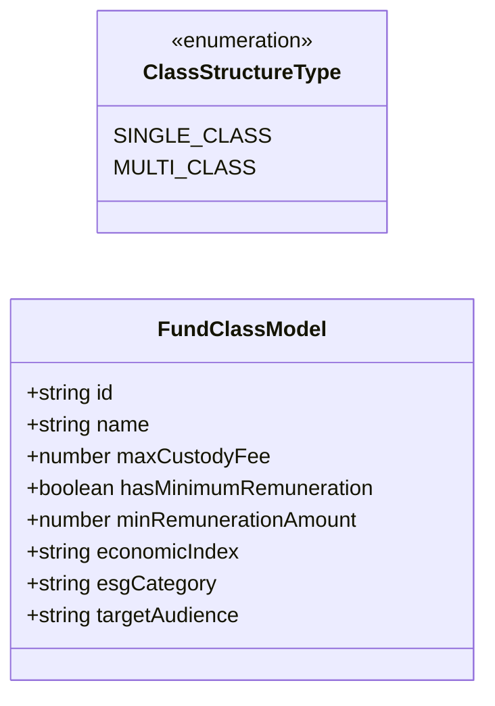
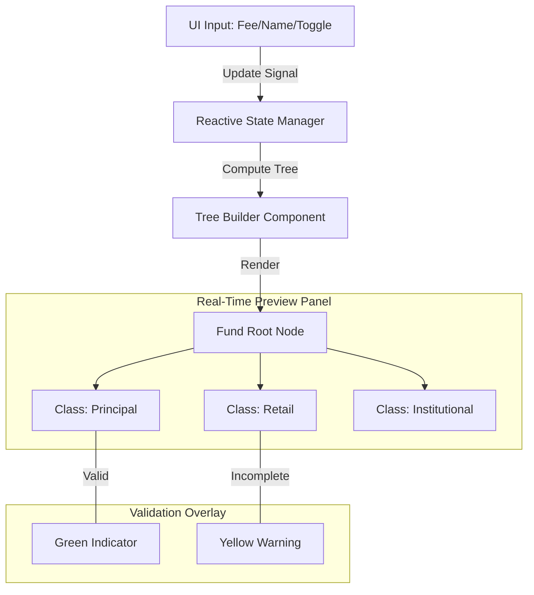

# Class Configuration Module: Implementation & Design Report

This document outlines the architecture, design choices, and implementation details for the **Investment Fund - Class Configuration** module.

---

## 1. Module Overview & Goals

The Class Configuration module allows specialists to define the class structure of an investment fund, set maximum custody fees, select ESG tags, select target audiences, and define conditional minimum custody remuneration.

Key features implemented:
- **Rule 1: Dynamic Tabs & Structure Selection:** Radio/segmented control to choose between "Single Class" and "Multiple Classes (up to 3)". If multiple classes are enabled, the UI displays dynamic tabs ("Classe Principal", "Classe Varejo", "Classe Institucional") that allow adding, editing, and deleting classes in real-time.
- **Rule 2: Custody Remuneration:**
  - "Maximum Custody Fee %" field with a 4 decimal place precision format (`0.0000%`).
  - "Minimum Remuneration" toggle. If enabled, it shows:
    - "Valor Mínimo Fixo Anual (R$)" input (with currency mask/prefix `R$ `).
    - "Índice Econômico de Correção" select dropdown containing generic index tags (CDI, IPCA, IGP-M, SELIC).
- **Rule 3: Generic Taxonomy:** Includes ESG categories (ESG Integration, Impact Investing) and Target Audiences (General, Qualified, Professional) aligned with standard taxonomy.
- **Interactive Tree Builder Preview:** Real-time hierarchical diagram representing the fund structure tree (Fund -> Active Classes) on the right side of the screen, updating in real-time. This implements a full **builder component** interface.

---

## 2. Component Files

The following files were created or modified:
1. **Component Logic:** [class-configuration.ts](file:///home/joelmaykon/joelmaykon94/angular/financial/src/app/class-configuration/class-configuration.ts) - Manages signal states, reactive array modifications, change notifications, and validation logic.
2. **Template Layout:** [class-configuration.html](file:///home/joelmaykon/joelmaykon94/angular/financial/src/app/class-configuration/class-configuration.html) - Renders forms, class tabs, validation error panels, and the interactive tree layout.
3. **Vitest Unit Tests:** [class-configuration.spec.ts](file:///home/joelmaykon/joelmaykon94/angular/financial/src/app/class-configuration/class-configuration.spec.ts) - 8 test cases verifying dynamic tab additions, tab removal bounds, fee precision limits, index requirements, and saving simulation.
4. **App Container Integrations:** [app.ts](file:///home/joelmaykon/joelmaykon94/angular/financial/src/app/app.ts) & [app.html](file:///home/joelmaykon/joelmaykon94/angular/financial/src/app/app.html) - Integrated as a third tab in the sidebar linked to the `Wallet` icon.

---

## 3. Class Configuration Data Model

### Data Model Description
The class diagram above defines the relationship between the fund's configuration and its associated classes. 
- **ClassStructureType**: An enumeration that determines if the fund follows a simple single-class structure or a complex multi-class setup.
- **FundClassModel**: The core entity representing an individual class. It contains attributes for financial parameters (fees, remuneration), regulatory metadata (ESG, target audience), and state management (minimum remuneration toggle).

---

## 4. UI/UX & Interactive Tree Builder (Builder Component)

### Interactive Tree Builder Flow

### Tree Builder Description
The flow diagram illustrates how user inputs in the configuration forms are propagated to the live preview tree. 
- **Reactive State Manager**: Uses Angular Signals to track every field change.
- **Tree Builder Component**: A specialized component that transforms the flat list of classes into a hierarchical SVG or HTML-based tree.
- **Validation Overlay**: Provides immediate visual feedback within the tree nodes, helping users identify incomplete configurations without leaving the "Builder" view.

> [!NOTE]
> To comply with the "frontend is builder component" request, the interface displays a **live preview tree** representing the fund composition:
> - **Top-level Node:** Fund (Single or Multi-class tag).
> - **Child Nodes:** Real-time cards representing each configured class.
> - **Live Updates:** Changes to custody fees, minimum values, indexes, or names automatically reflect inside the card structure, giving backoffice users an immediate overview of the fund topography.

---

## 5. Unit Testing Execution

All tests execute successfully under Vitest and JSDOM.

| Test File | Description | Status |
| :--- | :--- | :--- |
| [app.spec.ts](file:///home/joelmaykon/joelmaykon94/angular/financial/src/app/app.spec.ts) | Core app rendering | **PASSED** |
| [portfolio-composition.spec.ts](file:///home/joelmaykon/joelmaykon94/angular/financial/src/app/portfolio-composition/portfolio-composition.spec.ts) | Portfolio compositions and accordions | **PASSED** |
| [class-configuration.spec.ts](file:///home/joelmaykon/joelmaykon94/angular/financial/src/app/class-configuration/class-configuration.spec.ts) | Class settings, dynamic tab limits, remuneration validation, and index selections | **PASSED** |

> [!TIP]
> The test suite uses the `onFieldsChange()` change detection helper to force-trigger computed signal re-evaluation whenever properties inside the reactive list are mutated, guaranteeing that tests and components remain in sync.
