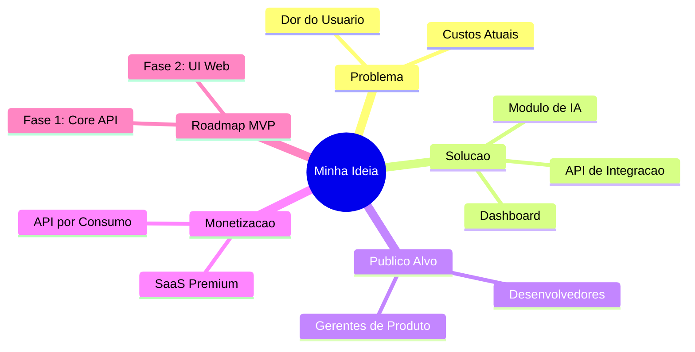
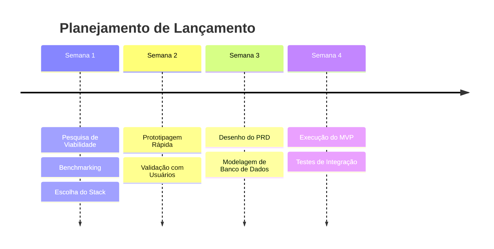

# 💡 Fase 1: Ideação (Idea)

Este arquivo serve como template para registrar, estruturar e refinar ideias de projetos utilizando inteligência artificial. O foco aqui é o brainstorming, identificação de problemas e definição de alto nível da proposta de valor.

---

## 🎯 1. Definição da Ideia

### 1.1 O Problema
*Descreva com clareza o problema do mundo real que você está tentando resolver. Quem sofre com esse problema? Qual é a dor atual do usuário?*
- **Pain point principal:** 
- **Impacto:** 
- **Alternativas atuais (gambiarras):** 

### 1.2 A Solução
*Apresente a solução conceitual. Como a tecnologia/software resolverá o problema citado?*
- **Abordagem técnica:** 
- **Diferencial competitivo:** 

### 1.3 Público-Alvo e Persona
*Quem utilizará o sistema? Defina o perfil dos usuários.*
- **Persona primária:** 
- **Setor/Nicho:** 

---

## 💎 2. Proposta de Valor e MVP

### 2.1 Proposta de Valor Única (UVP)
*Uma frase simples que explica por que a solução é valiosa e única.*
> "Nós ajudamos [Público-Alvo] a resolver [Problema] por meio de [Solução], economizando [Métrica de Sucesso]."

### 2.2 Escopo do MVP (Minimum Viable Product)
*Defina as funcionalidades mínimas necessárias para lançar e validar a ideia.*
- [ ] Funcionalidade essencial 1
- [ ] Funcionalidade essencial 2
- [ ] Funcionalidade essencial 3

---

## 🗺️ 3. Ecossistema da Ideia (Mermaid Mindmap)

Abaixo está um mapa mental estruturando os fluxos de valor, módulos iniciais e integrações do sistema.

---

## 🚀 4. Próximos Passos (Timeline)

---

> [!TIP]
> **Como interagir com a IA nesta fase:**
> Cole este template para a IA e peça:
> *"Aja como um Product Manager sênior. Baseado no problema X, me ajude a preencher as seções de Solução e Proposta de Valor deste template, expandindo o Mindmap do Mermaid para cobrir mais casos de uso."*

# react 