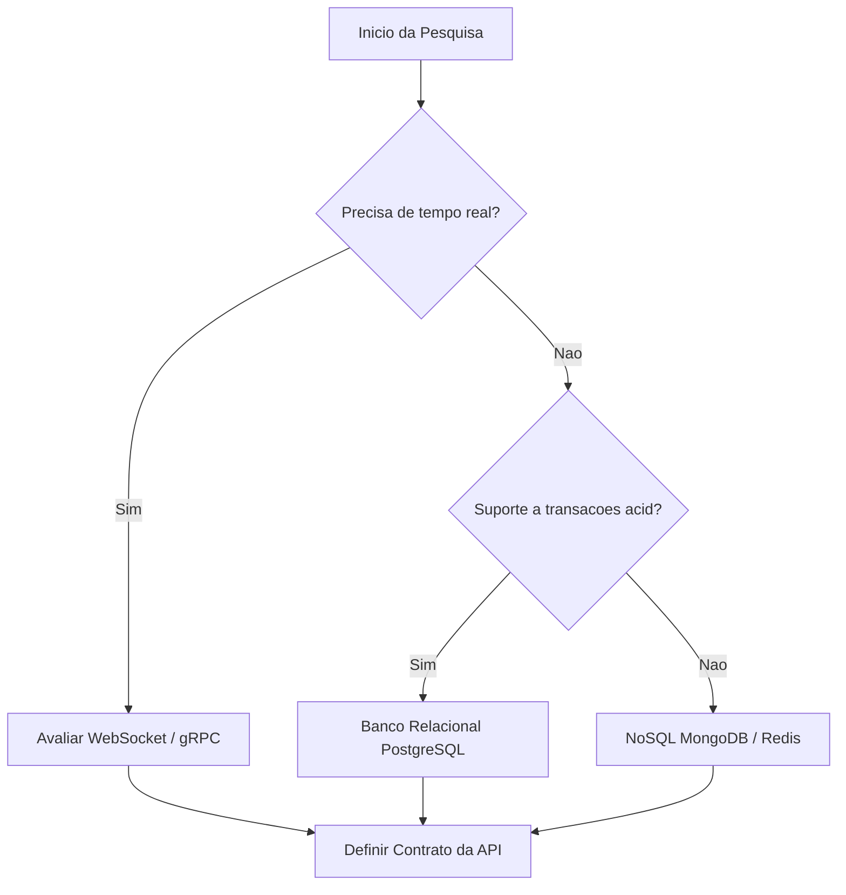

# 🔍 Fase 2: Pesquisa e Viabilidade (Research)

Este arquivo serve como template para registrar a pesquisa técnica, viabilidade do projeto, comparação de bibliotecas/frameworks e decisões arquiteturais preliminares com o suporte de IA.

---

## 🔬 1. Análise de Viabilidade Técnica

### 1.1 Estado da Arte
*Quais são as soluções existentes ou concorrentes? Como o mercado resolve este problema hoje?*
- **Concorrente/Padrão A:** *(Prós/Contras)*
- **Concorrente/Padrão B:** *(Prós/Contras)*

### 1.2 Limitações de Infraestrutura e Stack
- **Banco de Dados sugerido:** 
- **Linguagens e Frameworks:** 
- **Integrações de Terceiros (APIs):** 

---

## 📊 2. Comparativo de Tecnologias (Quadrant Chart)

Use este gráfico para mapear e decidir quais tecnologias ou bibliotecas valem a pena incluir no projeto com base na relação entre o **Valor entregue** e o **Esforço de implementação**.

```mermaid
quadrant-chart
    title Analise de Bibliotecas para o Stack
    x-axis Baixo Valor --> Alto Valor
    y-axis Alto Esforco --> Baixo Esforco
    "Framework Complexo (ex: Django)" : [0.3, 0.2]
    "Microframework Rápido (ex: FastAPI)" : [0.85, 0.8]
    "Banco de Dados NoSQL (Mongo)" : [0.6, 0.7]
    "ORMs Pesados" : [0.4, 0.4]
    "Integração com LLM via LangChain" : [0.8, 0.6]
    "Solução sob medida (In-house)" : [0.2, 0.1]
```

---

## 🔀 3. Fluxo de Tomada de Decisão (Decision Flow)

Representação visual do caminho de tomada de decisão técnica para a arquitetura.



---

## 🛡️ 4. Análise de Riscos e Mitigações

| Risco Técnico | Probabilidade | Impacto | Estratégia de Mitigação |
| :--- | :---: | :---: | :--- |
| **Escalabilidade da API** | Média | Alto | Utilizar cache Redis e paginação pesada |
| **Vazamento de chaves de API** | Baixa | Crítico | Utilizar `python-dotenv` e secrets manager da AWS/GitHub |
| **Latência na resposta da IA** | Alta | Médio | Implementar respostas assíncronas (Celery / Background Tasks) |

---

> [!NOTE]
> **Como interagir com a IA nesta fase:**
> Pergunte à IA:
> *"Com base no meu MVP do arquivo 1-idea.md, analise o mercado atual de bibliotecas Python para [Funcionalidade X]. Monte uma tabela comparativa com prós/contras das 3 principais ferramentas e me sugira como posicioná-las no Quadrant Chart do Mermaid."*
