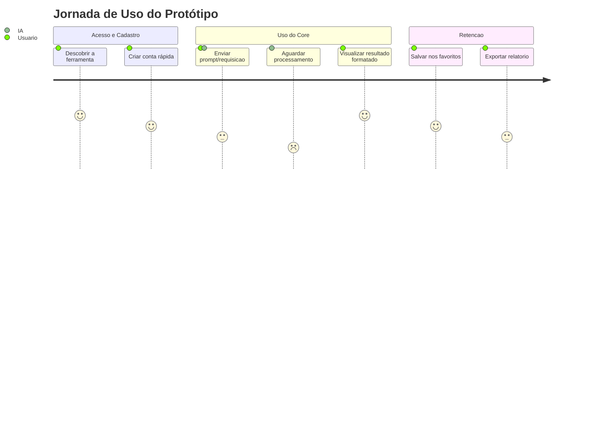
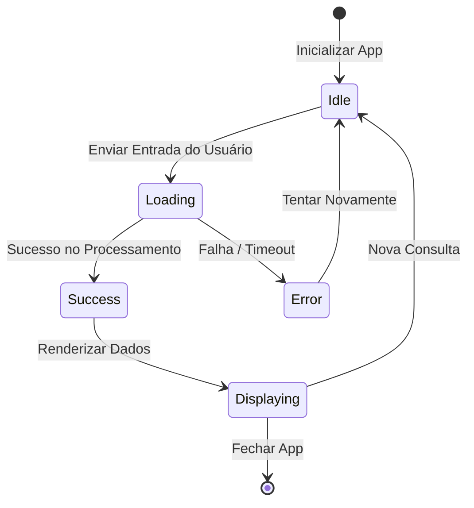

# 🧪 Fase 3: Protótipo (Prototype)

Este arquivo serve como template para planejar, mapear os fluxos e documentar as provas de conceito (PoC) rápidas construídas com IA para validar a usabilidade e o fluxo lógico do sistema.

---

## 🎨 1. Escopo do Protótipo

### 1.1 Objetivos de Validação
*O que este protótipo precisa provar/validar? (Ex: tempo de resposta da API, usabilidade do fluxo de checkout, etc.)*
- **Validação Lógica:** 
- **Validação de Interface:** 

### 1.2 Mocks e Stubs necessários
*Quais dados ou APIs externas serão simulados nesta fase para acelerar a validação?*
- `API de IA`: Mock de texto estático para evitar custos de token.
- `Banco de Dados`: Banco em memória (`SQLite` local ou dicionários em memória).

---

## 🗺️ 2. Jornada do Usuário (User Journey)

Abaixo está o mapeamento da jornada do usuário pelo protótipo, identificando pontos de fricção e sentimentos em cada etapa.

---

## ⚙️ 3. Diagrama de Estados do Protótipo (State Diagram)

Mapeamento dos estados possíveis que a aplicação pode assumir durante o fluxo do protótipo.

---

## 📝 4. Lições Aprendidas e Feedback do Usuário

Use esta seção para documentar o que funcionou e o que deve ser modificado antes do desenvolvimento final.

- **O que funcionou:** 
- **Pontos de atenção/gargalos:** 
- **Ajustes necessários no design:** 

---

> [!TIP]
> **Como interagir com a IA nesta fase:**
> Peça para a IA:
> *"Com base no fluxo de estados mapeado no diagrama Mermaid de stateDiagram-v2 acima, crie um script rápido de demonstração em Python usando Streamlit ou CLI para simular essa experiência interativa de forma funcional em menos de 100 linhas de código."*
