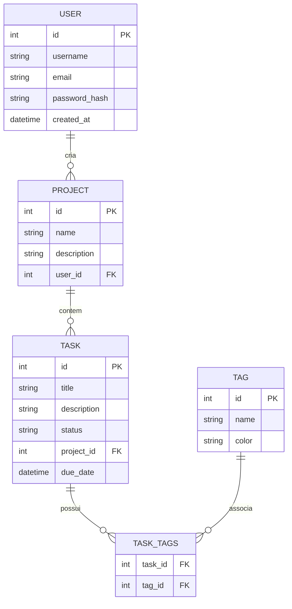

# 📄 Fase 4: Requisitos e Modelo de Dados (PRD)

Este arquivo serve como template para o **Product Requirements Document (PRD)**. Aqui definimos as regras de negócio rígidas, escopo detalhado, limites do sistema, e o modelo de dados que guiará a implementação.

---

## 📋 1. Requisitos do Sistema

### 1.1 Requisitos Funcionais (RF)
*Funcionalidades explícitas e comportamentos esperados do sistema.*

| ID | Descrição | Prioridade |
| :--- | :--- | :---: |
| **RF-001** | O usuário deve ser capaz de criar, editar e deletar tarefas no sistema. | Alta |
| **RF-002** | O sistema deve persistir os dados em um banco de dados relacional. | Alta |
| **RF-003** | O usuário deve conseguir categorizar as tarefas por tags. | Média |
| **RF-004** | O sistema deve exportar relatórios de progresso das tarefas em formato JSON. | Baixa |

### 1.2 Requisitos Não-Funcionais (RNF)
*Características sistêmicas (performance, segurança, manutenibilidade).*

| ID | Descrição | Categoria |
| :--- | :--- | :--- |
| **RNF-001** | As consultas ao banco de dados não devem demorar mais que 200ms. | Performance |
| **RNF-002** | O código deve seguir as normas de linting do Ruff e type-hints estritos com Mypy. | Manutenibilidade |
| **RNF-003** | Toda requisição à API deve ser autenticada via JWT. | Segurança |

---

## 🗄️ 2. Modelo de Dados (Entity Relationship Diagram - ERD)

Especificação detalhada das tabelas, tipos de dados e os relacionamentos do banco de dados relacional.



---

## 🌐 3. Contratos de API (Endpoints principais)

### 3.1 Criar Tarefa
- **Endpoint:** `POST /api/v1/tasks`
- **Autenticação:** Bearer Token (JWT)
- **Request Body:**
```json
{
  "title": "Configurar ambiente Poetry",
  "description": "Criar dependências e arquivos de template",
  "project_id": 1,
  "due_date": "2026-06-15T12:00:00Z"
}
```
- **Responses:**
  - `201 Created`
  - `400 Bad Request`

---

> [!IMPORTANT]
> **Como interagir com a IA nesta fase:**
> Peça para a IA:
> *"Com base no diagrama de relacionamento de entidades (ERD) definido em Mermaid acima, gere os modelos SQLAlchemy em Python, incluindo as validações de tipos necessárias e os relacionamentos de chave estrangeira."*
