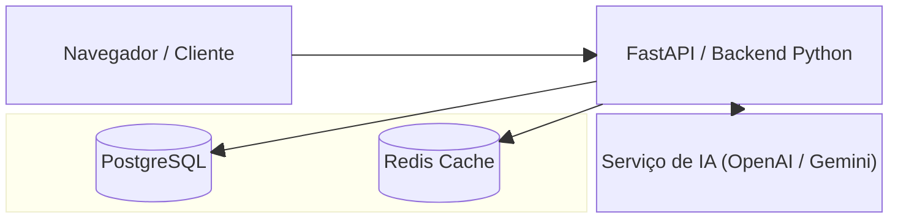
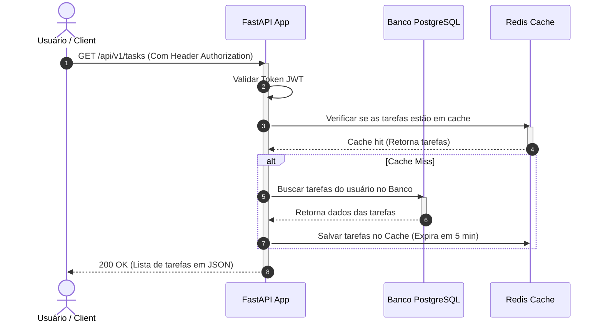

# 🚀 Fase 6: Execução e Desenvolvimento (Execution)

Este arquivo serve como template para guiar o desenvolvimento do código-fonte, estruturar o diretório do projeto, organizar as dependências do Poetry, e documentar os diagramas de sequência dos fluxos de runtime.

---

## 📂 1. Estrutura Recomendada do Projeto

Abaixo está o layout padrão para projetos Python estruturados com Poetry:

```
python/poetry/
├── pyproject.toml         # Gerenciamento de dependências (Poetry)
├── README.md              # Documentação geral de execução
├── poetry.lock            # Lockfile das dependências instaladas
├── app/
│   ├── __init__.py
│   ├── main.py            # Ponto de entrada da aplicação
│   ├── config.py          # Configurações de ambiente (.env)
│   ├── database.py        # Conexão com banco de dados e ORM
│   ├── models/            # Modelos do banco de dados (SQLAlchemy)
│   ├── schemas/           # Validação de dados (Pydantic)
│   └── routes/            # Rotas e controladores da API
└── tests/                 # Pasta de testes automatizados (pytest)
```

---

## 🏗️ 2. Arquitetura Físico-Lógica (Block Diagram)

A estrutura de comunicação física dos componentes durante a execução da aplicação:



---

## 🔄 3. Fluxo de Runtime da Aplicação (Sequence Diagram)

O diagrama abaixo representa a sequência de operações quando o usuário realiza uma requisição de listagem de tarefas protegida por autenticação.



---

## 📜 4. Diretrizes de Codificação (Code Rules)
1. **Tipagem Estrita:** Use anotações de tipo em todas as funções e retornos.
2. **Tratamento de Exceções:** Nunca use blocos `try-except` vazios. Sempre logue os erros com a biblioteca padrão ou com o `loguru`.
3. **Migrações:** Toda alteração de modelo de dados deve possuir sua migração criada pelo `alembic`.

---

> [!TIP]
> **Como interagir com a IA nesta fase:**
> Peça para a IA:
> *"Com base no fluxo de execução mapeado em 6-execution.md, crie a rota GET `/api/v1/tasks` com FastAPI. Implemente a lógica de cache usando Redis, seguindo a lógica do diagrama de sequência."*
