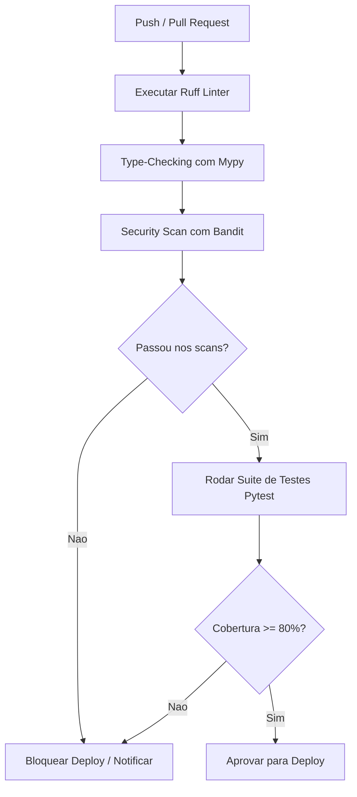
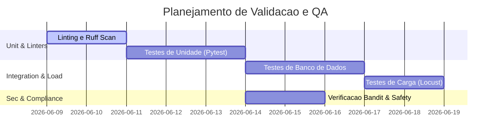

# 🧪 Fase 7: Garantia de Qualidade e Testes (QA)

Este arquivo serve como template para planejar a estratégia de testes, definir os cenários de aceitação de comportamento (BDD) e orquestrar as validações do pipeline de integração contínua (CI/CD) com IA.

---

## 📐 1. Estratégia de Cobertura de Testes

Buscamos atingir uma cobertura mínima de **80%** do código-fonte. Nossa suíte é dividida em três camadas principais:

### 1.1 Camadas de Testes
- **Testes Unitários (Fast/Isolated):** Testam lógica pura de funções, validadores de schemas e serializações. Não tocam em I/O (mocks de BD e de APIs).
- **Testes de Integração (Middle):** Validam rotas da API, comportamento do banco de dados (usando uma instância SQLite local de testes ou Docker).
- **Testes E2E (Slow/Systemic):** Simulam a jornada completa do cliente, validando o fluxo de ponta a ponta.

---

## 🔄 2. Pipeline de Testes e Qualidade (Flowchart)

Representação visual das verificações de segurança, linting e testes que ocorrem a cada Push ou Pull Request no GitHub.



---

## 📅 3. Cronograma e Planejamento de Testes (Gantt)

Cronograma visual das etapas de QA ao longo de um ciclo de desenvolvimento de feature.



---

## 📌 4. Cenários de Aceitação (BDD - Gherkin Syntax)

Utilize esta seção para descrever cenários em português estruturado para guiar testes de integração:

```gherkin
Cenário: Tentativa de criação de tarefa sem autenticação válida
  Dado que o usuário não está logado na aplicação
  Quando ele enviar uma requisição POST para "/api/v1/tasks" com o corpo correto
  Então o sistema deve retornar o código HTTP 401 Unauthorized
  E a mensagem de erro deve conter "Token inválido ou ausente"
```

---

> [!TIP]
> **Como interagir com a IA nesta fase:**
> Peça para a IA:
> *"Com base no cenário Gherkin descrito acima em 7-qa.md, gere a implementação de teste automatizado utilizando Pytest e FastAPI TestClient, garantindo o assert correto do status code e o retorno da mensagem de erro."*
