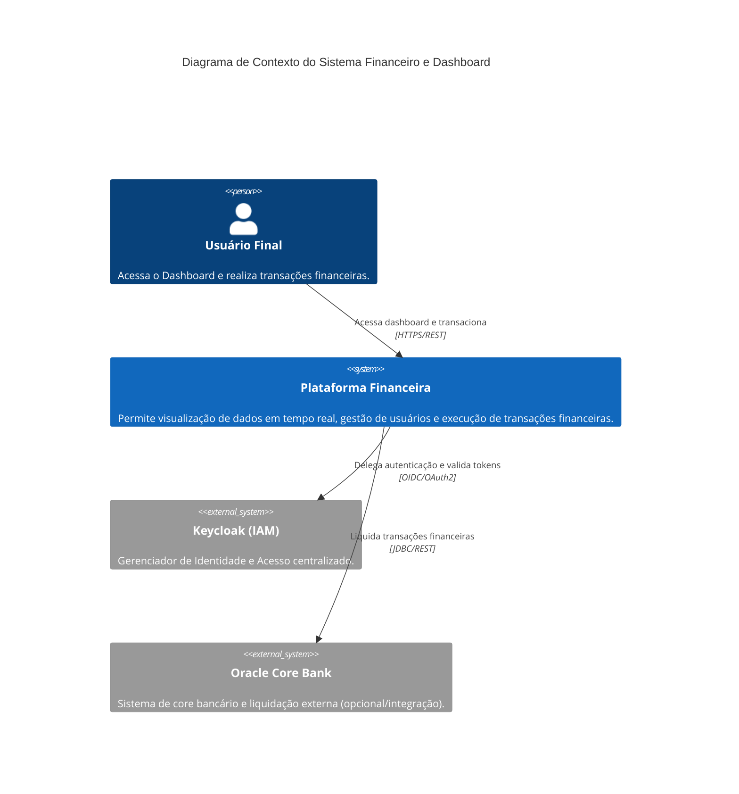
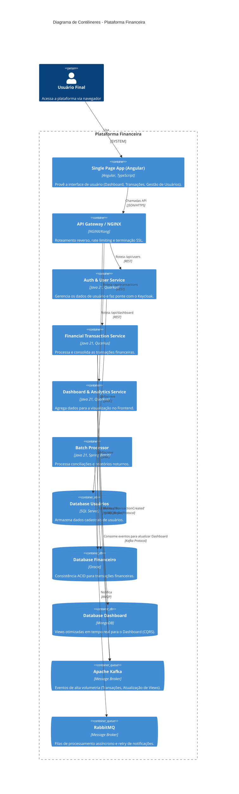

# 1. Visão Geral da Arquitetura

O sistema é desenhado como uma arquitetura de Microsserviços, focada em alta escalabilidade, resiliência e manutenção a longo prazo, atendendo a domínios complexos de finanças e gestão de usuários.

## Contexto do Sistema (C4 Model - Nível 1)

## Arquitetura de Contêineres (C4 Model - Nível 2)

## Resumo Tecnológico e Padrões
- **Padrões Arquiteturais:** API Gateway, CQRS (Command Query Responsibility Segregation), Event-Driven Architecture, Database-per-service.
- **Integração:** Orquestração no Frontend (BFF opcional) ou direto via API Gateway. Comunicação assíncrona entre serviços via Kafka.
