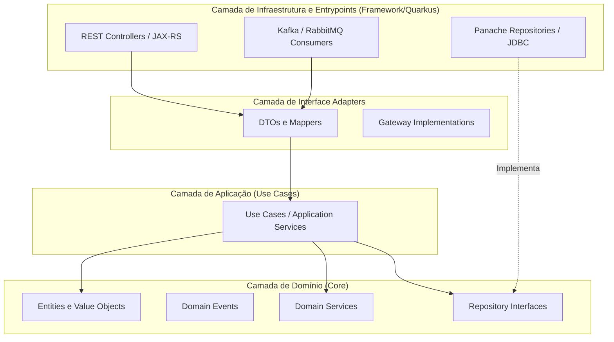

# 2. Domain-Driven Design (DDD) e Clean Architecture

A modelagem da solução é baseada em Domain-Driven Design (DDD) para identificar os Bounded Contexts, aliada à Clean Architecture para isolamento das regras de negócio do framework técnico.

## Bounded Contexts Identificados

1. **Contexto de Autenticação e Usuário (Identity & Access Context):**
   - **Linguagem Ubíqua:** Usuário, Perfil, Permissão, Credencial, Token.
   - **Responsabilidade:** Manter o ciclo de vida do cadastro do usuário. A autenticação forte é delegada ao Keycloak, mas regras de perfil e informações estendidas ficam neste domínio.

2. **Contexto Financeiro (Financial Transaction Context):**
   - **Linguagem Ubíqua:** Conta, Transação, Débito, Crédito, Saldo, Estorno.
   - **Responsabilidade:** Core da aplicação. Assegura as propriedades ACID para manipulação de saldos e registros de transação.

3. **Contexto de Dashboard e Análise (Analytics & Dashboard Context):**
   - **Linguagem Ubíqua:** Métrica, Visão, Resumo, Indicador, Gráfico.
   - **Responsabilidade:** Escutar eventos dos demais contextos e consolidar dados otimizados para leitura (Projeções de Leitura em MongoDB).

## Clean Architecture nos Microsserviços (Quarkus)

Para garantir que o código seja testável (TDD/BDD) e independente de infraestrutura, os microsserviços seguem as camadas:

### Regras de Ouro
- A camada de **Domínio** não possui anotações do Quarkus, JPA, Jackson ou mensageria. É puro Java (`record`, `class`).
- A camada de **Aplicação** orquestra as entidades de domínio e os repositórios (interfaces).
- A camada de **Infraestrutura** injeta os repositórios reais, conectores de API (Keycloak, etc) e manipula transações de banco (Ex: `@Transactional`).
