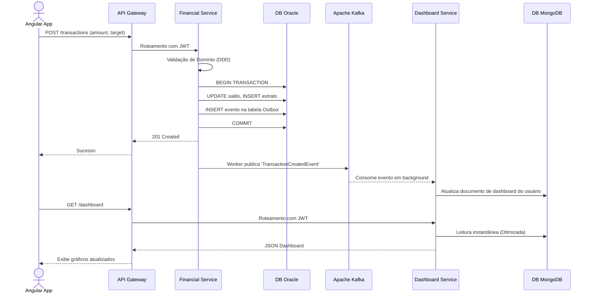

# 3. Ecossistema de Microsserviços

Esta seção detalha as responsabilidades e configurações dos serviços que compõem o ecossistema.

## Padrão Base: Java 21 + Quarkus

Escolhemos **Quarkus** com **Java 21** (Virtual Threads prontas para uso) devido ao seu rápido tempo de inicialização (ideal para Kubernetes) e baixo consumo de memória em relação ao Spring Boot padrão, além de possuir compilação nativa via GraalVM, o que é excelente para resiliência no cluster.

### 1. Auth & User Service
- **Responsabilidade:** Operações CRUD de usuários, integração via API com o Keycloak para delegação de Senhas e OAuth2.
- **Banco de Dados:** **SQL Server**.
- **Comunicação:** Disponibiliza API REST de `/users`. Publica evento `UserCreatedEvent` no RabbitMQ/Kafka.
- **Clean Arch:** 
  - `User` (Entity), `Email` (Value Object).
  - Portas para `KeycloakAdminClient` (para criar o usuário de forma sistêmica).

### 2. Financial Transaction Service
- **Responsabilidade:** Realizar pagamentos, transferências e estornos. Onde o "dinheiro muda de mãos".
- **Banco de Dados:** **Oracle** (Escolhido por alta confiabilidade transacional em ambientes financeiros).
- **Comunicação:** 
  - Recebe comandos POST `/transactions`.
  - Valida regras de negócio de saldo.
  - **Outbox Pattern:** Quando uma transação é concluída no Oracle, um registro é inserido na mesma transação em uma tabela de outbox. Um worker Quarkus ou Debezium lê essa tabela e publica no **Apache Kafka**.

### 3. Dashboard Service (CQRS - Read Side)
- **Responsabilidade:** Entregar a tela principal (dashboard) de forma extremamente rápida. Evita sobrecarregar o SQL Server e Oracle com querys analíticas pesadas.
- **Banco de Dados:** **MongoDB** (Modelagem baseada em documentos para respostas rápidas de JSON e agregações).
- **Comunicação:**
  - Consome tópicos do **Kafka** (`transaction-events`, `user-events`).
  - Atualiza as "Materialized Views" (Documentos) no MongoDB em tempo real.
  - Disponibiliza GET `/dashboard/metrics`.

### 4. Batch Processing Service
- **Tecnologia:** **Spring Batch** + Java 21. 
*(Nota: Spring Batch é maduro e superior para rotinas noturnas pesadas comparado ao ecossistema do Quarkus purista)*.
- **Responsabilidade:** Rotinas de fim de dia (EOD), consolidação de relatórios regulatórios, conciliação de transações que ficaram pendentes.
- **Agendamento:** Cronjobs Kubernetes ou chamadas via REST/Quartz.
- **Comunicação:** Dispara mensagens no **RabbitMQ** para o serviço de notificação ao finalizar o lote.

## Diagrama de Sequência de Transação com CQRS e Mensageria

