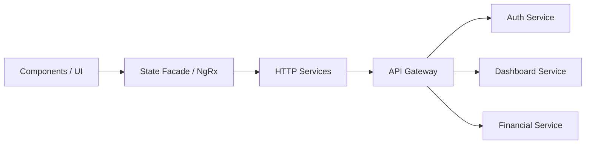

# 4. Frontend em Angular

A interface de usuário é construída com **Angular**. Esta escolha se baseia em sua robustez para aplicações corporativas, suporte nativo a TypeScript e arquitetura opinada.

## Estrutura do Projeto Angular

O frontend é modularizado (Feature Modules / Standalone Components) refletindo os contextos de negócio:

- `src/app/core/`: Serviços globais (AuthService, HTTP Interceptors, Guards).
- `src/app/shared/`: Componentes visuais reutilizáveis (Botões, Modais, Tabelas, Pipes).
- `src/app/features/auth/`: Telas de Login e Cadastro (integração Keycloak/OIDC).
- `src/app/features/dashboard/`: Gráficos e resumos financeiros.
- `src/app/features/transactions/`: Telas de extrato e formulários de transferência.
- `src/app/features/users/`: Gestão de perfil e usuários.

## Gerenciamento de Estado e Comunicação

- **NgRx (Opcional) / Signals:** Utilização do Angular Signals para reatividade local ou NgRx para gestão de estado global complexo (como dados do usuário autenticado).
- **HTTP Interceptor:** Um interceptor é responsável por capturar o token JWT do Keycloak e injetar no header `Authorization: Bearer <token>` de todas as requisições, bem como tratar erros 401/403 para forçar logout ou renovação do token (refresh token).

## Bibliotecas Complementares
- **Estilização:** TailwindCSS ou Angular Material para agilidade e consistência visual.
- **Gráficos:** Chart.js ou ECharts para o Dashboard.
- **Testes:** Jasmine/Karma para unitários, Cypress para End-to-End (E2E).
