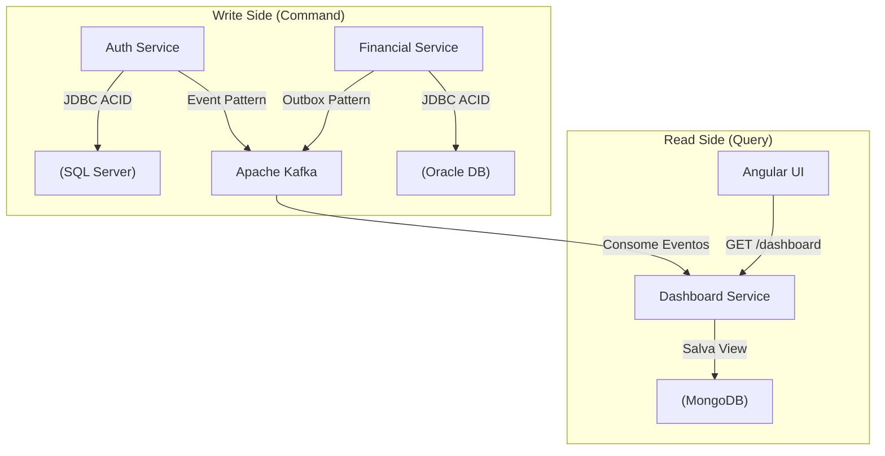

# 5. Bancos de Dados e Persistência

Para garantir a melhor ferramenta para cada tipo de problema (Poliglota), o sistema adota a estratégia **Database-per-Service**.

## 1. Banco de Dados Oracle (Financial Service)
O domínio financeiro exige o mais alto nível de confiabilidade (ACID estrito).
- **Motivo:** Transações financeiras, conciliações, concorrência pesada (lock otimista/pessimista).
- **Modelo:** Relacional tradicional.
- **Tabelas Principais:** `Account`, `Transaction`, `Ledger`, `OutboxEvent`.

## 2. Banco de Dados SQL Server (Auth & User Service)
O domínio de usuários guarda dados corporativos estruturados.
- **Motivo:** Adequação ao ecossistema corporativo para gestão de dados cadastrais.
- **Modelo:** Relacional.
- **Tabelas Principais:** `UserProfile`, `Preferences`, `UserAudit`.

## 3. Banco de Dados MongoDB (Dashboard Service)
O dashboard precisa exibir dados instantaneamente, sem joins complexos.
- **Motivo:** Estrutura de documentos (JSON-like) é perfeita para armazenar as "Materialized Views" (Visões consolidadas) geradas a partir de eventos (CQRS - Read Side).
- **Modelo:** NoSQL / Coleções de Documentos.
- **Coleções Principais:** `UserDashboardView`, `MonthlyMetrics`.

## Padrão de Integração de Dados
Nenhum microsserviço acessa o banco de dados do outro. Se o Dashboard precisa de um dado do Financeiro ou de Usuários, ele não faz querys cruzadas. Ele consome os eventos do Kafka e atualiza sua base MongoDB.

