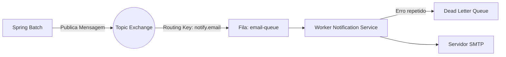

# 6. Mensageria e Eventos (Kafka & RabbitMQ)

O sistema utiliza dois brokers distintos, cada um para um propósito específico (Event-Driven Architecture vs Task Queues).

## Apache Kafka (Event Streaming / Core Choreography)

O Kafka é utilizado para **Publish-Subscribe** de eventos de negócio em alta escala e como espinha dorsal da coreografia do sistema.

- **Casos de Uso:**
  - `UserCreatedEvent`: Publicado pelo Auth Service. Consumido pelo Dashboard Service para inicializar as views do usuário.
  - `TransactionProcessedEvent`: Publicado pelo Financial Service. Consumido pelo Dashboard Service para somar/subtrair saldos nas métricas sem sobrecarregar o banco relacional.
- **Vantagens:** Retenção de logs, replicação, alta vazão, capacidade de fazer "replay" de eventos (Event Sourcing).
- **Integração no Quarkus:** Extensão `quarkus-smallrye-reactive-messaging-kafka`.

## RabbitMQ (Message Queue / Task Queues)

O RabbitMQ é utilizado para **comandos assíncronos e filas de tarefas** onde é necessário controle granular de falhas (Dead Letter Queues - DLQ) e processamento exato de uma mensagem.

- **Casos de Uso:**
  - Envio de Emails/SMS: `SendNotificationCommand`.
  - Filas de tarefas geradas pelo Spring Batch: O batch processa arquivos de milhares de linhas e envia cada linha como uma mensagem para uma fila do RabbitMQ, para que workers escaláveis (Quarkus) processem os registros individualmente.
- **Vantagens:** Roteamento flexível (Exchanges), DLQs nativas, Ack/Nack facilitado.

## Fluxo de Notificação com RabbitMQ

