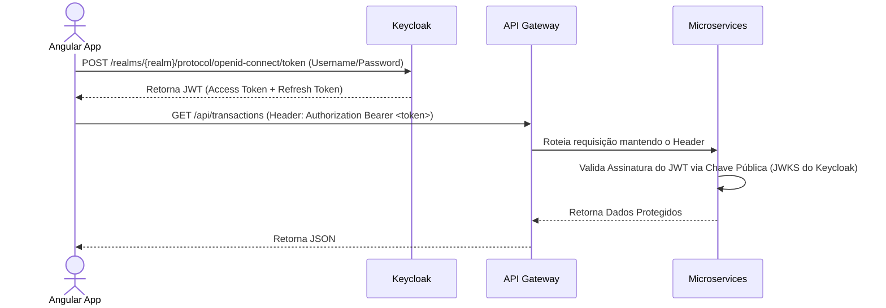

# 7. Segurança e Gestão de Identidade (Keycloak)

A segurança da plataforma é centralizada através do **Keycloak**, uma solução Open Source de Identity and Access Management (IAM).

## Padrão de Autenticação: OIDC (OpenID Connect) / OAuth 2.0

O sistema não armazena senhas no banco de dados local. Toda autenticação forte é delegada ao Keycloak.

### Fluxo de Login (Frontend + API)

## Autorização (RBAC - Role-Based Access Control)

- **Roles no Keycloak:** Os perfis (Ex: `admin`, `user_viewer`, `financial_manager`) são configurados no Keycloak.
- **Microserviços:** Os serviços Quarkus utilizam a anotação `@RolesAllowed("admin")` e extraem as roles de dentro do token JWT validado, garantindo a proteção dos endpoints.

## Gestão de Usuários (Backoffice)
Quando um administrador cria um usuário no sistema, o *Auth Service* chama a API de Administração (Admin REST API) do Keycloak para criar as credenciais iniciais. O ciclo de vida da conta é espelhado no banco SQL Server local para dados de negócio, enquanto as credenciais ficam isoladas no IAM.
