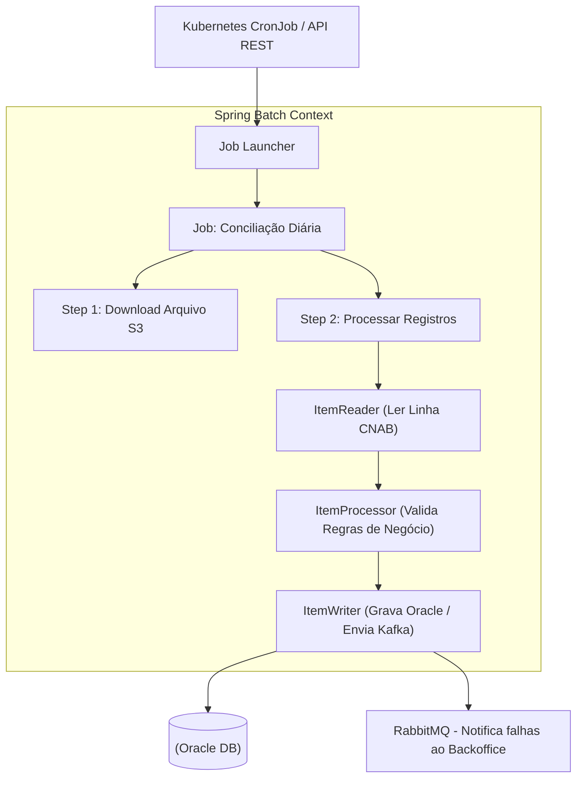

# 8. Processamento em Lote (Spring Batch)

Processos que lidam com milhões de registros e não exigem resposta em tempo real são delegados para o ecossistema de processamento em lote.

## Por que Spring Batch?
Enquanto os microsserviços core são desenvolvidos em Quarkus (pela agilidade no cluster), as rotinas pesadas de arquivos e relatórios usam **Spring Batch (Java 21)**. A robustez de controle transacional por chunks, reinício automático (restartability), e leituras/escritas paralelizadas do Spring Batch o tornam o padrão ouro para rotinas EOD (End of Day).

## Casos de Uso
1. **Conciliação Bancária:** Leitura de arquivos CNAB enviados por parceiros externos (como bancos core) e cruzamento com as transações da base Oracle para verificar divergências.
2. **Geração de Relatórios Regulatórios:** Agrupamento das movimentações de milhares de clientes para geração de arquivos mensais.

## Arquitetura de Execução

## Controle de Falhas
- **Chunk Processing:** Se o tamanho do chunk for 1000, ocorrendo erro no registro 999, o Spring Batch dá rollback apenas nestes 1000, podendo retomar a execução (Restart) do ponto exato onde falhou sem processar novamente registros já "commitados".
- **Skip & Retry:** Configura-se tolerância a falhas temporárias (ex: timeout de rede) via políticas de *Retry* nativas.
