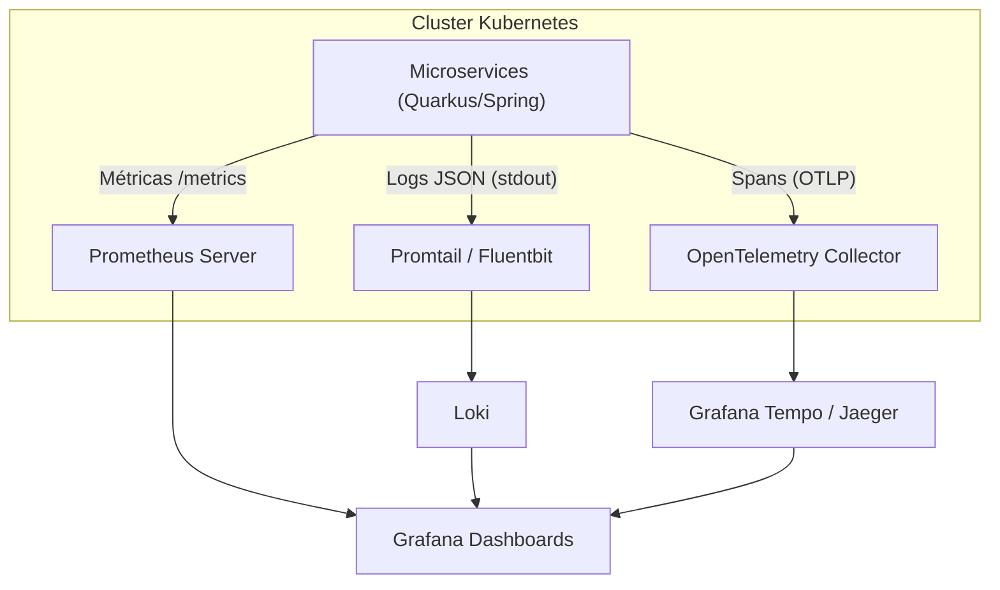

# 9. Observabilidade e Monitoramento

A observabilidade em uma arquitetura de microsserviços não é opcional, é obrigatória. Dividimos nossa estratégia nos "Três Pilares": Métricas, Logs e Tracing Distribuído.

## 1. Métricas (Prometheus + Grafana)
- **Coleta:** Cada microsserviço (Quarkus e Spring) expõe métricas via endpoint `/q/metrics` no padrão Micrometer.
- **Prometheus:** Um servidor Prometheus varre (scrapes) os pods no Kubernetes periodicamente.
- **Grafana:** Dashboards ricos consultam o Prometheus.
  - **Métricas Chave:** JVM Memory/CPU, GC Pauses, HTTP 500s, Transaction Throughput (Kafka lags), Database Connection Pool.

## 2. Logs Centralizados (ELK / Loki)
- **Geração:** Logs saem do contêiner para o `stdout` em formato **JSON**.
- **Coleta:** Fluentd, Filebeat ou Promtail captura a saída de todos os pods.
- **Armazenamento/Visualização:** 
  - *Opção A:* Elasticsearch + Kibana (ELK)
  - *Opção B:* Loki + Grafana (Mais leve, excelente integração com Kubernetes).

## 3. Tracing Distribuído (OpenTelemetry + Jaeger/Tempo)
O tracing permite acompanhar o ciclo de vida de uma única requisição que passa por 5 sistemas diferentes.
- **Propagação de Contexto:** Ao receber uma requisição, o API Gateway cria um `trace-id`. Esse ID é injetado nos headers HTTP (W3C Trace Context) e nos headers das mensagens do Kafka/RabbitMQ.
- **Quarkus OTel:** Extensão nativa `quarkus-opentelemetry` captura o fluxo automaticamente, exportando os *Spans* via protocolo OTLP.
- **Visualização:** Ferramentas como Jaeger (ou Grafana Tempo) montam o diagrama de cascata, permitindo ver em qual serviço ocorreu gargalo de lentidão.

## Arquitetura de Observabilidade

