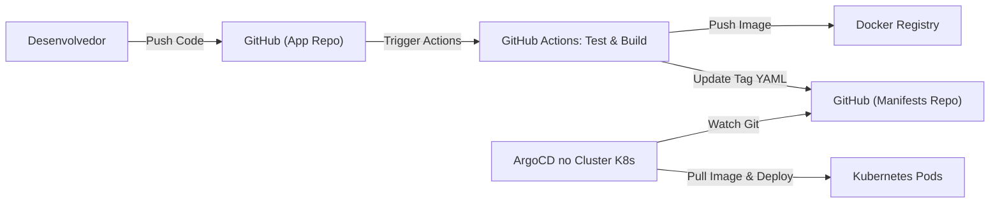

# 10. CI/CD, Gitflow e Qualidade de Código

Garantir a qualidade do software entregue e o deploy automatizado para suportar múltiplas entregas diárias.

## Workflow de Versionamento: Gitflow Adaptado (Trunk-Based)
O projeto adota uma variação ágil focada em Pull Requests.
- `main`: Branch produtiva, estritamente protegida. Requer Code Review, testes passando e verificação no SonarQube para merge.
- `develop`: (Opcional) Ambiente de homologação contínua, dependendo do ciclo da equipe, senão *feature branches* saem direto da `main`.
- `feature/*`: Funcionalidades novas.
- `bugfix/*` / `hotfix/*`: Correções de defeitos.

## Pipeline de Integração Contínua (CI) - GitHub Actions

Quando um Pull Request é aberto, o pipeline do GitHub Actions roda:

1. **Build & Test:** Maven (`mvn clean test`) compila os microsserviços Java e Angular CLI compila o frontend. Testes unitários são executados.
2. **Testcontainers:** Testes de integração utilizam a biblioteca *Testcontainers* (levanta contêineres Docker efêmeros do Oracle, Kafka, etc., roda os testes reais, e mata os contêineres).
3. **Análise de Qualidade (SonarQube):** 
   - Integração com servidor Sonar.
   - Quality Gate obriga: Mínimo 80% de cobertura de código, zero *Bugs* ou *Vulnerabilidades* críticas.
4. **Build do Contêiner:** Se aprovado (no merge), empacota a aplicação Docker (para Quarkus, utiliza imagem de JVM ou Nativa via GraalVM). Faz push para o Docker Registry (ex: GitHub Packages, Harbor).

## Pipeline de Entrega Contínua (CD) - ArgoCD (GitOps)

Não utilizamos *push* no deployment. A infraestrutura puxa a nova versão utilizando padrão **GitOps**.

1. Após empacotar a imagem Docker no CI, uma automação commita a nova versão da tag da imagem em um repositório de manifesto Git separado (Ex: `repo-k8s-manifests/greeting-service.yaml`).
2. O **ArgoCD**, que roda dentro do Kubernetes, monitora este repositório Git.
3. Quando o ArgoCD vê a mudança no YAML, ele aplica (*sync*) automaticamente a nova versão da imagem no cluster, reiniciando os pods de forma gracefully (Rolling Update).

