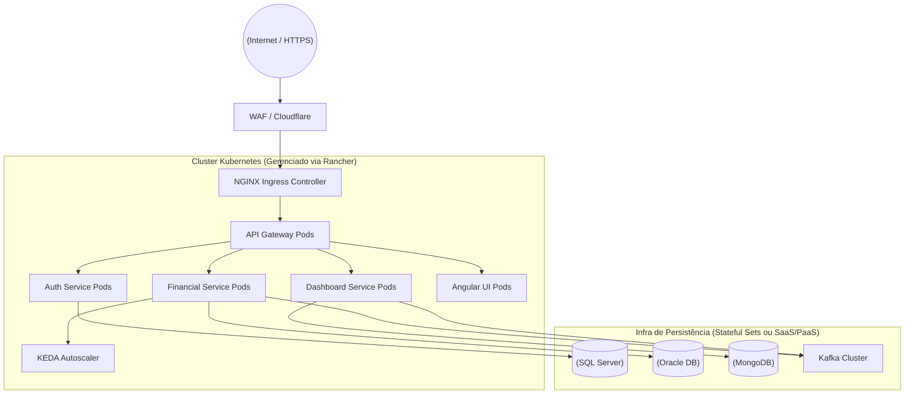

# 11. Infraestrutura, Kubernetes e Deployment

A plataforma foi projetada como "Cloud Native" de raiz. Ela é implantada sobre um cluster Kubernetes para orquestração escalável.

## Gestão do Cluster (Rancher)
O **Rancher** é utilizado como camada de abstração (Painel de Controle) para administrar múltiplos clusters Kubernetes (ex: Dev, Homologação, Produção). Ele simplifica a gestão de RBAC do cluster, monitoramento visual, e deploy de Helm Charts de ferramentas de infraestrutura.

## Arquitetura Kubernetes

- **Ingress Controller (NGINX):** Ponto de entrada público do cluster. Roteia tráfego HTTPS via regras de Ingress para o API Gateway interno. Terminação TLS e proteção inicial (WAF) ocorrem aqui.
- **Deployments & Pods:** Cada microsserviço (Quarkus/Angular/Batch) roda como um Deployment.
- **HPA (Horizontal Pod Autoscaler):** Configurado para escalar réplicas (pods) de serviços baseando-se no consumo de CPU ou tamanho de fila de Kafka (via KEDA).
- **ConfigMaps e Secrets:** Configurações (URL de banco de dados, tópicos) ficam em ConfigMaps. Senhas ficam em Secrets (integrados com Hashicorp Vault/External Secrets Operator se necessário).

## O Topo da Pirâmide de Infraestrutura

## Resumo Operacional
A união do Quarkus (startup em ms), Kubernetes (orquestração e self-healing), NGINX (roteamento robusto), Rancher (gestão visual) e ArgoCD (GitOps) resulta em um sistema "Zero Downtime", permitindo manutenções, updates e expansões sem interrupção dos serviços bancários aos usuários.
