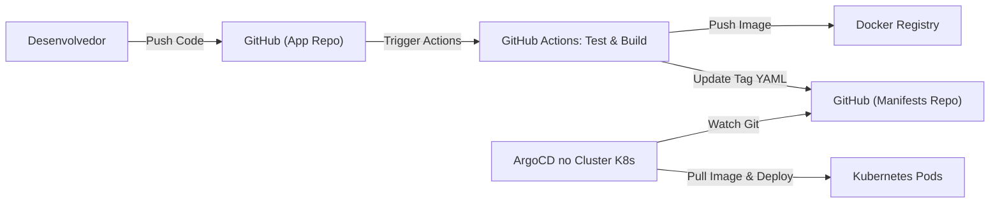

# 🛠️ CI/CD e Qualidade de Código

Garantir a qualidade do software entregue através de automação rigorosa e deploys previsíveis, suportando múltiplas entregas diárias com segurança.

:::info 
GitOps
Adotamos o modelo **GitOps**, onde o estado desejado da nossa infraestrutura é definido em arquivos de configuração no Git, garantindo auditabilidade e facilidade de rollback.
:::

## 🔄 Fluxo de Trabalho (Gitflow Adaptado)

Nosso workflow foca em agilidade através de Pull Requests e revisões constantes.

  
1

  

    <h3>Feature Development</h3>
    
O desenvolvedor cria uma branch <code>feature/*</code> a partir da <code>main</code>.

  

  
2

  

    <h3>Pull Request & CI</h3>
    
Ao abrir um PR, o GitHub Actions inicia automaticamente os testes e análises de qualidade.

  

  
3

  

    <h3>Code Review & Quality Gate</h3>
    
Revisão por pares e validação do <strong>SonarQube</strong>. O merge só é permitido se o Quality Gate for aprovado.

  

## 🧪 Estratégia de Testes

Utilizamos a **Pirâmide de Testes** para equilibrar custo e confiança:

| Tipo | Ferramenta | Descrição |
| :--- | :--- | :--- |
| **Unitários** | JUnit 5 / Mockito | Validação da lógica pura do Domínio. |
| **Integração** | Testcontainers | Sobe instâncias reais de Oracle e Kafka via Docker para testes. |
| **Qualidade** | SonarQube | Análise estática, cobertura e detecção de bugs/code smells. |
| **E2E** | Cypress / Playwright | Testes ponta a ponta simulando o fluxo do usuário no Angular. |

## 🏗️ Pipeline de Entrega (CI/CD)

O fluxo automatizado desde o código até a execução no cluster Kubernetes.

## 🛡️ Quality Gate (SonarQube)

Para garantir que o código em produção seja de alta qualidade, o SonarQube impõe:

*   **Cobertura de Testes:** Mínimo de **80%**.
*   **Bugs/Vulnerabilidades:** **Zero** Críticos ou Major.
*   **Code Smells:** Mantidos abaixo do limite de manutenibilidade.
*   **Duplicate Lines:** Máximo de **3%**.

:::success 
Deploy Seguro
Com o **ArgoCD**, qualquer alteração no ambiente de produção é precedida por um commit no repositório de manifestos, permitindo que o cluster se mantenha sempre sincronizado com o código.
:::
