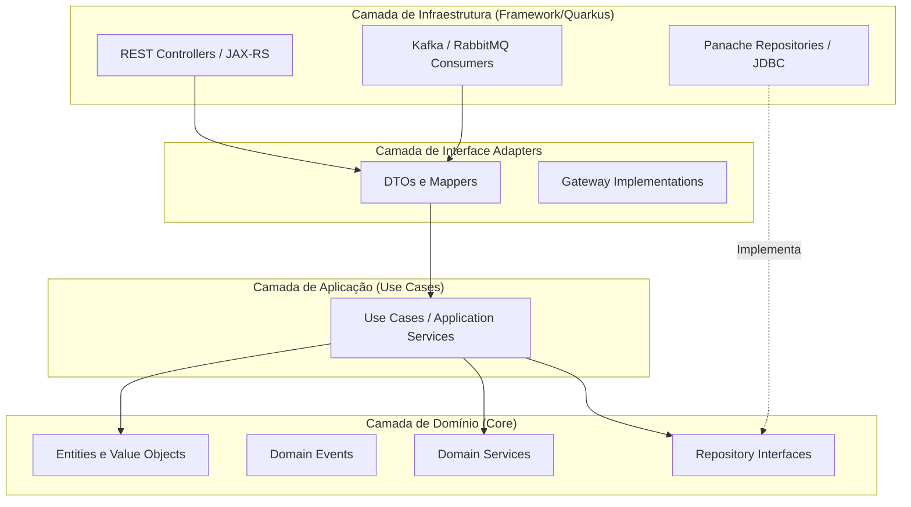

# 🧩 Padrões de Design e Domínio

A modelagem da solução é baseada em **Domain-Driven Design (DDD)** para identificar os Bounded Contexts, aliada à **Clean Architecture** para isolamento das regras de negócio do framework técnico.

:::tip 
Por que DDD?
Utilizamos DDD para garantir que a complexidade do negócio financeiro seja refletida fielmente no código, utilizando uma **Linguagem Ubíqua** compartilhada entre desenvolvedores e especialistas de negócio.
:::

## 🎯 Bounded Contexts

Identificamos três contextos principais que delimitam as responsabilidades do sistema:

  

    <h3>🔐 Identity & Access</h3>
    
<strong>Linguagem:</strong> Usuário, Perfil, Permissão, Token.

    
Focado no ciclo de vida do usuário e integração com Keycloak.

  

  

    <h3>💰 Financial Transaction</h3>
    
<strong>Linguagem:</strong> Conta, Transação, Débito, Crédito, Saldo.

    
O core do sistema. Garante transações ACID e integridade financeira.

  

  

    <h3>📊 Analytics & Dashboard</h3>
    
<strong>Linguagem:</strong> Métrica, Visão, Indicador, Gráfico.

    
Consolida eventos para fornecer visões rápidas e analíticas.

  

## 🏛️ Clean Architecture

Para garantir que o código seja testável e independente de infraestrutura, seguimos rigorosamente as camadas da Clean Architecture.

### 📜 Regras de Ouro de Implementação

1.  **Domínio Puro:** A camada de **Domínio** não possui dependências de frameworks (JPA, Quarkus, Jackson). Usamos apenas Java Standard (`record`, `class`).
2.  **Inversão de Dependência:** A aplicação depende de interfaces, e a infraestrutura implementa essas interfaces.
3.  **Independência de Framework:** Se decidirmos trocar o Quarkus pelo Spring, a regra de negócio (Core) permanece intacta.

:::warning
 Atenção
Nunca deixe anotações de persistência (`@Entity`, `@Table`) vazarem para a camada de Domínio. Utilize Mappers para converter entre a Entidade de Infraestrutura e o Objeto de Domínio.
:::
