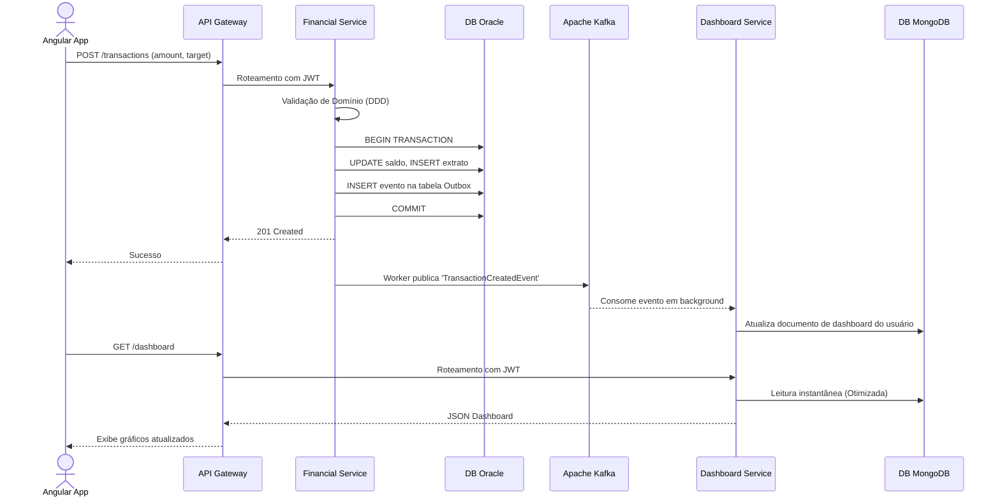

# 🚀 Ecossistema de Microsserviços

Esta seção detalha as responsabilidades e configurações dos serviços que compõem o ecossistema da plataforma.

:::info 
Escolha Tecnológica: Quarkus
Escolhemos **Quarkus** com **Java 21** (Virtual Threads) devido ao tempo de inicialização ultrarrápido e baixo consumo de memória, ideal para ambientes de cloud-native e Kubernetes.
:::

## 📦 Serviços Core

  
1

  

    <h3>Auth & User Service</h3>
    
Responsável pelo ciclo de vida do usuário e integração com Keycloak.

    <ul>
      <li><strong>DB:</strong> SQL Server</li>
      <li><strong>Eventos:</strong> Publica <code>UserCreatedEvent</code></li>
      <li>Identity & Access</li>
    </ul>
  

  
2

  

    <h3>Financial Transaction Service</h3>
    
Onde o "dinheiro muda de mãos". Realiza pagamentos e transferências com alta consistência.

    <ul>
      <li><strong>DB:</strong> Oracle (ACID Compliance)</li>
      <li><strong>Padrão:</strong> Outbox Pattern para mensageria resiliente</li>
      <li>Core Financial</li>
    </ul>
  

  
3

  

    <h3>Dashboard Service (CQRS Read Side)</h3>
    
Consolida dados analíticos de forma assíncrona para entregas em milissegundos.

    <ul>
      <li><strong>DB:</strong> MongoDB (NoSQL)</li>
      <li><strong>Eventos:</strong> Consome de Apache Kafka</li>
      <li>Analytics</li>
    </ul>
  

  
4

  

    <h3>Batch Processor</h3>
    
Executa rotinas pesadas de fim de dia (EOD) e conciliações bancárias.

    <ul>
      <li><strong>Tech:</strong> Spring Batch + Java 21</li>
      <li><strong>Agendamento:</strong> CronJobs Kubernetes</li>
      <li>Batch Processing</li>
    </ul>
  

## 🔄 Fluxo de Transação (CQRS + Mensageria)

O diagrama abaixo ilustra o fluxo ponta a ponta desde a requisição do usuário até a atualização do dashboard em tempo real.

:::tip
 Outbox Pattern
Utilizamos o **Outbox Pattern** para garantir que uma transação no banco de dados e a publicação de um evento no Kafka ocorram de forma atômica, evitando perda de eventos em caso de falha.
:::
