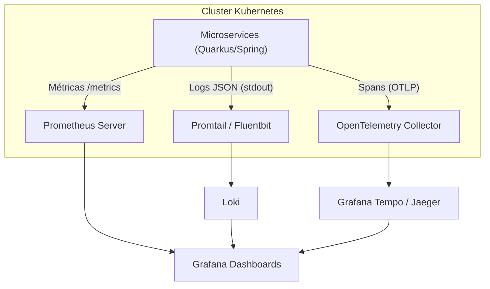

# 🕵️ Observabilidade e Monitoramento

Em uma arquitetura de microsserviços, a observabilidade não é opcional, é o sistema imunológico da plataforma. Implementamos a estratégia baseada nos "Três Pilares".

:::important
 Resiliência
Nossa stack de observabilidade permite identificar falhas antes mesmo que o usuário as perceba, através de alertas proativos e rastreamento ponta a ponta.
:::

## 📊 Os Três Pilares

  

    <h3>📈 Métricas</h3>
    
<strong>Ferramentas:</strong> Prometheus + Grafana

    
Monitoramento de saúde da JVM, CPU, Memória e throughput de mensagens (Kafka lag).

  

  

    <h3>📑 Logs</h3>
    
<strong>Ferramentas:</strong> Loki + Promtail

    
Logs centralizados em formato JSON para facilitar a busca e agregação por correlação.

  

  

    <h3>🔗 Tracing</h3>
    
<strong>Ferramentas:</strong> OpenTelemetry + Tempo

    
Rastreamento distribuído para acompanhar uma requisição através de múltiplos serviços.

  

## 🏗️ Arquitetura de Monitoramento

O diagrama abaixo detalha como os dados de telemetria fluem dos serviços até os dashboards do Grafana.

## 🎯 Métricas Chave de Sucesso (KPIs)

| Métrica | Descrição | Status |
| :--- | :--- | :--- |
| **Error Rate** | Porcentagem de requisições HTTP 5xx. | Crítico |
| **Latency (P99)** | Tempo de resposta para 99% das requisições. | Alerta |
| **Throughput** | Quantidade de transações por segundo (TPS). | Saudável |
| **Kafka Lag** | Atraso no processamento de mensagens nas filas. | Performance |

:::tip
 Tracing ID
Toda requisição que entra pelo **API Gateway** recebe um `trace-id` único. Esse ID é propagado para todos os serviços internos (via headers HTTP) e mensagens de fila, permitindo uma visão unificada do fluxo.
:::
