# <MdBarChart style={{verticalAlign: 'middle', marginRight: '8px', color: 'var(--color-storm-cloud)'}} /> Monitoramento com SonarQube

import Tabs from '@theme/Tabs';
import TabItem from '@theme/TabItem';
import { 
  MdBarChart, 
  MdSecurity, 
  MdBugReport, 
  MdAutoFixHigh, 
  MdRocketLaunch, 
  MdSettings, 
  MdTerminal,
  MdStorage,
  MdArchitecture,
  MdShowChart,
  MdLocalCafe,
  MdWeb,
  MdCode,
  MdFolder
} from 'react-icons/md';

<div className="flex-row margin-bottom--lg">
  <span className="badge-linear badge-linear--success">Code Quality: A</span>
  <span className="badge-linear badge-linear--warning">Security: Verified</span>
  <span className="badge-linear badge-linear--danger">Vulnerabilities: 0</span>
</div>

<div className="doc-featured-section">
  O **SonarQube** é o pilar de nossa estratégia de <span className="text-highlight">Shift-Left Security</span> e <span className="text-highlight">Clean Code</span>. Ele atua como um inspetor automatizado que analisa cada linha de código em busca de falhas antes que elas cheguem em produção.
</div>

:::info 
Referência no Código
Os arquivos de configuração desta implementação estão em:
- <MdFolder style={{verticalAlign: 'middle'}} /> `@devops/` (Servidor, DB e Floci)
- <MdCode style={{verticalAlign: 'middle'}} /> `sonar-project.properties` (Configuração do Scanner)
:::

---

## <MdArchitecture style={{verticalAlign: 'middle', marginRight: '8px', color: 'var(--color-storm-cloud)'}} /> Arquitetura de Integração

O fluxo de análise segue um modelo descentralizado onde o desenvolvedor valida o código localmente antes da integração contínua.

```mermaid
graph TD
    A[Desenvolvedor] -->|Escreve Código| B(Local Workspace)
    B -->|Docker Scan| C{SonarQube Local}
    C -->|Bugs/Smells| D[Correção Imediata]
    C -->|Aprovado| E[Git Push]
    E -->|Pipeline| F[SonarQube Cloud/Enterprise]
    
    style C fill:#161718,stroke:#d4d6b9,stroke-width:2px
    style F fill:#08090a,stroke:#5e6ad2,stroke-width:2px
```



---

## <MdRocketLaunch style={{verticalAlign: 'middle', marginRight: '8px', color: 'var(--color-storm-cloud)'}} /> Fluxo de Configuração

Siga os passos abaixo para preparar seu ambiente e executar sua primeira análise.

<div className="doc-step">
  <div className="doc-step-number">1</div>
  <div className="doc-step-content">
    <h3><MdStorage style={{verticalAlign: 'middle', marginRight: '8px', color: 'var(--color-storm-cloud)'}} /> Subindo a Infraestrutura</h3>
    <p>Toda a infraestrutura necessária está encapsulada em containers Docker, garantindo paridade entre ambientes.</p>
    
```bash title="@devops"
cd @devops
docker-compose up -d
```

:::info
 Endpoint do Servidor
**URL:** [http://localhost:9000](http://localhost:9000)  
**Acesso:** `admin` / `admin` (Mude no primeiro login)
:::
  </div>
</div>

<div className="doc-step">
  <div className="doc-step-number">2</div>
  <div className="doc-step-content">
    <h3><MdSettings style={{verticalAlign: 'middle', marginRight: '8px', color: 'var(--color-storm-cloud)'}} /> Preparação por Tecnologia</h3>
    <p>Selecione sua stack tecnológica para ver os requisitos de pré-análise:</p>

<Tabs>
  <TabItem value="java" label={<><MdLocalCafe style={{verticalAlign: 'text-bottom', marginRight: '4px'}} /> Java (Maven/Quarkus)</>} default>
    <p>O Sonar exige o bytecode compilado para análise profunda de fluxo de dados.</p>
    ```bash
    cd @java/atomant-auth && ./mvnw compile
    ```
    <span className="badge-linear badge-linear--success">Requisito: sonar.java.binaries</span>
  </TabItem>
  <TabItem value="angular" label={<><MdWeb style={{verticalAlign: 'text-bottom', marginRight: '4px'}} /> Angular</>}>
    <p>Certifique-se de que os pacotes estão instalados para análise de tipos e dependências.</p>
    ```bash
    npm install
    ```
  </TabItem>
  <TabItem value="python" label={<><MdCode style={{verticalAlign: 'text-bottom', marginRight: '4px'}} /> Python</>}>
    <p>Ative seu ambiente virtual para garantir o mapeamento correto das bibliotecas.</p>
    ```bash
    source .venv/bin/activate
    ```
  </TabItem>
</Tabs>
  </div>
</div>

<div className="doc-step">
  <div className="doc-step-number">3</div>
  <div className="doc-step-content">
    <h3><MdTerminal style={{verticalAlign: 'middle', marginRight: '8px', color: 'var(--color-storm-cloud)'}} /> Execução do Scanner</h3>
    <p>Rode o comando do scanner na raiz do workspace, referenciando o arquivo de configuração localizado em <code>@devops</code>.</p>

```bash title="Linux Scanner CLI"
docker run \
    --rm \
    --network="host" \
    -e SONAR_HOST_URL="http://localhost:9000" \
    -e SONAR_TOKEN="SEU_USER_TOKEN" \
    -v "$(pwd):/usr/src" \
    sonarsource/sonar-scanner-cli \
    -Dproject.settings=@devops/sonar-project.properties
```

:::danger
Conectividade Linux

Sempre utilize <span className="text-highlight">`--network="host"`</span> no Linux para permitir que o scanner atinja o serviço no localhost do host.
:::
  </div>
</div>

---

## <MdShowChart style={{verticalAlign: 'middle', marginRight: '8px', color: 'var(--color-storm-cloud)'}} /> Métricas & Visibilidade

| Métrica | Ícone | Foco | Descrição |
| :--- | :--- | :--- | :--- |
| **Reliability** | <MdBugReport size={20} color="#eb5757" /> | Zero Bugs | Erros de lógica e falhas críticas. |
| **Security** | <MdSecurity size={20} color="#d4d6b9" /> | SAST | Vulnerabilidades conhecidas e riscos de ataque. |
| **Maintainability** | <MdAutoFixHigh size={20} color="#5e6ad2" /> | Clean Code | Dívida técnica e facilidade de evolução. |

---

:::note 
Padronização
O arquivo <MdCode style={{verticalAlign: 'middle'}} /> `sonar-project.properties` é a fonte da verdade para o escopo da análise. Antes de adicionar novos módulos, certifique-se de incluí-los na chave `sonar.sources`.
:::
