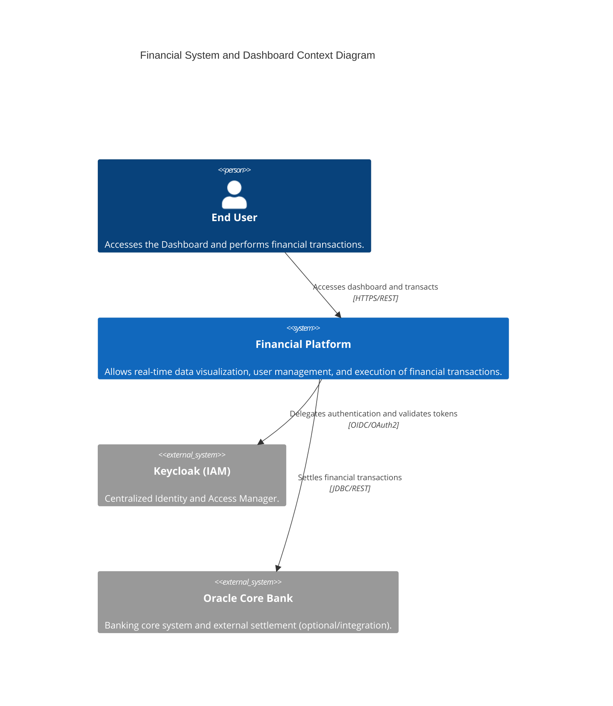
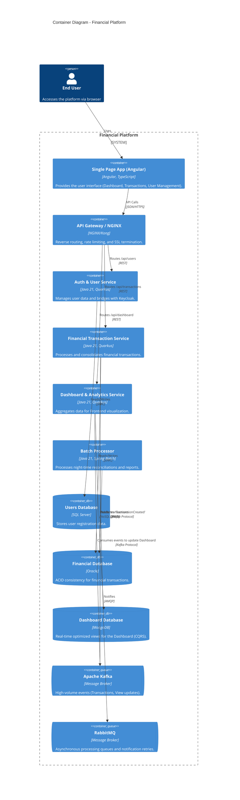

# 🏗️ Architecture Overview

The system is designed as a **Microservices** architecture, focused on high scalability, resilience, and long-term maintenance, serving complex domains of finance and user management.

:::info
Architectural Style
This project uses the most modern market standards, combining **Event-Driven Architecture** with **CQRS** to ensure performance and eventual consistency where necessary.
:::

## 🌐 System Context (C4 Model - Level 1)

The diagram below describes the high-level ecosystem and how the user interacts with the platform and its external systems.

## 📦 Container Architecture (C4 Model - Level 2)

Deepening into the solution, we detail how services communicate and which persistence technologies are used.

## 🛠️ Technology Stack

| Layer | Technology | Badge |
| :--- | :--- | :--- |
| **Backend** | Java 21 / Quarkus | Robustness |
| **Frontend** | Angular | Scalability |
| **Messaging** | Kafka / RabbitMQ | Resilience |
| **Database** | Oracle / SQL Server / MongoDB | Consistency |
| **Security** | Keycloak | Security |

## 📐 Implemented Architectural Patterns

  

    <h3>CQRS</h3>
    
Separation of responsibility between read and write for maximum performance.

  

  

    <h3>Event-Driven</h3>
    
Decoupled asynchronous communication using Apache Kafka.

  

  

    <h3>API Gateway</h3>
    
Single entry point, security, and routing for the ecosystem.

  

