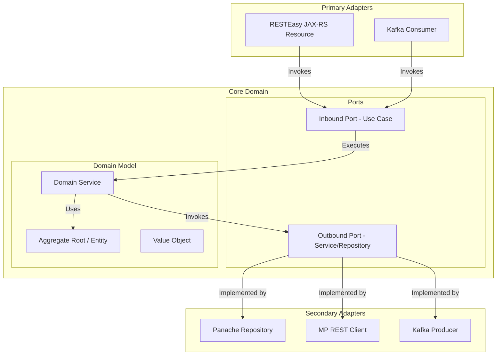
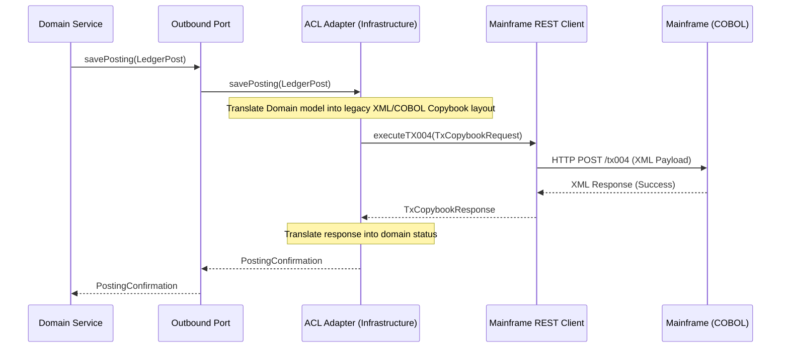

# Global Architecture Constitution: `enterprise-financial-core`

This constitution establishes the non-negotiable architectural principles, design patterns, and engineering standards for the **`enterprise-financial-core`** microservice. All development, code generation, and automated pipelines must strictly comply with these guidelines.

---

## 1. Architectural Style: Hexagonal Architecture (Ports & Adapters)

To protect the financial core domain from changes in external systems, frameworks, and infrastructure, the microservice must strictly follow the **Hexagonal Architecture** pattern.



### 1.1 Structural Package Layout
The codebase must be divided into three strictly separated directories/packages:

```
org.acme.financialcore
├── domain/                  <-- Pure Java domain. Zero dependencies on frameworks (Quarkus/Hibernate)
│   ├── model/               <-- Aggregates, Entities, Records (Value Objects)
│   ├── port/                
│   │   ├── inbound/         <-- Use Cases (Interfaces defined by domain)
│   │   └── outbound/        <-- Repository & Integration Interfaces (defined by domain)
│   └── service/             <-- Core business logic implementations
├── api/                     <-- Primary Adapters
│   ├── rest/                <-- JAX-RS resources, HTTP Controllers
│   ├── event/               <-- Kafka/AMQP event message listeners
│   └── dto/                 <-- Request/Response serialization DTOs
└── infrastructure/          <-- Secondary Adapters
    ├── persistence/         <-- Panache Entities and Repositories
    ├── client/              <-- REST Clients, SOAP Clients, and Anti-Corruption Layers
    └── config/              <-- Quarkus App configuration beans
```

---

## 2. Domain-Driven Design (DDD) & Bounded Contexts

The `enterprise-financial-core` encompasses the following Bounded Contexts:

| Bounded Context | Core Entities / Value Objects | Ubiquitous Language | Responsibility |
| :--- | :--- | :--- | :--- |
| **Ledger (Razão)** | `Account`, `LedgerEntry`, `Money` | Entry (Partida), Balance (Saldo) | Records historical financial postings using double-entry booking rules. |
| **Clearing (Liquidação)** | `SettlementInstruction`, `ClearingJob` | Settlement (Liquidação), Bank (Banco) | Handles interbank clearing, instant payment routing, and settlement confirmation. |
| **Anti-Fraud (Prevenção)** | `TransactionTelemetry`, `RuleEngine` | RiskScore (Score de Risco), Block (Bloqueio) | Real-time analysis of transaction patterns for AML (Anti-Money Laundering) checks. |
| **Fee Configurator (Tarifário)**| `FeePolicy`, `CalculationSchedule` | Fee DTO, Exemption (Isenção) | Dynamically computes operational fees and tax exclusions. |

---

## 3. Legacy Integration: Anti-Corruption Layer (ACL)

When integrating with legacy systems (e.g. mainframe COBOL engines, SOAP bank databases) under the **Strangler Fig Pattern**, the domain core must be insulated using an **Anti-Corruption Layer (ACL)**.

> [!IMPORTANT]
> - Domain core models must **never** reference legacy objects, mainframe terminology, or custom vendor packages.
> - Outbound adapters communicating with legacy systems must incorporate translation services to map incoming/outgoing schemas.



---

## 4. Enterprise Architecture: ABBs vs. SBBs

To maintain vendor-neutral logic and high architectural flexibility, the system separates **Architecture Building Blocks (ABBs)** from **Solution Building Blocks (SBBs)**.

| Logical ABB (Logical Specification) | Concrete SBB (Physical Solution) | Location / Layer |
| :--- | :--- | :--- |
| **Container Engine** | Docker | Build & Deploy Layer |
| **Execution Platform** | Java 21 / Quarkus runtime | Application Core |
| **Inbound Web Adapter** | RESTEasy Reactive | API Layer |
| **Relational Database** | PostgreSQL | Infrastructure persistence |
| **ORM / Repository Engine** | Hibernate ORM with Panache | Infrastructure persistence |
| **External HTTP Client** | MicroProfile REST Client Reactive | Infrastructure client |

---

## 5. Technology Stack & Coding Standards

### 5.1 Java 21 & Quarkus Guidelines
- **Virtual Threads:** All blocking I/O (persistence, external clients) must be scheduled on Virtual Threads using `@RunOnVirtualThread` to ensure massive concurrency and maximum processor utilization.
- **Java Records:** Records must be used for Value Objects, DTOs, and immutable state representations.
- **Null Safety:** Strict null checking. Optional type (`Optional<T>`) is required for data fields that can be empty.
- **Panache Repository Pattern:** Do not use Panache Active Record (`PanacheEntity`). Implement Panache Repositories (`PanacheRepositoryBase<Entity, ID>`) in the infrastructure layer to isolate the domain from the persistence framework.
- **Strict Testing Boundaries:**
  - 100% of domain services must have isolated unit tests (using JUnit 5 and Mockito).
  - Integrations and database operations must use `@QuarkusTest` with H2 or PostgreSQL Dev Services containers.
