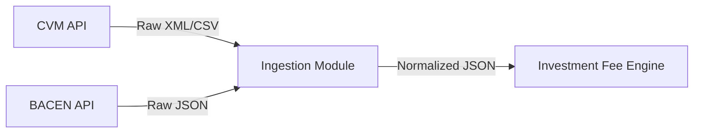

# Project Constitution & Engineering Principles: `atomant-ingestion-module` (Ingestion Module)

This constitution establishes the core, non-negotiable architectural rules, resilience patterns, and data ingestion/normalization standards for the **Ingestion Module** microservice. All contributors, AI agents, and pull requests must strictly adhere to this specification.

---

## 1. Microservice Responsibilities & Boundaries

The **Ingestion Module** is a stateless gateway microservice responsible for:
1. Fetching raw, public financial data (Open Data) from official institutions.
2. Applying resilience patterns to protect against external API outages.
3. Normalizing and sanitizing inconsistent formats.
4. Dispatching clean, standardized JSON payloads to the calculation engine.

---

## 2. API Ingestion Rules

### 2.1 CVM APIs (Comissão de Valores Mobiliários)
* **Daily Net Asset Value (NAV/PL)**: Consume the CVM *Informe Diário de Fundos de Investimento* endpoints.
  * **Rule**: Since CVM daily data contains records for thousands of funds, fetching raw files can be heavy. Use streaming parsers (e.g., Jackson streaming or chunked CSV parsers) rather than reading the entire payload into memory.
* **Quota Holder Positions**: Extract quota holder quantities and total quotas.
  * **Rule**: Ensure CNPJ strings are sanitized (remove dots, slashes, and dashes) to format uniform lookup keys (`00000000000100` instead of `00.000.000/0001-00`).

### 2.2 BACEN & Ipeadata APIs
* **Working Days (Dias Úteis)**: Query BACEN SGS (Sistema Gerenciador de Séries Temporais) to resolve official calendar days.
  * **Rule**: Microservices must cache the working calendar locally for the current fiscal year. Do not query BACEN on every single transaction or calculation loop.
* **Macroeconomic Indicators**: Query BACEN (Series 11 for daily SELIC) and Ipeadata (for IPCA/inflation index).
  * **Rule**: If a macro indicator fetch fails for a specific day, fall back to the last known rate (imputation) and flag the record as *estimated*.

---

## 3. Resilience Patterns (MicroProfile / SmallRye Fault Tolerance)

To prevent cascading failures and avoid overloading public APIs, all outbound REST clients must implement fault tolerance policies.

### 3.1 Retry Policy
* **Annotation**: `@Retry(maxRetries = 3, delay = 1000, jitter = 200)`
* **Rationale**: Public endpoints (CVM/BACEN) can experience transient load spikes. Adding jitter prevents the "thundering herd" effect from retrying clients.

### 3.2 Circuit Breaker Policy
* **Annotation**: `@CircuitBreaker(requestVolumeThreshold = 10, failureRatio = 0.50, delay = 10000)`
* **Rationale**: If 50% of the last 10 requests fail, open the circuit for 10 seconds.
* **Fallback Strategy**: Every client interface must have a corresponding `@Fallback` implementation that retrieves stale cached values or default states (e.g., marking days as standard business days if BACEN calendar is offline).

---

## 4. Data Normalization & Sanitization Rules

Raw data must go through a strict normalization pipeline in the domain service layer before downstream dispatch.

1. **Date Standardizer**: Parse any date format (`DD/MM/YYYY`, Unix timestamp, etc.) into ISO-8601 (`YYYY-MM-DD`).
2. **Numeric Precision**:
   * Currencies and Net Asset Value (PL) must be normalized to standard decimal numbers with **4 decimal places**.
   * Quota quantities and values must retain up to **8 decimal places** to avoid rounding discrepancies in huge splits.
3. **Data Completeness**:
   * Null fields must be populated with defined default values (e.g., zero for NAV, empty string for missing name) or trigger a validation alert.

---

## 5. Structural Layers & Packages

* **`org.acme.ingestion.api`**: Houses REST resources triggering manual imports or containing cron-based execution schedulers.
* **`org.acme.ingestion.domain`**: Contains the pure Java records for normalized models (`NormalizedFundData`, `NormalizedIndicator`) and the normalization interface.
* **`org.acme.ingestion.infrastructure.client`**: Houses MicroProfile REST clients annotated with `@RegisterRestClient`.
* **`org.acme.ingestion.infrastructure.dto`**: Contains vendor-specific raw response mappings.
