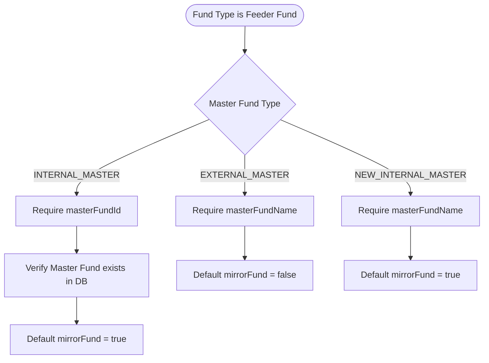

# Technical Specification: Investment Fund Creation - General Info

This document specifies the generic, framework-aligned API design and business rules for the **Investment Fund Creation - General Info** module in the `atomant-investment-core` service.

---

## 1. Domain Model Design

The core domain model `Fund` represents the investment fund. The **General Info** step captures the initial parameters required to register a fund.

### 1.1 Model Attributes & Types
The following attributes are mapped within the domain model class [Fund.java](file:///home/joelmaykon/joelmaykon94/java/atomant-investment-core/src/main/java/org/acme/investment/domain/model/Fund.java):

| Field | Type | Constraint | Description |
| :--- | :--- | :--- | :--- |
| `requestor` | `String` | Required | Name of the person initiating the fund creation request. |
| `originatingDepartment` | `String` | Required | The department code/name matching the originating desk. |
| `targetLaunchDate` | `LocalDate` | Future Date | Target launch date of the fund. Must be null if `noForecast` is true. |
| `noForecast` | `boolean` | Boolean flag | Indicates that there is no launch date forecast. |
| `name` | `String` | Max 300 chars | Public/Commercial name of the fund. |
| `fundType` | `FundType` | Enum | Classification of the fund (e.g. Fixed Income, Multimarket, Feeder). |
| `masterFundType` | `MasterFundType`| Enum (Optional) | Required only if `fundType` is `FEEDER_FUND`. |
| `masterFundId` | `Long` | Reference ID | DB reference to an existing internal Master Fund. |
| `masterFundName` | `String` | Max 300 chars | Custom name of the Master Fund (used for External/New masters). |
| `mirrorFund` | `Boolean` | Boolean flag | Indicates whether the feeder fund mirrors the master portfolio. |

---

## 2. API Endpoint Contracts

### 2.1 General Info Creation Endpoint
Creates a fund with general information parameters.

- **HTTP Method:** `POST`
- **Path:** `/funds/general-info`
- **Headers:** `Content-Type: application/json`
- **Request Payload (`FundGeneralInfoCreateDTO`):**
  ```json
  {
    "requestor": "John Doe",
    "originatingDepartment": "D01 - Asset Management Desk",
    "targetLaunchDate": "2026-12-01",
    "noForecast": false,
    "name": "Generic Global Fixed Income Fund",
    "fundType": "FEEDER_FUND",
    "masterFundType": "INTERNAL_MASTER",
    "masterFundId": 1024,
    "masterFundName": null,
    "mirrorFund": null
  }
  ```

- **Response Payload (`FundGeneralInfoResponseDTO`):**
  - **Status Code:** `201 Created`
  ```json
  {
    "id": 42,
    "requestor": "John Doe",
    "originatingDepartment": "D01 - Asset Management Desk",
    "targetLaunchDate": "2026-12-01",
    "noForecast": false,
    "name": "Generic Global Fixed Income Fund",
    "fundType": "FEEDER_FUND",
    "masterFundType": "INTERNAL_MASTER",
    "masterFundId": 1024,
    "masterFundName": null,
    "mirrorFund": true
  }
  ```

---

### 2.2 Department Type-Ahead Search Endpoint
Provides a 3-character type-ahead search to fetch originating departments from a generic external API.

- **HTTP Method:** `GET`
- **Path:** `/departments/search`
- **Query Parameters:** `query` (String, minimum 3 characters)
- **Response Payload:**
  - **Status Code:** `200 OK`
  ```json
  [
    {
      "code": "D01",
      "name": "Department 1 - Core Fixed Income"
    },
    {
      "code": "D02",
      "name": "Department 2 - Equities Ingestion"
    }
  ]
  ```
- **Error Responses:**
  - **Status Code:** `400 Bad Request` (if query is less than 3 characters).
  - **Status Code:** `503 Service Unavailable` (if the external API integration is failing).

---

## 3. Core Business & Validation Rules

### 3.1 Target Launch Date Constraints
- **Future Date Rule:** If `noForecast` is false, `targetLaunchDate` must be a date strictly in the future (`targetLaunchDate.isAfter(LocalDate.now())`).
- **No Forecast Mutex:** If `noForecast` is true, `targetLaunchDate` **must** be null. The client UI should disable the datepicker component accordingly.

### 3.2 Master/Feeder Conditional Logic
The conditional logic applies when `fundType` is selected as `FEEDER_FUND`:



1. **Internal Master:**
   - **Fields Required:** `masterFundId` must point to an existing registered master fund.
   - **Default Flag:** `mirrorFund` defaults to `true` if not explicitly set.
2. **External Master:**
   - **Fields Required:** `masterFundName` must be provided manually.
   - **Default Flag:** `mirrorFund` defaults to `false` if not explicitly set.
3. **New Internal Master:**
   - **Fields Required:** `masterFundName` must be provided manually to represent the new entity to be created.
   - **Default Flag:** `mirrorFund` defaults to `true` if not explicitly set.

---

## 4. Quarkus API Implementation Architecture

The architecture separates concerns across modular layers using Quarkus extensions:

### 4.1 REST Client Integration (MicroProfile)
The department type-ahead search delegates to a generic external endpoint using the MicroProfile REST Client:

```java
@RegisterRestClient(configKey = "department-api")
@Path("/departments")
public interface DepartmentClient {
    @GET
    @Path("/search")
    List<DepartmentDTO> searchDepartments(@QueryParam("query") String query);
}
```

### 4.2 JSR-380 Custom Constraint Validation
We declare a custom class-level validation constraint `@ValidFundGeneralInfo` mapped to [FundGeneralInfoValidator.java](file:///home/joelmaykon/joelmaykon94/java/atomant-investment-core/src/main/java/org/acme/investment/api/validator/FundGeneralInfoValidator.java):

```java
public class FundGeneralInfoValidator implements ConstraintValidator<ValidFundGeneralInfo, FundGeneralInfoCreateDTO> {
    @Override
    public boolean isValid(FundGeneralInfoCreateDTO dto, ConstraintValidatorContext context) {
        // Validation logic for target launch date & Master/Feeder mutual exclusions
    }
}
```

### 4.3 Virtual Thread Optimization (Java 21)
Because the creation steps perform blocking I/O (database writes via Hibernate, external API queries via REST client), all JAX-RS resource methods are annotated with `@RunOnVirtualThread` to leverage Java 21 light-weight threads, preventing OS thread starvation.
