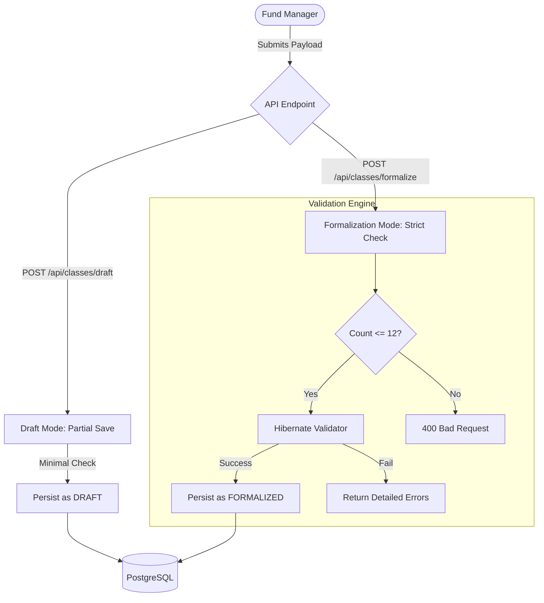

# Feature Specification: Fund Subclass Dynamic Generation

  

**Feature Branch**: `fund-subclass-dynamic-generation`

**Created**: 2026-06-08

**Status**: Draft

**Input**: User description: "Create the 'Fund Subclass Dynamic Generation' specification. Implement the business rule that allows a single Investment Class to spawn up to 12 distinct Subclasses dynamically. Define the API contracts that accept partial payloads for 'Draft' mode (Save) versus strict validation for 'Formalization' mode (Save and Proceed), ensuring that all 12 subclass data structures are independently validated before final submission. Stack: Quarkus, Hibernate Validator."

---

## Logical Flow Overview

### Diagram Description
The diagram above illustrates the dynamic generation lifecycle of investment fund subclasses. It highlights the transition from a **Draft State**, where partial data is accepted for incremental saving, to a **Formalized State**, where strict validation is enforced. 

Key stages include:
1.  **Payload Submission**: The Fund Manager sends a JSON payload containing Investment Class data and a list of up to 12 Subclasses.
2.  **State Detection**: The system determines if the request is for `DRAFT` (partial save) or `FORMALIZATION` (strict check).
3.  **Dynamic Spawning**: The backend logic iterates through the provided subclass structures, ensuring the count remains within the [1, 12] range.
4.  **Hibernate Validation**: For formalization, each subclass is independently validated (CNPJ format, positive fees, tax classification).
5.  **Persistence**: Data is saved to PostgreSQL, with the status updated to `FORMALIZED` upon successful validation.

### Technical Flow (Mermaid)

---

## User Scenarios & Testing *(mandatory)*

### User Story 1 - Draft Mode Saving (Priority: P1)

As a Fund Manager, I want to save a partial payload of an Investment Class and its generated Subclasses in "Draft" mode so that I can draft information incrementally without failing strict validation rules (e.g., missing names or tax codes).

* **Why this priority**: Crucial UX requirement. Allows users to save their progress when they don't have all subclass information yet.
* **Independent Test**: Send a POST to `/api/classes/draft` with only a fund ID and class name, leaving all subclass fields empty or null. Verify it saves with a status of `DRAFT` and returns a `201 Created` or `200 OK` response.
* **Acceptance Scenarios**:

1. **Given** a draft payload with missing mandatory subclass fields, **When** submitting to `/api/classes/draft`, **Then** the system persists the data and returns `201 Created` with the status set to `DRAFT`.

---

### User Story 2 - Subclass Dynamic Generation Limits (Priority: P1)

As a Fund Manager, I want the system to dynamically spawn up to 12 Subclasses for a single Investment Class during formalization, ensuring that any attempt to spawn more than 12 subclasses is blocked.

* **Why this priority**: Core business constraint. Prevents database bloat and enforces regulatory and operational limits on subclasses per class.
* **Independent Test**: Send a formalization request with 13 subclasses. Verify a `400 Bad Request` or `422 Unprocessable Entity` with a clear error message. Send with exactly 12, verify it succeeds.
* **Acceptance Scenarios**:

1. **Given** an Investment Class, **When** trying to associate 13 subclasses, **Then** the request is rejected with a validation error.
2. **Given** an Investment Class, **When** associating between 1 and 12 subclasses, **Then** the request passes the boundary limit check.

---

### User Story 3 - Formalization Strict Validation (Priority: P1)

As a Compliance Officer, I want the system to run strict Hibernate Validator checks on all subclasses when transitioning an Investment Class to "Formalized" status, so that invalid or incomplete subclasses are rejected.

* **Why this priority**: Prevents invalid data from going live, ensuring that only fully compliant structures are activated in the registry.
* **Independent Test**: Send a POST to `/api/classes/formalize` where one of the subclasses is missing mandatory fields (e.g., subclass name or CNPJ). Verify that the entire payload is rejected with a `400 Bad Request` displaying detailed constraint violations for the specific failing subclass.
* **Acceptance Scenarios**:

1. **Given** a formalization request, **When** any subclass fails validation, **Then** the request is rejected and returns a detailed validation error list with index/identifier of the failing subclass.

---

### Edge Cases

- **Zero Subclasses during Formalization**: Can a class be formalized with 0 subclasses?
  * *Resolution*: No, formalization requires at least 1 subclass. If subclasses are empty or null during formalization, reject with a validation error.
- **Duplicate Subclass Identifiers/Names**:
  * *Resolution*: Within the same Investment Class, subclass names or CNPJs/IDs must be unique. Duplicate names/identifiers within the 12 generated subclasses must trigger validation errors.
- **Payload Tampering between Draft and Formalization**:
  * *Resolution*: When a draft is formalized, the client sends the class ID along with the full verified payload or requests promotion. The promotion endpoint must validate the full current payload.

## Requirements *(mandatory)*

### Functional Requirements

- **FR-001 (Dynamic Subclass Spawning Limit)**: The system MUST allow an Investment Class to have between 1 and 12 subclasses. If the number of subclasses is 0 or exceeds 12, the system MUST reject formalization.
- **FR-002 (Draft Mode Payload Acceptance)**: The API endpoint for Draft mode (`POST /api/classes/draft`) MUST accept partial payloads. Basic constraints (like non-null Class Name if provided) are checked, but mandatory business fields for subclasses (such as subclass name, fee details, CNPJ) can be omitted.
- **FR-003 (Formalization Mode Strict Validation)**: The API endpoint for Formalization mode (`POST /api/classes/formalize` or `PUT /api/classes/{id}/formalize`) MUST run strict validation using Hibernate Validator on all subclasses.
- **FR-004 (Independent Subclass Validation)**: Each subclass in the subclass list MUST be validated independently. Validation errors MUST specify which subclass (e.g., using index or client-provided subclass code) failed validation.
- **FR-005 (State Transitions)**: An Investment Class MUST transition from `DRAFT` to `FORMALIZED` only when all validation rules pass. Once `FORMALIZED`, the structure is locked and cannot be edited without a formal amendment flow (out of scope for this spec).
- **FR-006 (Sanitization)**: Zero internal proprietary bank-specific naming conventions are permitted.

### Key Entities

- **InvestmentClass**:
  * Represents the class of shares/quotas.
  * Attributes: `id` (UUID), `name` (String), `status` (Enum: DRAFT, FORMALIZED), `subclasses` (List of InvestmentSubclass).

- **InvestmentSubclass**:
  * Represents the specific subclass structure spawned under the class.
  * Attributes: `id` (UUID), `subclassCode` (String, unique within Class), `name` (String), `cnpj` (String, valid Brazilian tax format if formalized), `adminFee` (BigDecimal, positive), `taxClassification` (String, valid taxonomy category if formalized).

## Success Criteria *(mandatory)*

### Measurable Outcomes

- **SC-001**: Submitting a draft payload with empty or missing subclass details succeeds 100% of the time as long as the base Class identifier is present.
- **SC-002**: Attempting to formalize an Investment Class with more than 12 subclasses is blocked with 100% accuracy.
- **SC-003**: The formalization validation returns a clear JSON error mapping indicating the index/subclassCode and specific fields that failed validation (e.g., `subclasses[2].cnpj: Must be a valid CNPJ`).
- **SC-004**: System validates a batch of 12 subclasses in under 10ms of CPU execution time.

## Assumptions

- **ASM-001**: The client application validates format patterns (like CNPJ format or positive administrative fees) client-side before submission, but the server always performs authoritative validation.
- **ASM-002**: Database storage uses PostgreSQL, with constraints mapping directly to the formalized requirements to prevent invalid states.
- **ASM-003**: Draft records are saved in the same table structure but with nullable columns or a loose schema representation, transitioning to non-null requirements during formalization validation.
