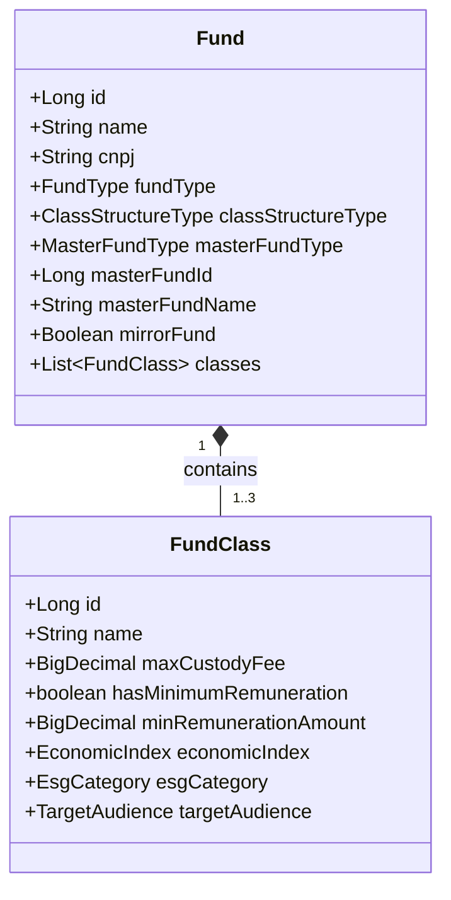
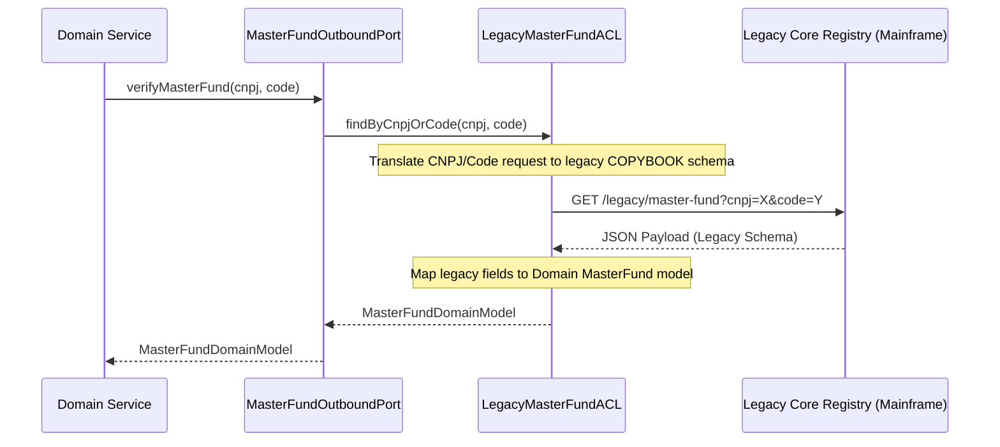

# Domain Specification: Investment Fund Constitution

This specification defines the domain models, validation constraints, legacy integration adapters, and financial arithmetic policies for the **Investment Fund Constitution** context in `atomant-investment-core`.

---

## 1. Domain Model Design: Fund & Classes

The **Fund** acts as the Aggregate Root, containing metadata, structural types, and a collection of one or more **Fund Classes**.



### 1.1 Structural Types & Card Constraints
1. **Single Class (`SINGLE_CLASS`):** The fund contains exactly 1 class of shares.
2. **Multiple Classes (`MULTI_CLASS`):** The fund contains between 1 and 3 classes of shares.

---

## 2. Master/Feeder (FIC) Funds & Legacy Integration (ACL)

A Feeder Fund (FIC - Fundo de Investimento em Cotas) must be linked to a Master Fund. To ensure compatibility with legacy core systems while keeping the domain clean, we integrate via an **Anti-Corruption Layer (ACL)**.



### 2.1 Resolution Logic
- **Internal Master:** Resolved directly against the local `FundRepository` by ID or CNPJ.
- **External Master:** Resolved via the `MasterFundOutboundPort`. The adapter implementation ([LegacyMasterFundACL](file:///home/joelmaykon/joelmaykon94/java/atomant-investment-core/src/main/java/org/acme/investment/infrastructure/client/)) queries the legacy core system by CNPJ or internal registry code, sanitizes the response, and returns a unified domain representation.

---

## 3. Custody Fee & Minimum Remuneration Logic

### 3.1 Maximum Custody Fee
- Represented as a percentage of Net Asset Value (NAV).
- Fields must support 4 decimal places (e.g. `0.8500%` is represented in code as `0.008500`).

### 3.2 Conditional Minimum Remuneration
If `hasMinimumRemuneration` is true:
- **`minRemunerationAmount`:** Mandatory. Represents the minimum annual amount in currency (e.g. `R$ 1.500,00`).
- **`economicIndex`:** Mandatory. Represents the correction index to adjust the minimum amount (e.g. CDI, IPCA).

---

## 4. Precision & Financial Arithmetic Policy

To prevent rounding accumulation errors and precision loss during daily fee calculations, all percentages, rates, and values must use Java's `BigDecimal` with Banker's Rounding:

```java
import java.math.BigDecimal;
import java.math.RoundingMode;

public class FeeCalculations {
    // Banker's Rounding (HALF_EVEN) is mandatory for all financial calculations
    private static final RoundingMode FINANCIAL_ROUNDING = RoundingMode.HALF_EVEN;
    
    // Scale conventions
    private static final int FEE_RATE_SCALE = 6;      // E.g. 0.008500 (6 decimals)
    private static final int CURRENCY_SCALE = 2;      // E.g. R$ 1500.25 (2 decimals)

    public static BigDecimal calculateDailyFee(BigDecimal nav, BigDecimal annualFeeRate) {
        BigDecimal dailyRate = annualFeeRate.divide(new BigDecimal("252"), FEE_RATE_SCALE, FINANCIAL_ROUNDING);
        return nav.multiply(dailyRate).setScale(CURRENCY_SCALE, FINANCIAL_ROUNDING);
    }
}
```

### Banker's Rounding Rule (RoundingMode.HALF_EVEN)
- Discards fractional values towards the nearest even neighbor when equidistant (e.g., `2.5` rounds to `2`, `3.5` rounds to `4`). This minimizes systemic upward bias over large sets of transaction calculations.

---

## 5. Persistence Mapping (H2/PostgreSQL with Flyway)

#### `db/migration/V1.3.0__create_classes_table.sql`
```sql
CREATE TABLE fund_classes (
    id BIGSERIAL PRIMARY KEY,
    fund_id BIGINT NOT NULL REFERENCES funds(id),
    name VARCHAR(150) NOT NULL,
    max_custody_fee NUMERIC(8, 6) NOT NULL, -- Supports up to 99.9999%
    has_minimum_remuneration BOOLEAN NOT NULL DEFAULT FALSE,
    min_remuneration_amount NUMERIC(15, 2), -- Minimum annual payment in cents
    economic_index VARCHAR(20),             -- CDI, IPCA, IGPM
    esg_category VARCHAR(30) NOT NULL,      -- ESG_INTEGRATION, etc.
    target_audience VARCHAR(30) NOT NULL    -- GENERAL, QUALIFIED, PROFESSIONAL
);

CREATE INDEX idx_fund_classes_fund ON fund_classes(fund_id);
```
