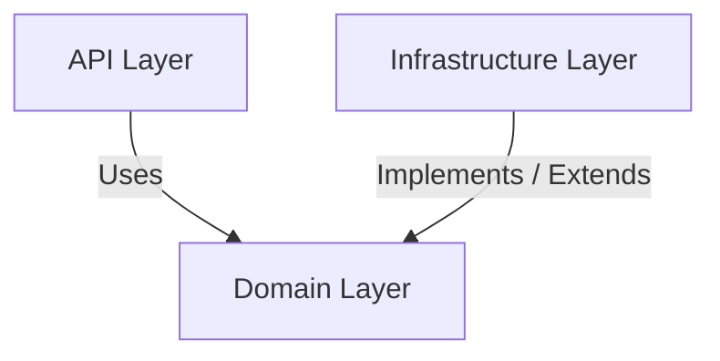
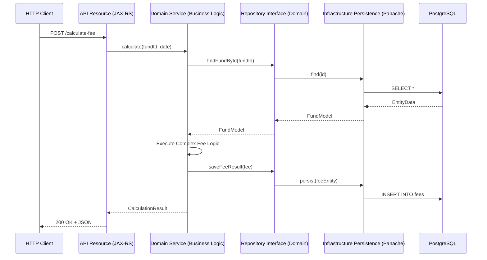

# Project Constitution & Engineering Principles: `atomant-investment-core` (Investment Fee Engine)

This constitution establishes the core, non-negotiable architectural layers, Domain-Driven Design (DDD) boundaries, engineering principles, and standards for the **Investment Fee Engine** PoC. All contributors, AI agents, and pull requests must strictly adhere to this specification to maintain architectural integrity.

---

## 1. Domain-Driven Design (DDD) Boundaries

The **Investment Fee Engine** is organized into distinct Bounded Contexts. The domain logic must remain clean, free of framework dependencies where possible, and reflect the ubiquitous language of Open Finance.

### 1.1 Bounded Contexts & Domain Model
1. **Fund Registry & NAV Management Bounded Context**
   * **Domain Elements**: `Fund` (Aggregate Root), `DailyNetAssetValue` (Entity/Value Object).
   * **Responsibility**: Tracks investment fund registration metadata (CNPJ, name, class) and daily Net Asset Value (NAV/Patrimônio Líquido).
2. **Quota Holder Ledger Bounded Context**
   * **Domain Elements**: `QuotaHolder` (Aggregate Root), `QuotaBalance` (Entity), `Transaction` (Value Object).
   * **Responsibility**: Tracks quotas owned by each participant and manages daily ownership ratios.
3. **Fee Calculation Engine Bounded Context**
   * **Domain Elements**: `PatrimonialFee` (Aggregate Root), `FeeCalculationJob` (Entity), `FeeSplit` (Value Object).
   * **Responsibility**: Computes the daily patrimonial fee based on the fund's NAV, annual fee rate (taxa de administração), and splits the computed fee among quota holders according to their daily ownership ratio.
4. **Open Data Ingestion Bounded Context**
   * **Domain Elements**: `PublicDataIngestionJob` (Entity), `ExternalFundData` (Value Object).
   * **Responsibility**: Handles fetching, parsing, and caching of daily public fund data from official Open Finance data endpoints.

### 1.2 Ubiquitous Language (Brazilian Open Finance Alignment)
* **Fund (Fundo)**: The investment vehicle.
* **Quota (Cota)**: Unit of ownership in a fund.
* **Quota Holder (Cotista)**: Entity holding quotas.
* **Net Asset Value (Patrimônio Líquido - PL)**: Total net value of the fund on a specific day.
* **Patrimonial Fee (Taxa de Administração)**: Annual percentage fee computed and deducted daily.
* **Daily Fee Split (Rateio Diário)**: The division of the calculated daily fee among quota holders based on their quota ownership percentage.

---

## 2. Structural Layers & Package Conventions

To enforce clean separation of concerns, the project is structured into three main layers: **API**, **Domain**, and **Infrastructure**.



### Layer Architecture Description
The diagram above represents the **Hexagonal/Clean Architecture** approach used in this project.
- **API Layer**: The entry point, responsible for HTTP communication and request/response mapping. It depends only on the Domain layer.
- **Domain Layer**: The heart of the application, containing all business logic and domain entities. It is completely isolated from frameworks and external concerns.
- **Infrastructure Layer**: Handles all technical details like database persistence (Hibernate), external API calls, and messaging. It implements interfaces defined in the Domain layer.

### Component Interaction Flow (Mermaid)


---

## 3. Naming Conventions

To prevent confusion and maintain codebase cleanliness, follow these naming conventions:

| Type | Directory/Package | Suffix / Pattern | Example |
| :--- | :--- | :--- | :--- |
| **JAX-RS Resource** | `api` | `*Resource` | `FundResource.java` |
| **Data Transfer Object**| `api.dto` | `*DTO` or `*Request`/`*Response`| `FundRegistrationDTO.java` |
| **Domain Model (Entity)**| `domain.model` | PascalCase (No Suffix) | `Fund.java` |
| **Domain Model (VO)** | `domain.model` | PascalCase (No Suffix) | `FeeSplit.java` |
| **Domain Service** | `domain.service` | `*Service` | `FeeCalculationService.java` |
| **Repository Interface**| `domain.repository`| `*Repository` | `FundRepository.java` |
| **Database Entity** | `infrastructure.persistence` | `*Entity` (with JPA `@Entity`) | `FundEntity.java` |
| **Repository Impl** | `infrastructure.persistence` | `Panache*Repository` | `PanacheFundRepository.java` |
| **REST Client** | `infrastructure.client` | `*Client` (with `@RegisterRestClient`)| `OpenFinanceDataClient.java` |

---

## 4. Error Handling Strategy

### 4.1 Domain Exceptions
* Define specific business/domain exceptions extending a custom `DomainException` base class (e.g., `FundNotFoundException`, `InsufficientBalanceException`).
* Domain exceptions must represent specific violations of business rules, not technical database errors.

### 4.2 Global HTTP Error Mapping
* Use JAX-RS `ExceptionMapper` classes located in `org.acme.investment.api.error` to intercept domain and validation exceptions.
* Standardize error responses to match the global format:
  ```json
  {
    "code": "FUND_NOT_FOUND",
    "message": "The fund identified by CNPJ 00.000.000/0001-00 could not be found.",
    "timestamp": "2026-06-06T20:44:01Z",
    "details": []
  }
  ```

---

## 5. Testing & Performance Requirements

### 5.1 Testing Principles
* All business calculations (daily fee calculations, ratio splits) must be unit tested under the `domain` layer using JUnit 5 and AssertJ.
* Use `@QuarkusTest` along with testcontainers or Quarkus Dev Services for PostgreSQL to test database transactions and Repository query performance.

### 5.2 Performance & Threading Model (Java 21)
* **Virtual Threads**: Since the database operations are blocking JDBC (PostgreSQL), configure endpoints and services to run on Java 21 Virtual Threads using the Quarkus `@RunOnVirtualThread` annotation.
  ```java
  @GET
  @Path("/{cnpj}/calculate")
  @RunOnVirtualThread
  public FeeCalculationResponse calculateDailyFee(@PathParam("cnpj") String cnpj) {
      return service.calculate(cnpj);
  }
  ```
* **Daily Ingestion Speed**: Target high concurrency parsing of open data. Stream inputs and parallelize calculations using Virtual Thread executors where needed.
