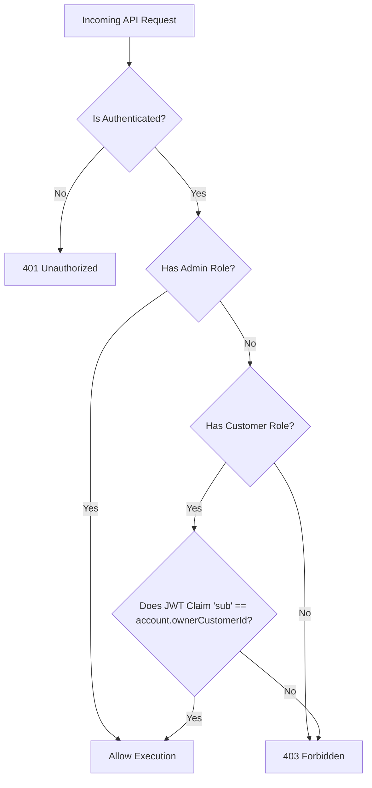

# Domain Specification: Account Management & Security

This specification outlines the functional constraints, API design, security parameters, database migrations, and testing requirements for the **Account Management & Security** module of the **Enterprise Payment Gateway** (`atomant-payment`).

---

## 1. Security Architecture (RBAC with SmallRye JWT)

Role-Based Access Control (RBAC) is enforced at the REST layer using the `quarkus-smallrye-jwt` extension. 

### 1.1 Mapped Roles & Rules
- **`ADMIN` (Unrestricted):** Can manage, view, close, and query statements for any account.
- **`CUSTOMER` (Restricted):** Can only create, view, close, or query statements for accounts that belong to them (where the JWT claim `sub` or `customerId` matches the account's `ownerCustomerId` attribute).

### 1.2 Access Validation Flow (Owner Constraint)
When a request is made by a user with the `CUSTOMER` role, the API layer must dynamically compare the authenticated claim against the target resource:



### Access Validation Description
The flowchart above details the rigorous security check performed for every account-related request. 
- **Authentication**: First, the system verifies the presence and validity of the JWT token.
- **Role Hierarchy**: 
    - Users with the `ADMIN` role bypass the ownership check, allowing support or system processes to manage any account.
    - Users with the `CUSTOMER` role must pass the **Ownership Verification** step.
- **Ownership Verification**: The `sub` (Subject) claim in the JWT is compared against the `ownerCustomerId` stored in the database for the requested account. If they do not match, a `403 Forbidden` response is returned, preventing unauthorized data access.

---

## 2. API Endpoint Contracts

All monetary values are modeled in **cents** (integer values) to avoid floating-point rounding issues in currency calculations.

### 2.1 Create Account
Creates a new bank account.

- **HTTP Method:** `POST`
- **Path:** `/accounts`
- **Security:** `@RolesAllowed({"ADMIN", "CUSTOMER"})`
- **Headers:** `Idempotency-Key: <UUID>` (Mandatory)
- **Request Payload (`AccountCreateDTO`):**
  ```json
  {
    "ownerCustomerId": "cust_99218274",
    "initialDepositInCents": 10000
  }
  ```
- **Response Payload (`AccountResponseDTO`):**
  - **Status Code:** `201 Created`
  ```json
  {
    "accountId": "acc_339102",
    "ownerCustomerId": "cust_99218274",
    "balanceInCents": 10000,
    "status": "ACTIVE",
    "createdAt": "2026-06-08T02:42:00Z"
  }
  ```

---

### 2.2 Query Account
Retrieves account metadata and balance.

- **HTTP Method:** `GET`
- **Path:** `/accounts/{accountId}`
- **Security:** `@RolesAllowed({"ADMIN", "CUSTOMER"})`
- **Response Payload:**
  - **Status Code:** `200 OK`
  ```json
  {
    "accountId": "acc_339102",
    "ownerCustomerId": "cust_99218274",
    "balanceInCents": 10000,
    "status": "ACTIVE",
    "createdAt": "2026-06-08T02:42:00Z"
  }
  ```

---

### 2.3 Close Account
Closes an active bank account.

- **HTTP Method:** `DELETE`
- **Path:** `/accounts/{accountId}`
- **Security:** `@RolesAllowed({"ADMIN", "CUSTOMER"})`
- **Business Rule:** An account can only be closed if its balance is **exactly zero**.
- **Response:**
  - **Status Code:** `204 No Content` (Success)
  - **Status Code:** `400 Bad Request` (If `balanceInCents > 0` or already closed).

---

### 2.4 Get Account Statement
Fetches the transaction history showing the last $N$ transactions.

- **HTTP Method:** `GET`
- **Path:** `/accounts/{accountId}/statement`
- **Query Parameters:** `limit` (Integer, default 10, max 100)
- **Security:** `@RolesAllowed({"ADMIN", "CUSTOMER"})`
- **Response Payload:**
  - **Status Code:** `200 OK`
  ```json
  {
    "accountId": "acc_339102",
    "balanceInCents": 10000,
    "transactions": [
      {
        "transactionId": "tx_8819283",
        "type": "CREDIT",
        "amountInCents": 5000,
        "description": "Pix deposit",
        "timestamp": "2026-06-08T02:45:00Z"
      },
      {
        "transactionId": "tx_7721832",
        "type": "DEBIT",
        "amountInCents": 2500,
        "description": "Debit Card purchase",
        "timestamp": "2026-06-08T02:43:00Z"
      }
    ]
  }
  ```

---

## 3. Database Persistence Design (Flyway)

Hibernate automatic DDL updates (`ddl-auto=update` or `create-drop`) are **strictly prohibited** in environments. Schema migration must be handled sequentially via Flyway.

### 3.1 Configuration (`application.properties`)
```properties
quarkus.hibernate-orm.database.generation=none
quarkus.flyway.migrate-at-start=true
```

### 3.2 SQL Migrations

#### `db/migration/V1.0.0__create_accounts_table.sql`
```sql
CREATE TABLE accounts (
    id VARCHAR(50) PRIMARY KEY,
    owner_customer_id VARCHAR(50) NOT NULL,
    balance_in_cents BIGINT NOT NULL DEFAULT 0,
    status VARCHAR(20) NOT NULL DEFAULT 'ACTIVE',
    created_at TIMESTAMP WITH TIME ZONE NOT NULL,
    closed_at TIMESTAMP WITH TIME ZONE,
    version INT NOT NULL DEFAULT 0
);

CREATE INDEX idx_accounts_owner ON accounts(owner_customer_id);
```

#### `db/migration/V1.1.0__create_transactions_table.sql`
```sql
CREATE TABLE transactions (
    id VARCHAR(50) PRIMARY KEY,
    account_id VARCHAR(50) NOT NULL REFERENCES accounts(id),
    type VARCHAR(10) NOT NULL CHECK (type IN ('CREDIT', 'DEBIT')),
    amount_in_cents BIGINT NOT NULL,
    description VARCHAR(255),
    created_at TIMESTAMP WITH TIME ZONE NOT NULL
);

CREATE INDEX idx_transactions_account_timestamp ON transactions(account_id, created_at DESC);
```

---

## 4. Test-First Imperative & Validation Matrix

To satisfy the **Test-First Imperative**, at least 50% line coverage must be met using JUnit 5, Mockito, and REST Assured. The following core scenarios must be implemented in test suites:

| Case ID | Context | Action | Expected Outcome | Test File |
| :--- | :--- | :--- | :--- | :--- |
| **TC-SEC-01** | Security | `CUSTOMER` calls `/accounts/acc_1` (belongs to `cust_2`) | `403 Forbidden` | `AccountResourceTest.java` |
| **TC-SEC-02** | Security | `ADMIN` calls `/accounts/acc_1` (belongs to `cust_2`) | `200 OK` | `AccountResourceTest.java` |
| **TC-BUS-01** | Account | Close account with `balanceInCents = 1500` | `400 Bad Request` | `AccountServiceTest.java` |
| **TC-BUS-02** | Account | Close account with `balanceInCents = 0` | Status changes to `CLOSED`, `204` | `AccountServiceTest.java` |
| **TC-STM-01** | Statement | Query statement with `limit = 5` | Returns last 5 txs ordered by timestamp DESC | `StatementServiceTest.java` |
| **TC-IDM-01** | Idempotency | Post duplicate create request with same `Idempotency-Key` | Yields cached `201` result, no duplicate | `AccountResourceTest.java` |
