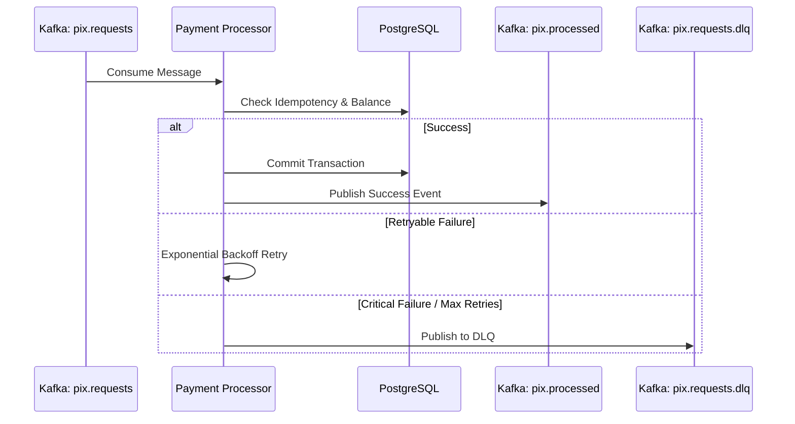

# Domain Specification: Async Pix Processing

This specification defines the asynchronous, event-driven design, resilience structures, concurrency model, and observability requirements for the **Async Pix Processing** module of the **Enterprise Payment Gateway** (`atomant-payment`).

---

## 1. Event-Driven Architecture (SmallRye Reactive Messaging)

The asynchronous Pix transfer pipeline operates over Apache Kafka using Quarkus SmallRye Reactive Messaging.

### 1.1 Inbound & Outbound Channels
- **`pix-requests`:** Consumes raw Pix execution requests. Linked to Kafka topic `pix.requests`.
- **`pix-processed`:** Emits processing confirmation events. Linked to Kafka topic `pix.processed`.
- **`pix-requests-dlq`:** Recovers message payloads that repeatedly fail validation or processing. Linked to Kafka topic `pix.requests.dlq`.

```mermaid
graph TD
    Client[Client REST API] -->|Publishes| RequestTopic[Topic: pix.requests]
    
    subgraph Payment Processor [Payment Processor Microservice]
        Consumer[@Incoming pix-requests]
        VT[@RunOnVirtualThread]
        Engine[Pix Processing Engine]
        Producer[@Outgoing pix-processed]
    end
    
    RequestTopic -->|Consume| Consumer
    Consumer --> VT
    VT --> Engine
    
    Engine -->|Success| Producer
    Producer -->|Publish| ProcessedTopic[Topic: pix.processed]
    
    Engine -->|Failure limit exceeded| DLQ[Dead-Letter Queue Broker]
    DLQ -->|Publish| DLQTopic[Topic: pix.requests.dlq]
```

### Architecture Description
The architecture diagram illustrates a robust, non-blocking ingestion pipeline.
- **Client REST API**: Decouples the user request from the processing by immediately publishing to Kafka.
- **Payment Processor**: Operates asynchronously, pulling messages from the `pix.requests` topic.
- **Virtual Threads**: Utilizes Java 21 light-weight threads to perform blocking I/O (like DB updates or external API calls) without exhausting the thread pool.
- **Dead-Letter Queue (DLQ)**: Provides a safety net for messages that cannot be processed after multiple retries, allowing for manual inspection and recovery.

### Kafka Message Flow (Mermaid)


### 1.2 Configuration Properties (`application.properties`)
```properties
# Kafka Bootstrap Servers
kafka.bootstrap.servers=localhost:9092

# Incoming Channel: pix-requests
mp.messaging.incoming.pix-requests.connector=smallrye-kafka
mp.messaging.incoming.pix-requests.topic=pix.requests
mp.messaging.incoming.pix-requests.value.deserializer=org.apache.kafka.common.serialization.StringDeserializer
mp.messaging.incoming.pix-requests.acknowledgement-mode=post-processing

# Outgoing Channel: pix-processed
mp.messaging.outgoing.pix-processed.connector=smallrye-kafka
mp.messaging.outgoing.pix-processed.topic=pix.processed
mp.messaging.outgoing.pix-processed.value.serializer=org.apache.kafka.common.serialization.StringSerializer
```

---

## 2. Resilience, Retries, and DLQ Policies

To prevent blocking Kafka partitions during processing failures (e.g. database locks, brief network timeouts), the processor implements a non-blocking retry-and-DLQ policy.

### 2.1 Retry Strategy
- Transient exceptions (e.g., database connection issues, timeouts) trigger up to **3 retry attempts** with exponential backoff:
  - Initial delay: `500ms`
  - Multiplier: `2.0` (500ms, 1000ms, 2000ms)
- Failures due to business/validation rules (e.g., invalid key format) do not trigger retries and are routed directly to the DLQ.

### 2.2 DLQ Configuration Properties
If a message exceeds the retry threshold, it is automatically routed to the dead-letter queue, and its partition offset is acknowledged to keep the stream moving.
```properties
mp.messaging.incoming.pix-requests.failure-strategy=dead-letter-queue
mp.messaging.incoming.pix-requests.dead-letter-queue.topic=pix.requests.dlq
mp.messaging.incoming.pix-requests.dead-letter-queue.key.serializer=org.apache.kafka.common.serialization.StringSerializer
mp.messaging.incoming.pix-requests.dead-letter-queue.value.serializer=org.apache.kafka.common.serialization.StringSerializer
```

---

## 3. Concurrency Model: Java 21 Virtual Threads

To handle high-throughput parallel consumption without wasting OS thread resources, processing handlers are scheduled on Java 21 Virtual Threads:

```java
import io.smallrye.common.annotation.RunOnVirtualThread;
import org.eclipse.microprofile.reactive.messaging.Incoming;
import org.eclipse.microprofile.reactive.messaging.Outgoing;
import jakarta.enterprise.context.ApplicationScoped;

@ApplicationScoped
public class PixMessageConsumer {

    private final PixProcessingService processingService;

    public PixMessageConsumer(PixProcessingService processingService) {
        this.processingService = processingService;
    }

    @Incoming("pix-requests")
    @Outgoing("pix-processed")
    @RunOnVirtualThread // Consumer execution runs on light-weight virtual thread
    public String processPixRequest(String payload) {
        // Blocks on database, API authorizers safely on a virtual thread
        return processingService.process(payload);
    }
}
```

---

## 4. Observability: Metrics & Structured JSON Logging

### 4.1 Micrometer Metrics Configuration
We monitor throughput, duration, and error rates using the `quarkus-micrometer-registry-prometheus` extension. The following key metrics are exposed at `/q/metrics`:

| Metric Name | Type | Tag(s) | Description |
| :--- | :--- | :--- | :--- |
| `pix_processed_total` | Counter | `status=SUCCESS/FAILURE` | Total count of processed Pix requests. |
| `pix_processing_duration_seconds` | Timer | - | Time taken to process a Pix request (from consumption to completion). |
| `pix_dlq_published_total` | Counter | `reason=TX_FAILED/VALIDATION` | Total count of messages diverted to the DLQ. |

---

### 4.2 Structured JSON Logging
Console logs are formatted in JSON for ingestion by centralized logging collectors (ELK, Datadog). Stack traces are formatted as nested fields, never dumped as raw lines.

- **Configuration (`application.properties`):**
  ```properties
  quarkus.log.console.json=true
  quarkus.log.console.json.pretty-print=false
  ```
- **Example Log Entry:**
  ```json
  {
    "timestamp": "2026-06-08T02:45:00.123Z",
    "level": "INFO",
    "loggerName": "org.acme.payment.PixProcessingService",
    "message": "Pix transaction processed successfully",
    "mdc": {
      "transactionId": "tx_9921828",
      "paymentId": "pay_339218",
      "correlationId": "corr_882910"
    },
    "durationMs": 142
  }
  ```
