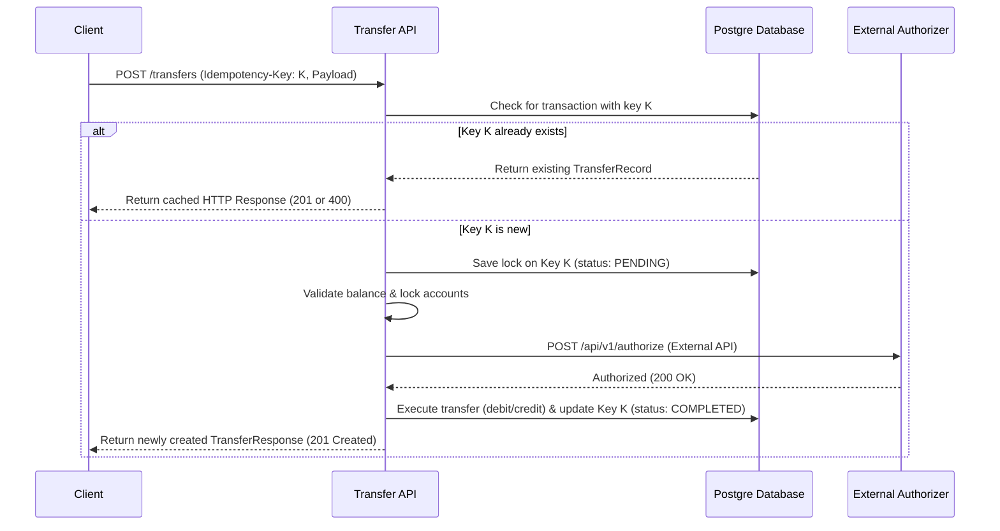
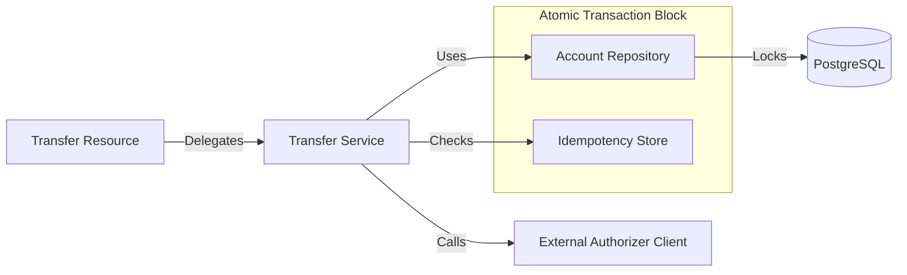

# Domain Specification: Financial Transfers

This specification outlines the business rules, transactional safety, fault tolerance mechanisms, API contracts, and database migrations for the **Financial Transfers** module of the **Enterprise Payment Gateway** (`atomant-payment`).

---

## 1. Transaction Safety & Atomicity Rules

To guarantee 100% data consistency, transfers between internal accounts must execute within a single atomic database transaction using pessimistic write locking.

### 1.1 Pessimistic Concurrency Control
To prevent dirty reads and race conditions (e.g. concurrent transfers from the same account trying to double-spend), account records must be locked inside the transaction block:

1. **Deterministic Lock Ordering:** To prevent deadlocks, the system must always acquire locks on the accounts in ascending order of their IDs (e.g., lock the account with the smaller alphanumeric ID first, then the larger ID).
2. **Query Layout:** Use Hibernate/JPA pessimistic write locks:
   ```java
   // Equivalent to: SELECT * FROM accounts WHERE id = :id FOR UPDATE
   Account payer = entityManager.find(Account.class, payerId, LockModeType.PESSIMISTIC_WRITE);
   ```

### 1.2 Balance Validation
- **No Negative Balances:** Before executing the debit, the domain service must verify that `payer.balanceInCents >= transferAmountInCents`.
- If insufficient, the transaction is rejected immediately with an `INSUFFICIENT_FUNDS` domain exception, triggering a rollback.

---

## 2. Idempotency Key Engine

To prevent duplicate transfers caused by client-side retries or network timeouts, the POST endpoint enforces a mandatory `Idempotency-Key` header:



### Idempotency Flow Description
The sequence diagram above demonstrates the lifecycle of a transfer request protected by an idempotency key. 
- **Deterministic Response**: If the same key is sent twice, the system returns the cached result of the first successful processing without re-executing business logic.
- **Race Condition Prevention**: The first request immediately marks the key as `PENDING` in the database, ensuring that concurrent requests with the same key are blocked or returned the pending status.
- **External Integrity**: The authorization from external partners is only requested for new, unique keys.

### Component Interaction (Mermaid)


---

## 3. Resilience & Fault Tolerance (SmallRye)

The system delegates transfer authorization to an unstable external Mock Authorizer API:
- **Endpoint:** `POST /api/v1/authorize`
- **Behavior Profile:**
  - **70%:** HTTP 200 (Authorized)
  - **20%:** HTTP 403 (Declined/Forbidden)
  - **10%:** HTTP 500 (Server Error)
  - **Latency:** 100ms to 3000ms

### 3.1 REST Client Interface Definition
The integration uses the Quarkus REST Client with SmallRye Fault Tolerance annotations:

```java
@RegisterRestClient(configKey = "authorizer-api")
@Path("/api/v1")
public interface AuthorizerClient {

    @POST
    @Path("/authorize")
    @Timeout(value = 1500, unit = ChronoUnit.MILLIS) // Enforce 1.5s latency cap
    @Retry(
        maxRetries = 3, 
        delay = 100, 
        delayUnit = ChronoUnit.MILLIS, 
        retryOn = {IOException.class, TimeoutException.class, ServerErrorException.class}
    )
    @Fallback(fallbackMethod = "fallbackAuthorization") // Decline if service fails
    AuthorizationResponse authorize(AuthorizationRequest request);
}
```

### 3.2 Resilience Rules
1. **Timeout Policy:** Any authorization request taking longer than `1500ms` is interrupted, throwing a `TimeoutException` (triggering a retry).
2. **Retry Policy:** Transients like HTTP 500 or Connection Timeouts trigger up to **3 retries** with a `100ms` delay.
3. **Fallback Policy:** If all retries fail or a HTTP 403 (Decline) is received, the fallback method must **reject the transfer** and raise an `AuthorizationDeclinedException` to trigger database rollback. The system must never approve a transfer when the authorizer is unreachable.

---

## 4. API Endpoint Contracts

### 4.1 Initiate Internal Transfer
Synchronously transfers funds between two internal accounts.

- **HTTP Method:** `POST`
- **Path:** `/transfers`
- **Headers:** 
  - `Idempotency-Key: <UUID>` (Mandatory)
- **Request Payload (`TransferRequestDTO`):**
  ```json
  {
    "payerAccountId": "acc_339102",
    "payeeAccountId": "acc_558192",
    "amountInCents": 15000,
    "description": "Payment for services rendered"
  }
  ```
- **Response Payload (`TransferResponseDTO`):**
  - **Status Code:** `201 Created`
  ```json
  {
    "transferId": "tf_7781923",
    "payerAccountId": "acc_339102",
    "payeeAccountId": "acc_558192",
    "amountInCents": 15000,
    "status": "COMPLETED",
    "authorizationId": "auth_9918231",
    "createdAt": "2026-06-08T02:44:00Z"
  }
  ```

- **Error Responses:**
  - **Status Code:** `400 Bad Request` (Insufficient funds, closed account).
  - **Status Code:** `422 Unprocessable Entity` (Authorization declined by mock API).
  - **Status Code:** `409 Conflict` (Idempotency key key reuse with different parameters).

---

## 5. Database Schema Migration (Flyway)

#### `db/migration/V1.2.0__create_transfers_table.sql`
```sql
CREATE TABLE transfers (
    id VARCHAR(50) PRIMARY KEY,
    payer_account_id VARCHAR(50) NOT NULL REFERENCES accounts(id),
    payee_account_id VARCHAR(50) NOT NULL REFERENCES accounts(id),
    amount_in_cents BIGINT NOT NULL,
    status VARCHAR(20) NOT NULL CHECK (status IN ('COMPLETED', 'REJECTED', 'FAILED')),
    idempotency_key VARCHAR(255) NOT NULL UNIQUE,
    authorization_id VARCHAR(100),
    description VARCHAR(255),
    created_at TIMESTAMP WITH TIME ZONE NOT NULL
);

CREATE INDEX idx_transfers_payer ON transfers(payer_account_id);
CREATE INDEX idx_transfers_payee ON transfers(payee_account_id);
```
